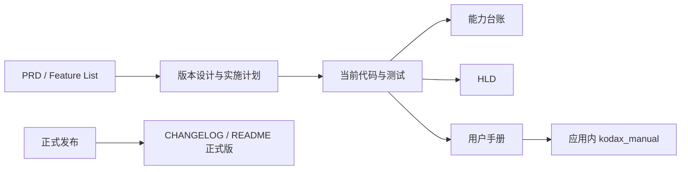

# KodaX Space 文档中心

> 当前代码基线：KodaX Space `v0.1.31` 开发版 / KodaX `0.7.67` 
> 当前公开正式版：KodaX Space `v0.1.30`

这里是文档的统一入口。`v0.1.31` 的 Runtime Host 实现和自动化验证已完成，仍待真实 Provider 人工验收、版本发布和独立 review；因此文档会同时标明“开发基线”和“公开正式版”，避免把尚未发布的能力当成已交付版本。

## 我想要……

| 目标                                | 从这里开始                                                                                                                                            |
| ----------------------------------- | ----------------------------------------------------------------------------------------------------------------------------------------------------- |
| 安装、配置、第一次完成任务          | [用户使用手册](USER_MANUAL.zh-CN.md)                                                                                                                  |
| 快速理解界面和功能                  | [用户使用手册：界面地图](USER_MANUAL.zh-CN.md#5-界面地图)                                                                                             |
| 理解 v0.1.31 有什么效果             | [用户使用手册：Runtime Host](USER_MANUAL.zh-CN.md#v0131-的-runtime-host-对用户有什么影响)                                                             |
| 从源码运行、测试、打包              | [运行与开发指南](USAGE.md)                                                                                                                            |
| 了解产品目标和边界                  | [PRD](PRD.md)                                                                                                                                         |
| 理解进程、IPC、Runtime 和数据所有权 | [HLD](HLD.md)                                                                                                                                         |
| 查看 KodaX 能力是否已接入           | [KodaX 能力台账](KODAX_CAPABILITY_LEDGER.md)                                                                                                          |
| 查看当前和未来 Feature              | [Feature List](FEATURE_LIST.md)                                                                                                                       |
| 查看 v0.1.31 的设计与实施           | [版本设计](features/v0.1.31.md) / [实施计划](features/v0.1.31-implementation-plan.md) / [人工测试指导](test-guides/FEATURE_116_v0.1.31_TEST_GUIDE.md) |
| 报告或核对已知问题                  | [Known Issues](KNOWN_ISSUES.md)                                                                                                                       |
| 参与贡献                            | [Contributing](../CONTRIBUTING.md)                                                                                                                    |

## 当前有效文档

| 文档                                                 | 性质             | 更新规则                                       |
| ---------------------------------------------------- | ---------------- | ---------------------------------------------- |
| `README.md` / `README_CN.md`                         | 项目入口         | 只概括公开版本和下一开发基线                   |
| `USER_MANUAL.zh-CN.md`                               | 面向用户         | 必须与当前 UI、快捷键和实际能力一致            |
| `USAGE.md`                                           | 面向开发/运维    | 必须与 package scripts、数据路径和验证流程一致 |
| `PRD.md`                                             | 产品目标与路线   | 保留长期方向，明确已交付/开发中/观察项         |
| `HLD.md`                                             | 当前高层架构     | 反映真实 owner、边界和降级策略                 |
| `KODAX_CAPABILITY_LEDGER.md`                         | 能力接入事实     | 每次 SDK/Runtime 接入后更新状态与证据          |
| `FEATURE_LIST.md`                                    | 版本路线图       | 只有可交付、可验证的版本项进入 active list     |
| `KNOWN_ISSUES.md`                                    | 当前问题         | 已解决项保留结论，新增问题需有复现和状态       |
| `apps/desktop/electron/kodax/space-manual-topics.ts` | 应用内 AI 自说明 | 与用户手册同步更新，防止 AI 给出旧操作说明     |

## 历史文档

以下文档是历史证据，不按当前 UI 重写：

- `CHANGELOG.md`：已发布版本的变更记录；
- `features/v*.md`：对应版本当时的目标、决策和验收；
- `ADR/`：架构决策及其 superseded/rejected 状态；
- `FEATURES_ARCHIVED.md`：已经交付、取消或进入 watchlist 的 Feature；
- `docs/known-issues/`：具体问题的调查与修复记录。

阅读历史文档时，请以文档日期和版本为准，不要用它判断当前 UI。当前事实优先看用户手册、HLD、能力台账和 Feature List。

## 文档与实现的关系

文档不能仅依据计划声称“已支持”。只有代码路径、自动化测试和必要人工验收都满足后，能力台账才能标为 `supported`；只有发布完成后，README/CHANGELOG 才能把它写成公开正式版。

## 更新检查清单

涉及用户可见能力、Runtime/SDK 边界或版本状态的改动，至少检查：

1. 用户手册是否说明入口、效果、限制和风险；
2. `space-manual-topics.ts` 是否给 AI 相同答案；
3. PRD/HLD/能力台账的 owner 和状态是否一致；
4. Feature List、版本设计、测试指导是否能互相链接；
5. README 是否仍准确区分开发版与正式版；
6. Mermaid、相对链接、标题锚点和代码命令是否可用；
7. 发布后是否同步 CHANGELOG、版本号和 release links。
