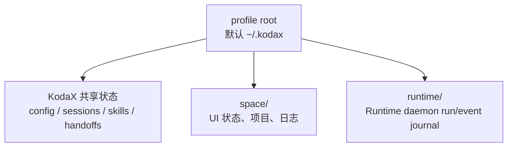
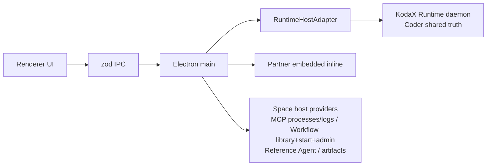

# KodaX Space 运行与开发指南

> 面向源码使用者、贡献者和发布维护者。普通用户请阅读[用户使用手册](USER_MANUAL.zh-CN.md)。
>
> 当前 Space 发布基线：`v0.1.33`；该发布使用 npm Registry 的精确 `@kodax-ai/kodax@0.7.77`。
> 本版本包含 canonical Actor/Turn 投影、精确 history/live 对齐、context/session usage、稳定缓存亲和诊断、可配置 Shell、F140 关闭行为，以及 builtin catalog、file reveal 和 Node/build 工具链维护。

## 1. 环境要求

- Node.js 22.12+（项目通过 `.nvmrc` 固定到 22.23.1，CI 读取同一文件）。
- npm 10+。
- Windows、macOS 或 Linux 桌面环境。
- 安装 native dependencies 所需的系统构建工具；Windows 通常需要 Visual Studio Build Tools。

```bash
git clone https://github.com/icetomoyo/KodaX-Space.git
cd KodaX-Space
npm install --include=dev
```

KodaX Space 是 npm workspace monorepo。不要只在 `apps/desktop` 中安装依赖，否则 workspace package、Electron native module 与根脚本可能不一致。

根、desktop manifest 与 lockfile 当前都固定到 npm 正式发布的精确 KodaX 0.7.77。官方 Registry tarball 的 SRI 为 `sha512-doAvH966LlOk/fBvmMZCmVSBbvLNPHKWtMaEQ6C2Vqvzs6ninQEs290ECGNHvAP/dMuRh2gD6Dso76HUgzLfzw==`，SHA256 为 `E30B447059F1C237B81E5896E51698D3FFD7987A8C5E1CF15F9F2354C846F63C`。`npm ls @kodax-ai/kodax --all` 应只显示一个 deduped 0.7.77；Runtime compatibility 会拒绝更旧 daemon，并继续要求 guardrail v3、`permission:grant-admin`、`interruptInput:1`、`actorControlPlane:1`、`contextCompaction:3`、`transcriptPaging:1` 和 `transcriptSearch:1`。Provider catalog 还要求 public `kimi-k3` 1M 路由与 Kimi Code 既有 tiers。依赖必须保持 Registry URL 与上述 lockfile SRI，不能提交开发机 `file:` 依赖。

## 2. 启动方式

### 2.1 开发模式

```bash
npm run dev
```

该命令协调 Vite renderer、Electron main watch、native dependency ABI 和桌面进程。需要调试界面时优先使用它，不要分别手工启动多个子进程。

### 2.2 正式安装包

普通用户从 [GitHub Releases](https://github.com/icetomoyo/KodaX-Space/releases/latest) 获取安装包：

| 平台    | 产物                        |
| ------- | --------------------------- |
| Windows | NSIS Setup、Portable、zip   |
| macOS   | universal dmg，或按架构构建 |
| Linux   | AppImage、deb               |

当前公开构建未经过面向公众的系统签名渠道，首次启动可能需要在 SmartScreen 或 Gatekeeper 中确认可信来源。

## 3. 配置与数据目录



| 路径或变量                           | 作用                                 | 说明                                              |
| ------------------------------------ | ------------------------------------ | ------------------------------------------------- |
| `~/.kodax/config.json`               | Provider、MCP、permission 等共享配置 | CLI/SDK/Space 共用                                |
| `~/.kodax/sessions/`                 | 会话历史                             | CLI/SDK/Space 共用                                |
| `~/.kodax/skills/`                   | 用户 Skills                          | 项目也可有项目级 Skills                           |
| `~/.kodax/handoffs/`                 | 桌面 handoff inbox                   | 用于上下文连续性                                  |
| `~/.kodax/space/`                    | Space UI 和桌面专属状态              | 包含 logs、state 等                               |
| `<profile-root>/runtime/`            | Shared Runtime state/journal         | Coder daemon runs；默认实际为 `~/.kodax/runtime/` |
| `KODAX_HOME=<abs>`                   | 改变 SDK 共享数据根                  | 必须在应用启动前设置                              |
| `KODAX_PROFILE_DIR=<abs>`            | 让 Space 和 SDK 使用一个独立 profile | 该绝对路径本身就是 profile 根，不再追加 `.kodax`  |
| `KODAX_TEST_ONBOARDING=1\|<safe-id>` | 测试隔离 profile                     | 强制写入系统临时目录，禁止指向真实用户数据        |

若同时使用 `KODAX_PROFILE_DIR`，Space 会在首次加载 SDK 前将 `KODAX_HOME` 对齐到该 profile。相对路径会被忽略；测试模式优先级最高。

## 4. v0.1.33 Runtime Host

`RuntimeHostAdapter` 是 Electron main 内部边界，不是用户设置：



v0.1.33 的 Coder daemon 路由包括：

- session/run/transcript/live projection、compact/fork/rewind 与共享设置 CAS；
- queue、permission grant、AskUser 和 daemon stop preflight；
- Workflow list/get/event 与 pause/resume/stop；
- Learning Center 命令、Skill/slash catalog、MCP tool discovery/reload；
- Runtime 配置 External Agent 的发现、预检和统一 Actor/Turn 任务控制。
- compaction v3 的 durable-before-evict 边界、精确 checkpoint/recovery-guidance 活动 lineage，以及 revision-bound transcript page/chunk/search；
- mailbox-driven 模型协调；Space/SDK 的 Actor progress snapshot/replay/long-poll 保持遥测语义，不驱动父模型重复采样；
- idle-yield 恢复用户提示、未确认 root completion 的一次性恢复，以及 root/child live projection 隔离。
- PowerShell `-Path` 方括号通配符 fail-closed 升级确认，同时保留 `-LiteralPath`/`-PSPath` 的精确方括号文件名语义；
- KodaX CLI auto-resume 有界扫描并跳过空 ACP 占位会话；Space 继续使用自己的显式 Session 选择器。
- 交互式 resume 恢复 workspace runtime、messages、UI history、lineage、artifacts、extensions、title、tag 与 session identity；
- 快速 Auto 设置写入按 Session 串行且 last-action-wins，`Auto[RULES]` 保持粘性，显式 `/auto-engine llm` 才切回 LLM；
- imperative manual compaction 先把精确 flat Session history 对齐进 lineage；durable interrupt-delivery 持久化失败时输入保持 queued，并只发出不含用户正文的有界 warning。
- `contextDiagnostics` 只投影根上下文分类 Token 数；Renderer 以最终自动压缩阈值为有效分母，并把模型最大上下文作为独立事实。Provider 根计数优先，budget fallback 会减去 reserved response capacity。
- KodaX 0.7.77 的完成态 hash-only cache diagnostic 是 Session usage 的权威物理调用源，按 `requestId` 去重并覆盖 root/child、retry、fallback、repair、workflow digest 与 compaction summary；`iteration_end.usage` 仅是旧 Runtime/mock 在诊断激活前的回退。

以下仍由 Space 管理：renderer 投影、Partner profile/tools/policy、Workflow library/start/rerun/save/admin/result/artifact、MCP server 进程与日志、Artifact 和 Space Reference Agent durable store。不要把这些路径写成 Runtime-native。

Coder 缺少必要 Runtime capability 时 fail closed，不会把已接受操作重放到 inline owner。Partner 始终保持 embedded-inline。内部紧急回滚方式如下，必须在没有活动工作时、应用启动前设置并重启：

```powershell
$env:KODAX_SPACE_RUNTIME_HOST='legacy'
npm run dev
```

恢复 Runtime 路径：

```powershell
$env:KODAX_SPACE_RUNTIME_HOST='runtime'
npm run dev
```

该变量是维护窗口中的内部回滚开关，不应做成用户偏好，也不支持在 live run 中切换。

### Windows 后台托盘

Windows 默认启用后台托盘。F140 让主窗口关闭行为可在 Settings → Preferences 中设为
每次询问、最小化到托盘并保留 Runtime，或请求安全彻底退出；首次关闭默认询问，
并可记住选择。最小化到托盘会销毁 BrowserWindow/renderer，但保留轻量 Electron
main、托盘和 Runtime 客户端连接。托盘可重建窗口、只退出 Space 并保留 daemon，
或请求安全的彻底退出。

彻底退出必须先断开 Space，再通过发布版 KodaX CLI 的 daemon stop 安全门执行；
active/queued/pending 工作或其他客户端会阻止 daemon 停止。自动化 fixture 可设置
`SPACE_DISABLE_TRAY=1` 获得确定性的关闭即退出行为；这不是 renderer 可写的产品偏好。
若托盘初始化失败，应用同样退回关闭即退出，避免不可见驻留。

Settings → Preferences 的 Terminal Shell 选择会同时作用于 Space PTY 与 Coder
命令工具。Electron main 从选中 shell 的登录环境解析 `PATH`，剥离常见密钥变量后再
建立执行环境；若 shell 不可用则显示明确诊断，不静默切到不同的执行语义。

## 5. 常用开发命令

| 目标                        | 命令                                        |
| --------------------------- | ------------------------------------------- |
| 启动开发环境                | `npm run dev`                               |
| 类型检查                    | `npm run typecheck`                         |
| Lint                        | `npm run lint`                              |
| 全量单元/集成测试           | `npm test`                                  |
| Desktop 单元测试            | `npm test -w @kodax-space/desktop`          |
| IPC schema 测试             | `npm test -w @kodax-space/space-ipc-schema` |
| 构建 renderer/main/packages | `npm run build:smoke`                       |
| Playwright E2E              | `npm run e2e`                               |
| 有界面 E2E                  | `npm run e2e:headed`                        |
| 校验 builtin skill 来源锁   | `npm run skills:check`                      |
| 从审定上游更新 builtin      | `npm run skills:update`                     |
| 打包产物检查                | `npm run smoke:pack`                        |
| packaged boot smoke         | `npm run smoke:boot`                        |

建议提交前按下面顺序执行：

```bash
npm run typecheck
npm run lint
npm test
npm run e2e
npm run build:smoke
```

高风险的 main/IPC/session/runtime 改动还应执行对应人工测试指导，例如 [v0.1.31 测试指导](test-guides/FEATURE_116_v0.1.31_TEST_GUIDE.md)。

Space 自有 builtin skill 的来源、许可证、补丁和逐文件哈希由
`resources/builtin-skills.sources.json`、`resources/builtin-skill-patches/` 与
`resources/builtin-skills.lock.json` 共同固定。正常更新必须使用 `npm run skills:update`，
审阅完整 diff 后再执行 `npm run skills:check`；不要直接修改生成的
`resources/builtin-skills/`。完整流程见 [builtin skill 维护说明](BUILTIN_SKILLS.md)。

## 6. Native module ABI

Desktop 单元测试需要 Node ABI，Electron 启动与 E2E 需要 Electron ABI。项目脚本会自动调用：

```bash
node scripts/ensure-sqlite-native.mjs node
node scripts/ensure-sqlite-native.mjs electron
```

不要并行运行会把同一个 native module 重建成不同 ABI 的测试/构建任务。典型症状是 `better-sqlite3` 或其他 native addon 报 `NODE_MODULE_VERSION` 不匹配。出现时，停止并行进程，再通过目标命令让脚本重建到正确 ABI。

`.npmrc` 启用 `engine-strict`，因此低于 Node 22.12 的安装会直接失败。Electron 与
electron-builder 二进制下载使用项目配置的镜像；若组织网络要求自建镜像，请在受控 CI
环境中覆盖对应 npm 配置，不要提交临时开发机路径。

## 7. 构建与打包

```bash
npm run build:win
npm run build:mac
npm run build:linux
```

跨平台产物最好在对应系统或 CI runner 上生成。发布前至少确认：

1. `package.json`、应用 Version IPC、CHANGELOG 和 feature doc 版本一致；
2. `npm run build:smoke` 通过；
3. installer/portable 或目标平台产物能够启动；
4. `npm run skills:check` 通过，打包后的 Space builtin 文件集/字节与 lock 完全一致，Huashu 三个有序补丁及大小写不敏感的推广签名禁词门禁有效，SDK builtin Markdown 也仍在 `app.asar`；
5. Provider、创建会话、发送消息、后台 Session 权限/AskUser、session restore、fork/rewind/compact 完成人工冒烟；
6. Windows 本地产物和 CI 的 Windows/macOS/Linux 产物均通过 package/boot smoke；
7. Windows 人工验证主/Artifact 窗口图标、托盘关闭/重开/两种退出语义，以及重复查询时不出现瞬时 console 窗口；KodaX 0.7.77 保留非交互子进程隐藏，任何重现都按回归处理；
8. 正式发布后再把文档中的“开发基线”改成“公开正式版”。

当前源码使用 `electron-builder@26.15.3` 和 `node-gyp@12.2.0`，Windows CI 可运行在
`windows-latest` 的 Visual Studio 2026 工具链上。`afterPack` 通过固定的
`resedit@1.7.2` 直接修改 PE icon/version resources，不再扫描或启动缓存中的
`rcedit.exe`。相关依赖和资源门禁失败必须让安装/打包失败，不能用 `|| true` 吞掉。

`v0.1.33` 的可执行门禁、目标产物、人工验收、已知风险和 tag 后步骤集中在
[发布就绪清单](releases/v0.1.33-release-readiness.md)。在该清单关闭之前，不应创建
稳定版 `v0.1.33` tag。

## 8. 排障

| 现象                          | 首先检查                                                                   |
| ----------------------------- | -------------------------------------------------------------------------- |
| 没有 Provider / API key       | Settings → Providers；环境变量；OS Keychain 状态                           |
| 会话或配置出现在错误 profile  | 启动前的 `KODAX_HOME`、`KODAX_PROFILE_DIR`；不要在 SDK import 后修改       |
| Runtime run 失败              | 版本信息、runId、`~/.kodax/space/logs`、Runtime status/capability snapshot |
| MCP 工具不可见                | MCP panel 的 Refresh/Reload、server diagnostics；MCP 子进程由 Space 管理   |
| E2E 启动失败且提到 native ABI | 结束并行测试，运行 `node scripts/ensure-sqlite-native.mjs electron`        |
| Node 单测提到 native ABI      | 运行 `node scripts/ensure-sqlite-native.mjs node`                          |
| UI 状态损坏                   | 先备份 `~/.kodax/space/`，检查日志；最后手段才重置 `state.json`            |

提交问题时请包含版本、操作系统、复现步骤、是否使用独立 profile、相关日志和脱敏截图。已知问题见 [KNOWN_ISSUES.md](KNOWN_ISSUES.md)。

## 9. 文档入口

- [文档中心](README.md)
- [用户使用手册](USER_MANUAL.zh-CN.md)
- [产品需求文档](PRD.md)
- [高层设计](HLD.md)
- [KodaX 能力台账](KODAX_CAPABILITY_LEDGER.md)
- [Feature 路线图](FEATURE_LIST.md)
- [Builtin skill 维护说明](BUILTIN_SKILLS.md)
- [v0.1.33 发布就绪清单](releases/v0.1.33-release-readiness.md)
- [贡献指南](../CONTRIBUTING.md)
