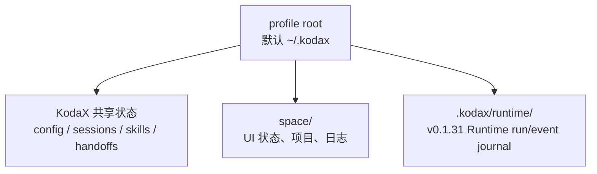
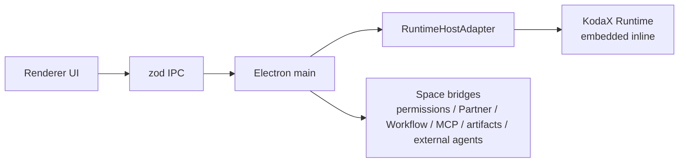

# KodaX Space 运行与开发指南

> 面向源码使用者、贡献者和发布维护者。普通用户请阅读[用户使用手册](USER_MANUAL.zh-CN.md)。
>
> 当前紧急预发布版本：KodaX Space `v0.1.32-hotfix.0` / `@kodax-ai/kodax@0.7.72-hotfix.0`；后续正式版仍为 `v0.1.32`。

## 1. 环境要求

- Node.js 20+（建议使用项目 CI 对齐的当前 LTS）。
- npm 10+。
- Windows、macOS 或 Linux 桌面环境。
- 安装 native dependencies 所需的系统构建工具；Windows 通常需要 Visual Studio Build Tools。

```bash
git clone https://github.com/icetomoyo/KodaX-Space.git
cd KodaX-Space
npm install --include=dev
```

KodaX Space 是 npm workspace monorepo。不要只在 `apps/desktop` 中安装依赖，否则 workspace package、Electron native module 与根脚本可能不一致。

根、desktop manifest 与 lockfile 都固定到精确 KodaX 0.7.68。`npm ls @kodax-ai/kodax --all` 应只显示同一个 deduped 版本；Runtime compatibility 和 packaged smoke 也会严格核对 0.7.68，依赖树漂移不能通过 release gate。

## 2. 启动方式

### 2.1 开发模式

```bash
npm run dev
```

该命令协调 Vite renderer、Electron main watch、native dependency ABI 和桌面进程。需要调试界面时优先使用它，不要分别手工启动多个子进程。

### 2.2 正式安装包

普通用户从 [GitHub Releases](https://github.com/icetomoyo/KodaX-Space/releases/latest) 获取安装包：

| 平台    | 产物                        |
| ------- | --------------------------- |
| Windows | NSIS Setup、Portable、zip   |
| macOS   | universal dmg，或按架构构建 |
| Linux   | AppImage、deb               |

当前公开构建未经过面向公众的系统签名渠道，首次启动可能需要在 SmartScreen 或 Gatekeeper 中确认可信来源。

## 3. 配置与数据目录



| 路径或变量                           | 作用                                 | 说明                                                        |
| ------------------------------------ | ------------------------------------ | ----------------------------------------------------------- |
| `~/.kodax/config.json`               | Provider、MCP、permission 等共享配置 | CLI/SDK/Space 共用                                          |
| `~/.kodax/sessions/`                 | 会话历史                             | CLI/SDK/Space 共用                                          |
| `~/.kodax/skills/`                   | 用户 Skills                          | 项目也可有项目级 Skills                                     |
| `~/.kodax/handoffs/`                 | 桌面 handoff inbox                   | 用于上下文连续性                                            |
| `~/.kodax/space/`                    | Space UI 和桌面专属状态              | 包含 logs、state 等                                         |
| `<profile-root>/.kodax/runtime/`     | Runtime journal                      | v0.1.31 managed runs；默认实际为 `~/.kodax/.kodax/runtime/` |
| `KODAX_HOME=<abs>`                   | 改变 SDK 共享数据根                  | 必须在应用启动前设置                                        |
| `KODAX_PROFILE_DIR=<abs>`            | 让 Space 和 SDK 使用一个独立 profile | 该绝对路径本身就是 profile 根，不再追加 `.kodax`            |
| `KODAX_TEST_ONBOARDING=1\|<safe-id>` | 测试隔离 profile                     | 强制写入系统临时目录，禁止指向真实用户数据                  |

若同时使用 `KODAX_PROFILE_DIR`，Space 会在首次加载 SDK 前将 `KODAX_HOME` 对齐到该 profile。相对路径会被忽略；测试模式优先级最高。

## 4. v0.1.31 Runtime Host

`RuntimeHostAdapter` 是 Electron main 内部边界，不是用户设置：



v0.1.31 的迁移范围是：

- 新 managed run 的 start/cancel/dispose；
- 稳定 `runId` 与 Runtime event journal；
- transcript、compact、fork、rewind；
- capability snapshot 与状态诊断。

以下仍由 Space 管理：renderer 事件投影、permission/AskUser、Partner profile/tools/policy、Workflow Controller、MCP server 进程与日志、Artifact 和 External Agent durable store。不要把这些路径写成 Runtime-native。

Runtime Host 当前只选择 `inline`。Worker/daemon 会被探测但不启用。短期紧急回滚方式如下，必须在应用启动前设置并重启：

```powershell
$env:KODAX_SPACE_RUNTIME_HOST='legacy'
npm run dev
```

恢复 Runtime 路径：

```powershell
$env:KODAX_SPACE_RUNTIME_HOST='runtime'
npm run dev
```

该变量是维护窗口中的内部回滚开关，不应做成用户偏好，也不支持在 live run 中切换。

## 5. 常用开发命令

| 目标                        | 命令                                        |
| --------------------------- | ------------------------------------------- |
| 启动开发环境                | `npm run dev`                               |
| 类型检查                    | `npm run typecheck`                         |
| Lint                        | `npm run lint`                              |
| 全量单元/集成测试           | `npm test`                                  |
| Desktop 单元测试            | `npm test -w @kodax-space/desktop`          |
| IPC schema 测试             | `npm test -w @kodax-space/space-ipc-schema` |
| 构建 renderer/main/packages | `npm run build:smoke`                       |
| Playwright E2E              | `npm run e2e`                               |
| 有界面 E2E                  | `npm run e2e:headed`                        |
| 打包产物检查                | `npm run smoke:pack`                        |
| packaged boot smoke         | `npm run smoke:boot`                        |

建议提交前按下面顺序执行：

```bash
npm run typecheck
npm run lint
npm test
npm run e2e
npm run build:smoke
```

高风险的 main/IPC/session/runtime 改动还应执行对应人工测试指导，例如 [v0.1.31 测试指导](test-guides/FEATURE_116_v0.1.31_TEST_GUIDE.md)。

## 6. Native module ABI

Desktop 单元测试需要 Node ABI，Electron 启动与 E2E 需要 Electron ABI。项目脚本会自动调用：

```bash
node scripts/ensure-sqlite-native.mjs node
node scripts/ensure-sqlite-native.mjs electron
```

不要并行运行会把同一个 native module 重建成不同 ABI 的测试/构建任务。典型症状是 `better-sqlite3` 或其他 native addon 报 `NODE_MODULE_VERSION` 不匹配。出现时，停止并行进程，再通过目标命令让脚本重建到正确 ABI。

## 7. 构建与打包

```bash
npm run build:win
npm run build:mac
npm run build:linux
```

跨平台产物最好在对应系统或 CI runner 上生成。发布前至少确认：

1. `package.json`、应用 Version IPC、CHANGELOG 和 feature doc 版本一致；
2. `npm run build:smoke` 通过；
3. installer/portable 或目标平台产物能够启动；
4. Provider、创建会话、发送消息、权限、session restore、fork/rewind/compact 完成人工冒烟；
5. 正式发布后再把文档中的“开发基线”改成“公开正式版”。

## 8. 排障

| 现象                          | 首先检查                                                                   |
| ----------------------------- | -------------------------------------------------------------------------- |
| 没有 Provider / API key       | Settings → Providers；环境变量；OS Keychain 状态                           |
| 会话或配置出现在错误 profile  | 启动前的 `KODAX_HOME`、`KODAX_PROFILE_DIR`；不要在 SDK import 后修改       |
| Runtime run 失败              | 版本信息、runId、`~/.kodax/space/logs`、Runtime status/capability snapshot |
| MCP 工具不可见                | MCP panel 的 Refresh/Reload、server diagnostics；MCP 子进程由 Space 管理   |
| E2E 启动失败且提到 native ABI | 结束并行测试，运行 `node scripts/ensure-sqlite-native.mjs electron`        |
| Node 单测提到 native ABI      | 运行 `node scripts/ensure-sqlite-native.mjs node`                          |
| UI 状态损坏                   | 先备份 `~/.kodax/space/`，检查日志；最后手段才重置 `state.json`            |

提交问题时请包含版本、操作系统、复现步骤、是否使用独立 profile、相关日志和脱敏截图。已知问题见 [KNOWN_ISSUES.md](KNOWN_ISSUES.md)。

## 9. 文档入口

- [文档中心](README.md)
- [用户使用手册](USER_MANUAL.zh-CN.md)
- [产品需求文档](PRD.md)
- [高层设计](HLD.md)
- [KodaX 能力台账](KODAX_CAPABILITY_LEDGER.md)
- [Feature 路线图](FEATURE_LIST.md)
- [贡献指南](../CONTRIBUTING.md)
