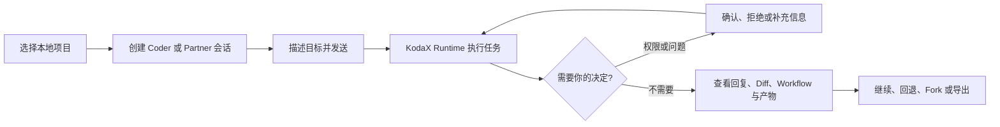
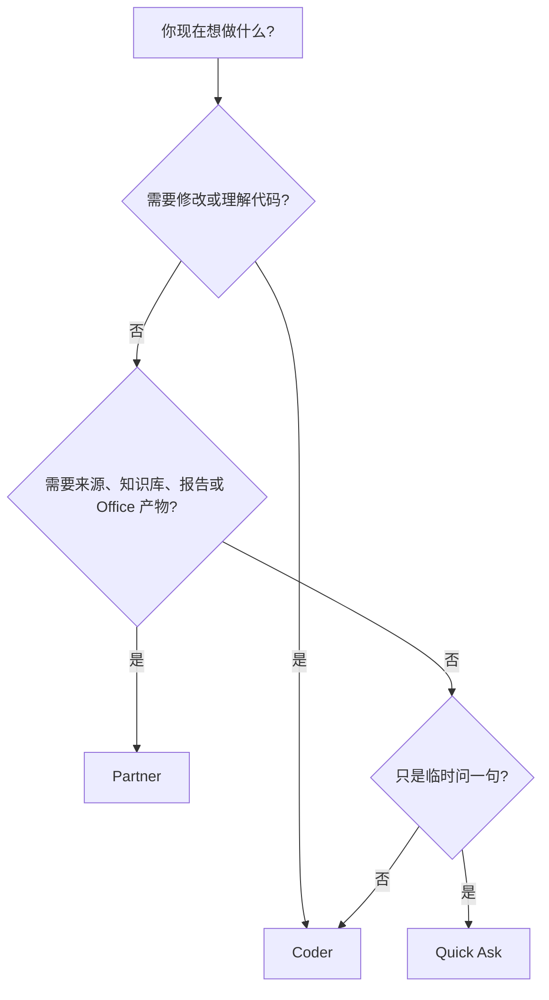
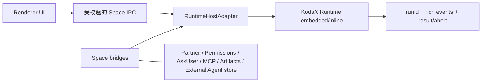
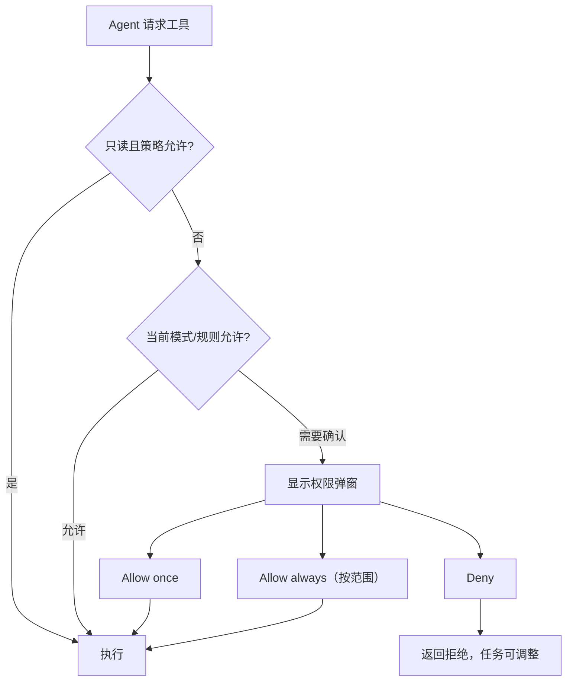
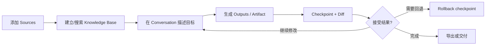
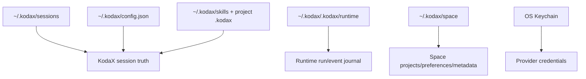

# KodaX Space 用户使用手册

<p align="center">
  
</p>

> 当前正式版本：KodaX Space `v0.1.31` / KodaX `0.7.68`
>
> 更新日期：2026-07-12
>
> 如果你的界面与本文不同，请先在 Settings → License/版本信息中确认构建版本。

这份手册面向第一次使用 KodaX Space 的开发者、技术团队成员和代码相关知识工作者。它以“完成一件真实工作”为主线；架构和开发细节分别放在 [HLD](HLD.md) 与 [USAGE](USAGE.md)。

## 1. 先用一句话理解 KodaX Space

KodaX Space 是运行在你电脑上的 KodaX 桌面工作台：你选择一个本地项目或工作目录，告诉 AI 想完成什么，然后在同一个界面里观察计划、工具调用、文件变化、Workflow、产物和需要你确认的风险操作。



它不是另一个完整 IDE，也不是云端沙箱。代码编辑仍可回到 VS Code、JetBrains 等 IDE；Space 的价值是让本机 Agent 的执行过程、证据和决定更容易看懂和控制。

## 2. 该选 Coder、Partner 还是 Quick Ask



| 入口          | 适合任务                                                       | 当前边界                                                                 |
| ------------- | -------------------------------------------------------------- | ------------------------------------------------------------------------ |
| **Coder**     | 阅读代码、改文件、运行命令、排查问题、评审 Diff、长任务        | 主要软件研发工作面                                                       |
| **Partner**   | 研究、文档、需求、数据分析、演示、知识库、workspace-first 交付 | 已启用；浏览器、通用 Connector 写操作和远程自动化尚未交付                |
| **Quick Ask** | 临时解释、快速确认、短问题                                     | 当前使用临时 Plan session；可提升到 Coder，不是真正无 session side query |

## 3. 安装与首次启动

从 [GitHub Releases](https://github.com/icetomoyo/KodaX-Space/releases/latest) 获取安装包。

| 系统    | 推荐包                                 | 说明                            |
| ------- | -------------------------------------- | ------------------------------- |
| Windows | `Setup.exe`；免安装可用 `Portable.exe` | 浏览器拦截时可使用对应 zip      |
| macOS   | `.dmg`                                 | 首次打开可能需要右键 → 打开     |
| Linux   | `AppImage` 或 `.deb`                   | AppImage 可能需要添加可执行权限 |

当前公开安装包可能未签名。只从可信的 KodaX-AI 发布渠道下载安装；SmartScreen 或 Gatekeeper 提示并不等于文件一定安全，仍需核对来源和版本。

源码启动面向开发者：

```bash
git clone https://github.com/icetomoyo/KodaX-Space.git
cd KodaX-Space
npm install --include=dev
npm run dev
```

## 4. 十分钟完成第一项任务

### 第一步：打开一个项目

点击启动页或左侧栏的打开文件夹入口，选择项目根目录。建议选择仓库根目录，不要直接选择整个用户主目录。

### 第二步：配置 Provider

打开 Settings → Providers：

1. 选择内置 Provider，或点击 Add custom 添加兼容网关。
2. 填入 API Key；Keychain 可用时会保存在系统凭据存储中。
3. 点击 Test connection。
4. 需要时设为默认 Provider。

### 第三步：选择权限模式

第一次体验建议选择 **Plan**，确认 AI 能正确理解项目后，再切到 **Accept Edits**。

### 第四步：发送任务

在底部输入：

```text
请阅读 README、package.json 和主要目录，告诉我这个项目如何启动、核心模块在哪里。
```

你会在中央对话区看到回复和工具卡；右侧 Task Dock 会显示运行、计划、变化和上下文。

### 第五步：试一次受控修改

切换为 Accept Edits，然后发送：

```text
请给 README 增加一个“本地开发”小节。先说明计划，修改后展示 Diff，不要提交 Git。
```

出现权限请求时先阅读工具名、目标路径和参数，再选择 Allow once 或 Deny。完成后从 Task Dock → Changes 打开 Diff。

## 5. 界面地图

```text
┌──────────────────────────────────────────────────────────────────────┐
│ 顶部：Environment Hub │ 活动入口 │ Handoff │ Settings               │
├───────────────┬──────────────────────────────────┬───────────────────┤
│ 左侧栏        │ 中央 Transcript                  │ 右侧 Task Dock    │
│               │                                  │                   │
│ Projects      │ 用户消息                         │ Run / Plan        │
│ Sessions      │ AI 回复                          │ Agents / Workflow │
│ Archived      │ 工具卡 / 权限状态 / 产物卡       │ Changes / Sources │
│               │                                  │ Artifacts/Context │
├───────────────┴──────────────────────────────────┴───────────────────┤
│ 底部 Composer：附件 │ Agent │ Model/Effort │ Mode │ 输入框 │ 发送   │
└──────────────────────────────────────────────────────────────────────┘
```

| 区域            | 你通常在这里做什么                                                               |
| --------------- | -------------------------------------------------------------------------------- |
| 左侧栏          | 打开项目、切换会话、重命名、Fork、Rewind、删除或归档                             |
| Environment Hub | 看当前目录、Git branch/changes、来源和运行上下文，并跳到对应 Task Dock 分区      |
| Transcript      | 阅读对话、工具调用、系统提示、Workflow notice 与 Artifact 卡片                   |
| Task Dock       | 快速查看 Run、Plan、Agents、Workflow、Changes、Sources、Artifacts、Context       |
| Composer        | 输入任务、添加图片/文件、选择 Provider/Model、Effort、Agent Mode 和权限模式      |
| Popout          | 深入查看 Preview、Diff、Terminal、Agents、MCP、Memory、Workflow、Tasks、Artifact |

按 `?` 打开应用内快捷键帮助；按 `Ctrl/Cmd+Shift+P` 打开命令面板。

## 6. 理解项目、会话和一次运行

- **Project**：本地工作目录，也是文件工具的主要边界。
- **Session**：围绕一个项目持续进行的对话，保存 transcript 和上下文。
- **Turn**：你发送一条消息，到这一轮完成、失败或取消。
- **Run**：KodaX Runtime 对一轮任务的执行记录；`v0.1.31` 为新运行提供稳定 `runId` 和事件日志。
- **Artifact**：独立于项目文件的生成物，例如报告、HTML、SVG、PDF、DOCX、XLSX。
- **Workflow**：可观察、可暂停/恢复/停止、可保存和复跑的多步骤任务。

### v0.1.31 的 Runtime Host 对用户有什么影响

没有新增“Runtime 模式”开关。默认仍按原来的 Coder/Partner 方式使用，但底层的新 managed run 通过 inline KodaX Runtime 启动：



用户可感知的目标是：停止更可靠、失败只收口一次、历史操作保持连续，并为后续运行诊断提供事实。Worker 和 daemon 在本版本不可用；Workflow、MCP 进程和 External Agent durable store 仍由 Space 的兼容层负责。

## 7. 权限：什么时候该允许

| 模式             | 建议用途                 | 实际含义                                                |
| ---------------- | ------------------------ | ------------------------------------------------------- |
| **Plan**         | 陌生项目、审阅、先分析   | 以只读分析和计划为主                                    |
| **Accept Edits** | 日常开发，推荐默认       | 文件编辑更顺畅；命令和高风险动作仍可能确认              |
| **Auto**         | 你信任项目、规则和工具时 | 由 LLM/rules guardrail 自动判断，仍受策略和安全边界限制 |

切换方式：底部 ModeSelector、`Shift+Tab`、`Ctrl+M` 或 `/mode`。



不要只看按钮颜色。允许前检查：工具名称、命令、目标路径、是否访问网络、是否会删除/覆盖数据。Auto 不是 OS 安全沙箱，也不是“允许一切”。

## 8. Composer、附件与排队

| 操作             | 结果                             |
| ---------------- | -------------------------------- |
| `Enter`          | 发送                             |
| `Shift+Enter`    | 换行                             |
| `Ctrl/Cmd+Enter` | 排到当前 turn 之后发送           |
| `Esc` 或停止按钮 | 停止当前运行或关闭最上层浮窗     |
| 输入 `/`         | 打开 slash command 与 Skill 补全 |
| 输入 `@`         | 打开项目路径补全                 |

附件规则：

- PNG/JPEG/WEBP 可粘贴或拖入，单轮最多 8 张、单张约 6 MiB。
- 项目内文件优先成为 `@relative/path` 引用。
- 项目外文件以受控文件引用处理，不会自动变成项目文件。
- PDF、DOCX、XLS/XLSX 和文本/代码文件可在 Preview 查看；大文件受大小和单元格数量限制。
- 运行中追加的信息会进入当前 session 的队列；停止任务会同时清理不应继续的后续提示。

## 9. Provider、Model、Effort 与 Agent Mode

Settings 有四个主标签：Preferences、Providers、Runtime、License。

### Provider

内置 Provider 和自定义 OpenAI-compatible/Anthropic-compatible Provider 都从 Providers 管理。环境变量也可提供凭据；UI 会尽量说明凭据来源。自定义 Provider 的 Base URL、协议和模型名必须与服务端实际兼容。

### Model 与 Reasoning Effort

- 会话可覆盖 Provider 和 Model。
- Effort 使用 `off / auto / quick / balanced / deep` 的 Space 抽象，再映射到模型支持的参数。
- `Ctrl+Shift+E` 打开/循环可用 effort；`Ctrl+T` 保留为旧式循环快捷键。
- Thinking 是模型输出行为，不等于 Effort。

### Agent Mode

- **SA**：单 Agent 路径，适合直接、小型任务。
- **AMA**：显式 managed/multi-agent 工作方式。
- **AMAW**：允许 KodaX 根据任务自动组织 Workflow/子任务。

不同 Provider、工具和任务并不保证三种模式产生相同效果。不确定时保留默认值；用 `Alt+M` 或 `/agent-mode` 调整。

## 10. 会话历史、Fork、Rewind 与 Compact

| 操作    | 用途                   | 注意                             |
| ------- | ---------------------- | -------------------------------- |
| Rename  | 给会话一个容易找的名字 | 标题由 Space 兼容层维护          |
| Fork    | 从当前分支派生新会话   | 源会话不变，新会话继承运行设置   |
| Rewind  | 回到较早的用户轮次     | 会先停止当前运行，再截断活动分支 |
| Compact | 压缩长会话上下文       | UI 仍回放完整 append-order 历史  |
| Delete  | 删除会话               | 先确认没有其他 KodaX 进程占用    |

Space 与 KodaX CLI/REPL 共用 `~/.kodax/sessions/`。如果 CLI 改写了正在显示的同一 session，Space 不保证实时文件级同步；切换会话或重启可重新读取。

Quick Ask 的临时 session 会尽力在关闭时清理；选择 Continue in Coder 后会提升为正常 Coder 会话。

## 11. Task Dock 与常用 Popout

| 面板           | 主要用途                                        |
| -------------- | ----------------------------------------------- |
| Plan           | 当前计划与进度                                  |
| Diff / Changes | AI 修改和 Git working tree 差异                 |
| Tasks / Agents | 子 Agent、markdown agents 和外部任务            |
| Workflow       | 多步骤 run、历史与保存的流程                    |
| Preview        | PDF、DOCX、XLS/XLSX、代码和文本预览             |
| Terminal       | 当前项目下的真实 PTY 多标签终端                 |
| MCP            | Server 状态、启停、工具、诊断、`.mcpb`          |
| Memory         | Coder memory proposals、refs、governance、hints |
| Artifact       | 版本、复制、导出、迭代、独立窗口                |

Smart Popout Director 在首次出现 plan、diff 或 task 信号时自动打开一次对应面板。可在 Settings → Preferences 关闭。

## 12. Partner：从来源到可交付成果

Partner 适合把资料整理成可复核的工作成果。推荐流程：



Partner 已支持 Sources、KB、workspace-first Outputs、checkpointed writes、基础 Office/PDF 便利写入和本地 policy/audit。它不会自动获得 Coder 的全部工具，也不应被当成浏览器、邮件发送器或远程办公自动化平台。

## 13. Artifact、Preview 与 Workspace 文件

三类对象不要混淆：

- **项目文件**：属于当前 workspace，由文件工具修改，通常在 Diff 中审阅。
- **Artifact**：由 Space 管理的独立生成物，有自己的版本、复制和导出行为。
- **Partner Output**：面向知识工作的 workspace-first 交付物，可带 checkpoint/diff/rollback。

interactive HTML 在沙箱中预览；React artifact 当前不是 LiveCanvas。Office writer 提供的是可靠基础文件，不承诺品牌模板级排版。

## 14. Workflow、Memory、MCP、Skills 与 External Agents

### Workflow

Workflow 管理多步骤任务和历史。入口包括 `/workflow`、Workflow Launcher、Task Dock 和 Workflow popout。可查看 run、pause/resume/stop、rerun、rename/delete，以及保存/运行 workflow。Space 的 Workflow Controller 保留 durable history、origin、立即停止投影和 Artifact 关联。

### Memory Governance

Memory 是 Coder-only 治理界面：

- Inbox：批准或拒绝 memory proposal。
- Refs：查看已批准引用。
- Governance：检查过期、冲突和合并建议。
- Hints：为当前任务构建 memory pack。

Partner Knowledge Base 与 Coder Memory 是两套不同职责，不能互相替代。

KodaX 0.7.68 新增 FEATURE_260 Memory Agent。它不会创建第二套记忆库，而是在普通 managed run 内复用 F228：已准备好的相关记忆可作为零等待、低权威、默认静默的提示；模型确有需要时可调用只读 `memory_recall({ need })`，但不能自行指定 tenant/user/project 等 scope。任务结束后可形成有界 Outcome Digest，并继续通过 proposal、preview、fingerprint 和 apply 进入现有治理流程。

Space 0.1.31 集成运行契约：启动时验证真实 `/experimental-memory` 导出和 policy，在版本/诊断中如实报告，并记录不含记忆正文的生命周期元数据。普通 recall 不生成“记忆思考”消息；完整 Episodes、Activity、纠正、forget/purge 界面仍属于 F117 计划。现有 Inbox、Refs、Governance、Hints 继续由 F228 提供。

### MCP 与 `.mcpb`

MCP 面板展示 server 状态、命令/URL、start/stop、工具、日志/诊断和扩展卸载。`v0.1.31` 仍由 Space MCP Manager 负责进程和日志，Runtime 不会启动第二套 MCP manager。只安装可信来源的扩展。

### Skills 与 Markdown Agents

- 用户 Skill：`~/.kodax/skills/`
- 项目 Skill：`<project>/.kodax/skills/`
- 在 `/` 补全中调用；重名时使用 `/skill:<name>`。
- `AGENTS.md` 与 markdown agents 提供项目规则和角色，Agent picker 用 `@agent-name` 插入。

### External Agents

Settings → Runtime → External Agents 管理 KodaX `0.7.68` 中保留的 Reference Agent。Task Dock 可查看事件、回复 `input-required`、取消或 reconcile 未知状态。当前 Reference Executor 是本地合规适配器：不访问网络、不直接写 workspace。A2A、MCP Tasks 和 governed HTTP 适配器尚未交付。

## 15. Quick Ask、Handoff 与 CLI 连续性

- `Ctrl/Cmd+K` 打开 Quick Ask。
- `Ctrl/Cmd+Shift+P` 打开命令面板，两者不是同一个功能。
- Quick Ask 需要项目上下文，当前使用临时 Plan session；有价值的回答可 Continue in Coder。
- Handoff inbox 读取 `~/.kodax/handoffs/*.json`；Accept 前会验证目标 session，Dismiss 会移除 descriptor。
- 当前 Space 已实现 handoff receiver；CLI writer 是否可用取决于 KodaX 的公开契约。

## 16. 常用 Slash 命令

以应用内 `/help` 为最终准确信息。高频命令：

| 命令                                        | 作用                          |
| ------------------------------------------- | ----------------------------- |
| `/mode`                                     | 查看或切换权限模式            |
| `/provider`、`/model`                       | 切换 Provider/Model           |
| `/reasoning`、`/thinking`                   | 调整 Effort/Thinking          |
| `/agent-mode`                               | 切换 SA/AMA/AMAW              |
| `/workflow`                                 | 启动或查看 Workflow           |
| `/compact`                                  | 立即压缩当前持久会话上下文    |
| `/tree`、`/history`                         | 查看 lineage 或用户消息历史   |
| `/fork`、`/rewind`                          | 派生或回退会话                |
| `/memory`、`/skills`、`/mcp`、`/extensions` | 打开对应能力入口              |
| `/doctor`、`/status`、`/repointel`          | 诊断 Provider、会话与仓库智能 |
| `/review`                                   | 插入评审模板和当前未提交 Diff |

## 17. 快捷键速查

`Mod` 表示 macOS 的 `Cmd`、Windows/Linux 的 `Ctrl`。

| 快捷键                    | 作用                   |
| ------------------------- | ---------------------- |
| `Mod+K`                   | Quick Ask              |
| `Mod+Shift+P`             | 命令面板               |
| `Mod+N`                   | 新建会话               |
| `Mod+O`                   | 打开文件夹             |
| `Mod+,`                   | Settings               |
| `Shift+Tab`               | 循环权限模式           |
| `Ctrl+M`                  | 权限模式选择器         |
| `Ctrl+Shift+E`            | Reasoning Effort       |
| `Alt+M`                   | Agent Mode             |
| `Mod+F`                   | Transcript 搜索        |
| `Ctrl+Shift+O`            | Transcript 视图菜单    |
| `Ctrl+\`                  | Coder 专注模式         |
| `Ctrl+Shift+V`            | Preview                |
| `Ctrl+Shift+D`            | Diff                   |
| Ctrl + 反引号（`）        | Terminal（按平台映射） |
| `Ctrl+Shift+T`            | 循环主题               |
| `Ctrl+滚轮`、`Ctrl+=/-/0` | 全局缩放               |
| `?`                       | 帮助                   |

## 18. 数据、安全与隐私



说明：默认 profile 根是 `~/.kodax`；因此 Runtime journal 的实际默认位置是 `~/.kodax/.kodax/runtime`。自定义 `KODAX_HOME` 或 `KODAX_PROFILE_DIR` 时路径随 profile 移动。

- Renderer 不直接执行 LLM、文件工具或 shell。
- API Key 不应进入 renderer、普通 IPC 列表、日志或错误消息。
- Terminal 会剥离常见 `*_KEY`、`*_TOKEN` 环境变量。
- 第三方 Provider 会收到你实际提交给模型的内容；敏感代码仍应遵循组织政策。
- Worker isolation 不是 OS sandbox；本版本实际使用 inline Runtime。

## 19. 常见问题

| 问题                        | 建议检查                                                                         |
| --------------------------- | -------------------------------------------------------------------------------- |
| Provider 显示 No key        | Settings → Providers、环境变量名、Keychain 可用性                                |
| Test connection 失败        | Base URL、协议、模型名、网络代理、服务端鉴权                                     |
| AI 看不到文件               | 是否已打开正确项目、路径是否在 workspace、是否正确使用 `@path`                   |
| 为什么一直弹权限            | 当前 Mode、工具风险、Allow always 的 scope、项目是否可信                         |
| 停止后仍看到旧输出          | 等待取消终态；若持续出现，记录 session、时间和日志报告问题                       |
| 历史看起来不完整            | 重开 session；检查是否 compact/rewind；确认 CLI 是否同时改写                     |
| MCP 工具不可见              | MCP 面板 Refresh/Reload、server 状态、PATH、配置来源和 diagnostics               |
| Partner 没有浏览器/邮件发送 | 当前未交付，不是配置错误                                                         |
| External Agent 不可选       | Reference 注册需 enabled 且 preflight 通过；真实网络适配器尚未交付               |
| Quick Ask 不能打开          | 先打开项目；使用 `Mod+K`，不要与命令面板混淆                                     |
| 语言切换后仍有英文          | 模型输出、工具日志、文件内容和第三方数据不会被强制翻译                           |
| UI 白屏或状态异常           | 记录版本、打开 DevTools、查看 `~/.kodax/space/logs`，不要直接删除整个 `~/.kodax` |

## 20. 当前限制与诚实边界

- `v0.1.31` 已正式采用 inline Runtime Host；Worker/daemon、Runtime-native Workflow/MCP/Skills/Partner 等仍不属于本版本承诺。
- Worker、daemon 和 Runtime Learning Center 尚未成为当前可用桌面能力。Memory Agent 的 0.7.68 运行契约已经集成；完整 F117 桌面管理体验尚未交付。
- Partner 浏览器、通用 Connector、远程任务、桌面电脑控制和自动化尚未交付。
- External Agent 只有本地 Reference Executor；A2A/MCP Tasks/governed HTTP 不可用。
- Quick Ask 不是完全无 session side query。
- React artifact 不是可交互 LiveCanvas。
- Office/PDF writer 是基础可靠输出，不是品牌模板级设计系统。
- 安装包签名、release channel 与诊断导出仍在后续版本计划中。

## 21. 获取帮助与反馈

提交问题时尽量提供：

1. Space 与 KodaX 版本；
2. 操作系统和安装方式；
3. Coder/Partner/Quick Ask 与 session 状态；
4. 可重复的步骤；
5. 脱敏后的日志、错误和截图；
6. 是否设置 `KODAX_HOME`、`KODAX_PROFILE_DIR` 或 Runtime rollback 环境变量。

普通问题可使用 GitHub Issues。安全漏洞、凭据泄露或未公开数据请不要提交公开 Issue，应通过私密渠道联系维护者。

更多入口：

- [文档中心](README.md)
- [开发与运行指南](USAGE.md)
- [能力台账](KODAX_CAPABILITY_LEDGER.md)
- [当前路线图](FEATURE_LIST.md)
- [v0.1.31 人工测试指导](test-guides/FEATURE_116_v0.1.31_TEST_GUIDE.md)
