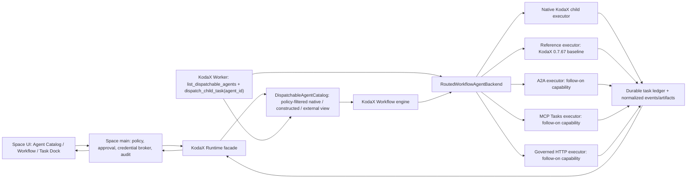

# v0.1.31 - External Agent Orchestration Gateway

> Design batch: F115
> Status: Completed for the KodaX 0.7.67 Reference Executor baseline; real protocol adapters remain capability-gated follow-ons
> Priority: Critical
> Created: 2026-07-10
> Source of truth: [FEATURE_LIST.md](../FEATURE_LIST.md) + this design

> Implemented 2026-07-11: Space now owns a bounded persistent `AgentExecutorPlane`, injects the same binding into live session Workers and explicit Workflow launches, exposes redacted admin/catalog/task IPC, and provides a Runtime Settings surface for Reference registrations. Compatibility coverage proves 0.7.67 Runtime registration/discovery/task completion and Space coverage proves persistence plus input/reconcile identity. The host also performs a Reference-only continuation reconcile so a slow durable store cannot strand the 0.7.67 conformance executor at `working`; real adapters retain native event semantics. A2A, MCP Tasks, and governed HTTP are deliberately reported unavailable until upstream adapters ship and pass conformance.

Baseline acceptance completed in this tranche:

- [x] exact root/desktop dependency and lockfile resolution to `@kodax-ai/kodax@0.7.67`;
- [x] one bounded persistent executor plane with Reference Factory and fail-closed credential/artifact policies;
- [x] the same binding in live session Workers and explicit Workflow launch options;
- [x] redacted registration, dispatchability, and task IPC with no executor config or secret in renderer state;
- [x] Runtime Settings Reference registration management, editing, enable/disable, removal, live preflight, and conformance launch;
- [x] policy-filtered Workflow default child Agent selection with revision-aware preflight and authored-target precedence;
- [x] Task Dock lifecycle, event timeline, input-required continuation, cancel and reconcile interventions;
- [x] complete `en-US` / `zh-CN` localization and Electron accessibility/UI regression coverage;
- [x] Reference dispatch, durable terminal results, input continuation, cancellation/reconcile primitives, and restart reload coverage;
- [x] full Electron E2E suite passes (57/57), including two dedicated Reference Agent journeys;
- [x] review hardening covers 512+ event pagination, host-issued registration identity, primary-window-only administration, main-derived task ownership, session-scoped reads/interventions, stale-response rejection, non-overlapping adaptive polling, resolved-revision audit, Workflow method binding, and version-derived packaged Runtime smoke;
- [x] A2A, MCP Tasks, and governed HTTP capability flags remain false.

## FEATURE_115: External Agent Orchestration Gateway

### 1. Decision

KodaX Space should support customer-owned agents through one protocol-neutral **External Agent Executor Plane**, rather than implementing three independent orchestration models in the desktop application.

- **A2A is the preferred full-agent protocol**: use Agent Card discovery plus task/message/artifact/streaming semantics when the customer agent supports them.
- **MCP keeps its original tool/data role**, while an explicit KodaX `McpAgentProfile` identifies which MCP tool is a long-running agent entry point. Use MCP Tasks when both sides support the experimental Tasks capability; otherwise the invocation is a bounded blocking tool call, not a durable remote task.
- **Private HTTP is a governed compatibility adapter**: support declarative sync, async-poll, and optionally async-SSE profiles. Do not accept arbitrary JavaScript request/response mappings.
- **Workflow 和 `dispatch_child_task` 必须消费同一个可调度 Agent 目录**：接入成功的第三方 Agent 只有在当前 actor/project/task 策略下通过资格过滤后，才出现在 Workflow picker、KodaX Worker 的发现工具和 dispatch 路由中。
- **外部 Agent 不能伪装成本地 Constructed Agent**：现有 `subagent_type` 继续兼容本地 specialist；新增稳定的 `agent_id` 选择统一目录中的 native/constructed/external target，远程 target 通过 External Agent Executor Plane 执行。
- **KodaX SDK owns orchestration semantics and executor lifecycle**. Space owns registration UI, policy, credentials, approvals, task presentation, and audit UX. Space must not add protocol branches directly to `workflow-controller.ts`.
- Protocol selection is resolved and recorded **before dispatch**. After a remote system accepts a task, Space/KodaX must reconcile that same task and must not silently fail over to another protocol or agent.
- **Release truth follows Runtime capabilities**: KodaX `0.7.67` supplies the protocol-neutral Catalog, Executor Plane, Task Ledger, Worker/Workflow bridge, Runtime API, and Reference Executor. Space integrates and proves that substrate first; A2A, MCP Tasks, and governed HTTP are enabled only as their separately delivered adapters pass conformance.

The first release is outbound only: Space/KodaX calls customer agents. Hosting KodaX itself as a public A2A/MCP/HTTP agent endpoint is a separate feature.

### 2. Why this is a distinct product capability

The current concepts must remain separate:

| Concept                         | What it represents                       | Orchestration semantics                                                                        |
| ------------------------------- | ---------------------------------------- | ---------------------------------------------------------------------------------------------- |
| Provider                        | Model inference endpoint                 | Tokens/model calls; not an autonomous task owner                                               |
| Connector / ordinary MCP server | Tools, prompts, and resources            | A KodaX agent invokes a capability and remains the task owner                                  |
| External Agent                  | A customer-owned autonomous executor     | Accepts a delegated task, exposes lifecycle, may request input, and returns messages/artifacts |
| Remote Runner                   | KodaX execution moved to another machine | Still a KodaX runtime; this is deployment placement, not third-party-agent interoperability    |

F115 therefore does not replace F096 Connectors or F099 Remote Runner. It adds the missing **delegated-agent** boundary.

### 3. Customer outcomes

An administrator can register a customer agent once, test connectivity and capabilities, and expose it only to approved projects/workflows. A workflow author can explicitly select that agent for a node. A KodaX Worker can query the policy-filtered dispatchable-agent list and pass the returned opaque `agent_id` unchanged to `dispatch_child_task`, so a remote customer agent participates as a real child task with parent/child lineage. During execution, the user can see which external agent owns the task, its normalized state and progress, input requests, artifacts, costs/usage when reported, and a complete audit trail. The user can cancel or answer the task without learning the underlying protocol.

The system must support these representative cases:

1. Delegate a research task to an A2A agent and stream progress/artifacts into Task Dock.
2. Invoke a customer agent exposed as an MCP tool, with durable task polling when MCP Tasks is negotiated.
3. Start a job through an intranet HTTP API, poll its customer job ID, normalize its state, and collect declared artifacts.
4. Resume/reconcile an accepted remote task after Space restarts or reconnects.
5. Deny dispatch when destination, credential, capability, data classification, project scope, or budget violates local policy.
6. Let a KodaX Worker call `list_dispatchable_agents`, choose an eligible third-party Agent, and dispatch it as a child through the same `task_output`/`task_stop`/progress surfaces used by local children.

### 4. Scope and non-goals

#### Included in F115

- Local Agent Catalog with protocol configuration, capability snapshot, policy scope, health/preflight result, and credential references.
- A policy-filtered `DispatchableAgentCatalog` projection spanning native, constructed, and external registrations, with opaque SDK-issued IDs and revision snapshots.
- Explicit workflow target selection; the built-in child (`native:kodax-child`) remains the backward-compatible default.
- A bridge from KodaX `dispatch_child_task` to the same executor router and task ledger, plus an on-demand `list_dispatchable_agents` discovery tool/API.
- Protocol-neutral task lifecycle, events, messages, input requests, artifacts, cancellation, reconciliation, attribution, and audit.
- KodaX `0.7.67` Reference Executor integration and conformance coverage as the v0.1.31 baseline.
- Capability-gated follow-on integration for A2A, explicit MCP Agent Profile/Tasks, and declarative private HTTP adapters in that order; an adapter is not a v0.1.31 capability until Runtime advertises it and conformance passes.
- Runtime/daemon facade required by Space, including `workflows.start`.
- Egress, credential, artifact, budget, and audit controls.

#### Not included in F115

- Automatically treating every MCP tool as an agent.
- Registering a remote A2A/MCP/HTTP endpoint as a fake local `Agent` declaration and executing it through the local constructed-agent runner.
- LLM-based dynamic routing among customer agents. F115 uses explicit or deterministic policy-approved routing.
- Arbitrary mapping scripts, arbitrary headers in renderer state, or renderer access to raw secrets.
- Push webhooks in the first release. A2A/MCP/HTTP use outbound stream or poll so Space does not expose a callback listener and SSRF surface.
- Silent cross-protocol retry after the remote side may have accepted a task.
- Hosting a public inbound A2A server, MCP server, or generic agent gateway.
- Direct third-party access to unrestricted local files, shell, KodaX memory, or Space IPC.
- Claiming full MCP durable-agent support when only a normal blocking tool call is available.
- General multi-agent planning, auctions, marketplaces, or autonomous agent discovery.

### 5. Target architecture and ownership



| Layer              | Owns                                                                                                                                                                                                                                        | Must not own                                                                                   |
| ------------------ | ------------------------------------------------------------------------------------------------------------------------------------------------------------------------------------------------------------------------------------------- | ---------------------------------------------------------------------------------------------- |
| KodaX SDK          | Opaque Agent IDs, registration catalog, descriptor/live-dispatchability split, executor interface/registry/router, Workflow target, lifecycle/cancel normalization, event cursor, durable task identity, reconciliation, runtime/daemon API | Space-specific forms, secret material, renderer IPC                                            |
| Space main process | Admin UX, policy evaluation, egress approval, Host Credential Broker, descriptor cache, audit persistence/redaction, artifact quarantine/export policy                                                                                      | A second catalog identity scheme, a second task state machine, or protocol-specific task truth |
| Space renderer     | Registration/workflow/task UX and user decisions                                                                                                                                                                                            | Raw credentials, unrestricted network calls, authoritative task state                          |
| Protocol adapter   | Discovery, wire translation, protocol auth challenge mapping, remote IDs and cursors                                                                                                                                                        | Product policy decisions or implicit access to local workspace                                 |

ADR-003's in-process KodaX embedding remains valid: the Space-to-KodaX boundary can stay in-process. A2A/MCP/HTTP are **KodaX-to-customer-agent** adapters behind the SDK interface, not a replacement ACP connection between Space and KodaX.

### 6. Canonical domain contract

The executor contract must preserve protocol details for diagnosis without leaking them into Workflow logic.

```ts
export type ExternalAgentProtocol = 'native' | 'reference' | 'a2a' | 'mcp' | 'http';

export interface WorkflowAgentTarget {
  agentId: string;
  expectedConfigurationRevision?: string;
}

export type CapabilitySupport = 'supported' | 'unsupported' | 'conditional';

export interface AgentCapabilities {
  streaming: CapabilitySupport;
  durableTasks: CapabilitySupport;
  inputRequired: CapabilitySupport;
  cancellation: CapabilitySupport;
  restartRecovery: CapabilitySupport;
  artifacts: CapabilitySupport;
}

export interface AgentDescriptor {
  /** Opaque SDK-issued identifier. Space stores and echoes it but never parses it. */
  agentId: string;
  displayName: string;
  protocol: ExternalAgentProtocol;
  description?: string;
  origin: 'native' | 'constructed' | 'external';
  capabilities: AgentCapabilities;
  configurationRevision: string;
  policyTags?: string[];
  skills?: readonly string[];
  inputModalities?: readonly string[];
  outputModalities?: readonly string[];
  remoteEffect: 'none' | 'read' | 'write' | 'unknown';
  workspaceEffect: 'none' | 'proposal';
}

export interface DispatchableAgentState {
  agentId: string;
  observedConfigurationRevision: string;
  availability: 'available' | 'degraded' | 'busy';
  capabilityConditions?: Readonly<Record<string, string>>;
  checkedAt: string;
}

export interface DispatchableAgentEntry {
  /** Stable/cacheable metadata remains structurally separate from live state. */
  descriptor: AgentDescriptor;
  state: DispatchableAgentState;
}

export interface DispatchableAgentQuery {
  actorId: string;
  projectId?: string;
  workflowId?: string;
  parentTaskId?: string;
  requiredSkills?: readonly string[];
  requiredCapabilities?: Partial<AgentCapabilities>;
  dataClassifications?: readonly string[];
}

export type AgentTaskState =
  | 'submitted'
  | 'working'
  | 'input-required'
  | 'auth-required'
  | 'completed'
  | 'failed'
  | 'canceled'
  | 'rejected'
  | 'unknown';

export type AgentTaskCancelState =
  | 'none'
  | 'requested'
  | 'confirmed'
  | 'unsupported'
  | 'failed'
  | 'unknown';

export interface AgentTaskHandle {
  taskId: string;
  executorId: string;
  agentId: string;
  protocol: ExternalAgentProtocol;
  remoteTaskId?: string;
  state: AgentTaskState;
  cancelState: AgentTaskCancelState;
  acceptedAt?: string;
  configurationRevision: string;
}
```

`WorkflowSpawnAgentInput` gains `target?: { agentId; expectedConfigurationRevision? }`. Protocol is deliberately absent: the Catalog resolves protocol/executor from the opaque `agentId`. Space persists the exact returned ID and never constructs, namespaces, splits, or otherwise interprets it. Project-level IDs must already encode stable scope inside the SDK-owned opaque value. The default built-in child target is `native:kodax-child`, not the top-level Worker identity. A selected target is snapshotted by ID and observed configuration revision at dispatch; if `expectedConfigurationRevision` is present and stale, preflight/start fails explicitly instead of silently using changed configuration.

There are two separate registries and one federated read model:

- **Executor Registry** contains implementations registered by stable `executorId`. Multiple factories may implement the same protocol.
- **Agent Registration Catalog** contains concrete configured instances, including endpoint/profile references, `executorId`, `credentialRef`, and policy metadata.
- **DispatchableAgentCatalog** projects native/constructed agents plus eligible external registrations into one policy-filtered list. It is the only list consumed by Workflow pickers and KodaX dispatch discovery.

The external registration must not be inserted into `listConstructedAgents()` as a fake local `Agent`; doing that would send it through `child-executor.ts` and incorrectly apply local instructions/tool-whitelist semantics. `agentId` is opaque to Space and all other clients. Only the Catalog owns identity formation, collision handling, scope encoding, lookup, and protocol/executor resolution.

Stable descriptor data and live dispatch state are separate contracts. Space may cache `AgentDescriptor` fields such as name, description, skills and declared capability support for presentation, but it must call `listDispatchable` before showing an eligible Workflow choice and call `preflight` immediately before start. `supported | unsupported | conditional` prevents conditional MCP Tasks, cancellation, and restart recovery from being flattened into misleading booleans; preflight resolves the applicable conditions for this registration and task.

`remoteEffect` describes effects in the customer's remote system, while `workspaceEffect` describes whether the Agent can return a local workspace proposal. `readOnly` is only a pre-dispatch eligibility constraint evaluated against these declarations and policy. KodaX does not claim to sandbox the remote system.

The normalized task input contains:

- task text/instructions;
- typed parts: text, structured JSON, artifact reference, and bounded file reference;
- project/workflow/node/run correlation IDs;
- user/tenant policy context without raw credentials;
- optional conversation/context ID for an intentional follow-up;
- deadline, idempotency key, and budget envelope.

The normalized result contains final state, messages, artifacts, structured output, usage/cost when reported, warnings, protocol diagnostics, and immutable attribution (`agentId`, executor, endpoint identity/hash, configuration revision, remote task ID).

#### State normalization

| Canonical state  | Meaning                                                                                | Terminal |
| ---------------- | -------------------------------------------------------------------------------------- | -------: |
| `submitted`      | Local record exists; dispatch or remote acceptance is pending                          |       No |
| `working`        | Remote executor accepted and is processing                                             |       No |
| `input-required` | User/application input is needed for the same task                                     |       No |
| `auth-required`  | Additional authorization is required; never display a raw secret challenge in renderer |       No |
| `completed`      | Final outputs are available                                                            |      Yes |
| `failed`         | Execution ended unsuccessfully                                                         |      Yes |
| `canceled`       | Remote/executor cancellation is confirmed; a local request alone is insufficient       |      Yes |
| `rejected`       | Dispatch was denied or remote rejected before acceptance                               |      Yes |
| `unknown`        | Reconciliation cannot currently determine the remote state                             |       No |

Unknown is not failure. If the network fails after the remote may have accepted the task, the task becomes `unknown` and may only reconcile; it must not automatically call start again. Task state and cancel state are orthogonal: `cancelState=requested` does not make `state=canceled`; only confirmed remote cancellation can produce the terminal canceled state. Unsupported, failed, and unknown cancellation outcomes remain visible and auditable.

### 7. Follow-on protocol adapter target designs

These sections define the adapter contracts Space will consume after the KodaX `0.7.67` neutral substrate. They are not claims that `0.7.67` or the initial v0.1.31 integration already ships the protocol adapters.

#### 7.1 A2A adapter: preferred full-agent path

Registration accepts an Agent Card URL or a policy-approved static card. Preflight must validate the selected interface/binding, protocol version, declared skills/capabilities, authentication scheme, TLS destination, and response size. The catalog stores a sanitized capability snapshot and content hash, not bearer tokens.

Execution maps canonical operations to A2A message/task operations:

- create/send task message, with a stable client message ID/idempotency key;
- consume streaming updates when supported, otherwise poll/get task;
- map task state, status messages, artifacts, and input/auth-required transitions;
- send follow-up input against the same task/context;
- cancel when advertised and supported;
- reconcile by remote task ID after reconnect/restart.

A2A tranche constraints:

- outbound HTTPS by default; private CA support is an administrator-controlled trust-store choice;
- no push notification callback registration;
- redirects, DNS rebinding, loopback/link-local/cloud metadata destinations, and cross-host artifact downloads are policy checked;
- Agent Card changes produce a new configuration revision and require re-approval when security/capabilities materially change;
- isolate A2A SDK wire types behind the adapter. The JavaScript SDK's stable/v-next maturity must not leak into KodaX public types; pin and compatibility-test the chosen version.

#### 7.2 MCP Agent Profile: explicit, never inferred

MCP remains a general context/tool protocol. A server becomes an external-agent target only through an administrator-created profile such as:

```ts
export interface McpAgentProfile {
  serverId: string;
  invokeTool: string;
  taskMode: 'blocking' | 'tasks-required' | 'tasks-preferred';
  inputSchemaRevision?: string;
  outputMapping: {
    textPath?: string;
    structuredContentPath?: string;
    artifactPaths?: string[];
  };
}
```

- `blocking`: one bounded `tools/call`; KodaX can cancel the local wait/transport when possible, but must not claim durable remote cancellation or recovery unless the server contract supplies it.
- `tasks-required`: registration/preflight fails unless MCP Tasks is negotiated for the selected operation.
- `tasks-preferred`: use Tasks when negotiated; otherwise record the downgraded blocking semantics before dispatch and surface that limitation.

When Tasks is available, the adapter maps task creation, status retrieval, result retrieval, cancellation, and task-scoped auth context into the canonical ledger. Because MCP Tasks in specification revision `2025-11-25` is experimental, the adapter must be capability-negotiated and version-isolated. F115 must not modify MCP's base protocol or invent implicit agent semantics that other MCP clients cannot understand.

#### 7.3 Governed private HTTP adapter

HTTP registration uses one of a small number of declarative profiles:

| Profile      | Start response             | Progress/result                       | Required identity               |
| ------------ | -------------------------- | ------------------------------------- | ------------------------------- |
| `sync`       | Final response             | Same response                         | Local task ID + idempotency key |
| `async-poll` | Customer job ID/status URL | Bounded polling                       | Stable remote job ID            |
| `async-sse`  | Customer job ID + stream   | SSE plus final fetch/reconnect cursor | Stable remote job ID            |

The configuration declares method/path, allowed base origin, auth reference, fixed safe headers, timeout/poll policy, request template fields, and JSON Pointer response mappings. Mapping expressions cannot execute code or access the environment/filesystem.

Required HTTP behavior:

- send a stable idempotency key and correlation ID;
- distinguish connect failure from an ambiguous timeout after possible acceptance;
- persist remote job ID before treating dispatch as accepted;
- honor bounded `Retry-After` and retry policy only for safe/idempotent operations;
- support explicit status/result/cancel endpoints for async profiles;
- cap body/artifact sizes and sanitize error bodies before audit/UI;
- disallow renderer-supplied destinations and headers;
- validate every redirect and artifact URL against the egress policy.

An HTTP endpoint with only `POST -> final JSON` can be useful, but is correctly labeled a synchronous agent adapter with limited lifecycle guarantees.

#### 7.4 Deterministic protocol selection

An Agent Catalog entry may expose multiple approved interfaces. Selection is resolved during preflight using an explicit configured preference, with the recommended capability order:

1. A2A with durable task semantics;
2. MCP Agent Profile with MCP Tasks;
3. HTTP async-poll/async-SSE;
4. MCP blocking tool;
5. HTTP sync.

This is a preference, not blind fallback. The registration resolves a stable `executorId`; the router does not assume one global Factory per protocol. The resolved executor ID, endpoint identity, capability snapshot, and configuration revision are written into the task record before dispatch. A failure before any possible acceptance may retry according to policy. An ambiguous or accepted dispatch is reconciled through the same executor.

#### 7.5 `dispatch_child_task` bridge and dispatchable-agent lists

KodaX already has FEATURE_191 specialist routing: `dispatch_child_task(subagent_type="...")` resolves `listConstructedAgents()` / `resolveConstructedAgent()` and executes the selected local specialist through `child-executor.ts`. F115 must extend this dispatch surface without breaking it.

The recommended tool contract is:

```ts
interface DispatchChildTaskInput {
  objective: string;
  /** Opaque selector returned by list_dispatchable_agents. */
  agent_id?: string;
  /** Backward-compatible local constructed-agent selector. */
  subagent_type?: string;
  readOnly?: boolean;
  // Existing scope/evidence fields remain unchanged. provider/model/effort
  // retain their existing meaning for KodaX local children only.
}
```

- `agent_id` and `subagent_type` are mutually exclusive. Supplying both is a correctable tool error.
- `subagent_type` keeps the current local specialist behavior.
- `agent_id` resolves only through `DispatchableAgentCatalog`, re-runs preflight/policy at dispatch time, snapshots the revision, and routes through `RoutedWorkflowAgentBackend`/`AgentExecutor`.
- `agent_id` is copied exactly from the Catalog. Space, Workflow authors, and the Worker never construct or parse it.
- Omitting both preserves the current anonymous local child behavior.
- A remote child receives a normal local child-task ID and parent-task lineage. Existing progress/task-output surfaces consume normalized ledger events rather than protocol events directly.
- `task_output` reads the normalized snapshot/result; `task_stop` calls executor cancellation and reports requested/confirmed/unsupported truthfully; parent/user continuation maps to `sendInput` only when the target supports it.
- `readOnly` cannot sandbox a remote system. For an external target it is only a preflight eligibility constraint evaluated against `remoteEffect` and `workspaceEffect`. F115 does not grant direct external writes to the local workspace; file changes return as governed artifacts/proposals.
- Existing `provider`, `model`, and `effort` parameters remain KodaX local-child controls and are not forwarded to a generic external Agent. Remote model choice belongs in governed Registration/Adapter configuration.

Three lists serve different audiences and must not be conflated:

| List/API                                | Audience                                  | Contents                                                                                                                                                           |
| --------------------------------------- | ----------------------------------------- | ------------------------------------------------------------------------------------------------------------------------------------------------------------------ |
| `runtime.admin.agentRegistrations.list` | Space main-process admin path             | All configured external entries, including disabled/unhealthy items and redacted diagnostics; never raw secrets                                                    |
| `agents.listDispatchable(query)`        | Workflow picker, KodaX Worker, SDK caller | Only agents eligible for the current actor/project/parent task after policy, credential, health, concurrency, budget, data-classification and capability filtering |
| `agentTasks.list(filter)`               | Task Dock, support/audit                  | Current and historical normalized task handles/results visible to the caller                                                                                       |

Because the existing `list_agents` name may represent live/running child agents, F115 should not silently change its meaning. Add an explicit `list_dispatchable_agents` KodaX tool backed by `agents.listDispatchable`. Its output includes opaque `agent_id`, display name, short description, origin, protocol, skills/modalities, three-state lifecycle capabilities, remote/workspace effect declarations, live availability and observed configuration revision. It excludes endpoint URLs, credentials and denied registrations.

The KodaX Worker receives a short conditional prompt hint that the discovery tool exists; the full catalog is fetched on demand to avoid prompt bloat and stale capability snapshots. Choosing an entry is explicit: the model calls `dispatch_child_task(agent_id="...")`. F115 does not introduce a hidden scheduler that changes the selected target after dispatch.

### 8. Space product surface

#### Agent Catalog

The Settings/Admin surface provides:

- name, description, owner, protocol and endpoint/profile;
- credential selection by opaque `credentialRef`;
- cacheable descriptor/capability declaration and separately labeled last live preflight time;
- `supported` / `unsupported` / `conditional` lifecycle badges, with resolved conditions from the latest preflight;
- project/workflow scope, data classification, allowed artifact types/sizes, egress destination, concurrency and budget policy;
- disable/revoke, configuration revision history, and active-task warning;
- `Test connection` and `Validate capabilities` actions that do not run a production task.
- an admin registration list plus a separate `Eligible for dispatch` preview for a selected project/actor, including filtered-out reasons without exposing secrets.

#### Workflow authoring and run preflight

- Agent-executing nodes and manual child-dispatch surfaces refresh the same `agents.listDispatchable` projection immediately before display: built-in child (`native:kodax-child`), constructed specialists, and policy-approved external entries.
- The selected agent is explicit in the node and run confirmation; no hidden model-based choice in F115.
- Space stores the Catalog's opaque `agentId` verbatim and calls preflight immediately before start; preflight explains stale expected revision, missing credentials, conditional/unsupported lifecycle needs, destination/policy denial, unavailable agent, or blocking-only downgrade.
- Workflow run records preserve agent revision and attribution.

#### Task Dock and intervention

- Show agent/protocol, normalized state, elapsed time, last update, remote ID (redacted as configured), usage/cost, and connection/reconciliation state.
- Stream normalized progress without flooding the main transcript.
- Render input-required as an explicit continuation of the same task.
- Show task state and cancel state separately: `Cancel requested` is not `Canceled`; confirmed, unsupported, failed, and unknown cancellation outcomes remain visible.
- Route artifacts through Space's existing artifact/delivery policy before preview or export.
- Provide a redacted protocol diagnostic bundle for support.

### 9. Security, governance, and reliability

F115 is a trust-boundary feature. Minimum controls are release gates, not follow-up polish:

1. **Egress allow-list**: scheme, resolved host/IP range, port, redirect targets, and artifact origins are policy checked. Protect loopback, link-local, multicast, cloud metadata, DNS rebinding, and proxy bypass cases.
2. **Credential broker**: Registration, Workflow, Task, Event, audit, and logs contain only `credentialRef`; API keys, tokens, and Authorization headers are supplied transiently by the Host Credential Broker, never serialized to SDK Client/renderer payloads, and can be revoked independently.
3. **Least disclosure**: a task receives only explicitly attached text/artifacts and approved metadata, never ambient project files, memory, shell, or full transcript by default.
4. **Artifact quarantine**: MIME sniffing, extension mismatch detection, size/count limits, hash, provenance, safe preview, and explicit export/apply policy.
5. **Idempotency and ambiguous dispatch**: stable keys, persisted attempt records, and reconciliation prevent accidental duplicate remote work.
6. **Durable ledger**: local task state, remote identity, cursor, last event, executor revision, and terminal result survive restart. The remote system remains authoritative for remote task state; local policy remains authoritative for visibility/export.
7. **Backpressure**: bounded event rate/size, reconnect strategy, heartbeat timeout, polling interval, total deadline, concurrency and per-agent queues.
8. **Audit**: actor, project/workflow/run/node, agent/revision/protocol, endpoint identity hash, policy decision, credential reference ID (not secret), data/artifact classification, lifecycle transitions, user interventions, usage/cost, and redacted error.
9. **Extension isolation**: daemon-loaded executor extensions need a controlled registration path and lifecycle. Secrets and privileged network access cannot be exposed through an untrusted renderer plugin.
10. **No capability inflation**: UI and logs distinguish declared, preflight-verified, and actually observed capabilities.

### 10. KodaX SDK 对齐后的上游契约

> 2026-07-10：本节已经吸收 KodaX SDK 团队根据实际代码给出的契约修正，并作为 Space 后续接入的上游基线。

#### 10.1 需求名称

**External Agent Executor Plane + Dispatchable Agent Catalog：KodaX `0.7.67` 先交付协议中立 Catalog、Executor Plane、Task Ledger、Worker/Workflow Bridge、Runtime API 和 Reference Executor；A2A、MCP Tasks、Governed HTTP Adapter 后续分批交付。**

#### 10.2 背景与目标

KodaX Space 的客户需要把其已有 Agent 接入 Workflow，并与 KodaX 自有 Agent 一起被启动、观察、交互、取消、恢复和审计。协议至少包括 A2A、MCP 和私有 HTTP API。

当前 KodaX 已有可复用基础：

- `packages/agent/src/workflow/types.ts` 已有 `WorkflowSpawnAgentInput` 与 `WorkflowAgentBackend` 中性缝隙；
- FEATURE_191 已让 `dispatch_child_task(subagent_type)` 查询 `listConstructedAgents()` / `resolveConstructedAgent()` 并路由本地 specialist，Worker prompt 也会注入本地 `Available specialist agents`；这是可复用的 dispatch 入口，但当前只认识本地 Constructed Agent；
- `src/sdk-runtime.ts` 已有 Runtime facade 和 Workflow observe/control 服务；
- KodaX `0.7.64-0.7.66` 已推进 Runtime/daemon；KodaX 团队确认在 `0.7.67` 先补齐协议中立 external-agent substrate 和 Reference Executor；
- Space 当前仍在 `workflow-controller.ts` 调用内置 Workflow，且 Partner 路径有 Coder surface 硬门，不能靠 Space 再写一套远程状态机来绕过。

目标是在 KodaX SDK 内形成协议无关的执行平面和统一的可调度目录，使 Workflow target 与 `dispatch_child_task` 只依赖同一 Agent task contract。Space 通过 Runtime 初始化返回的 `externalAgents` capability 判断是否启用入口，并按 Reference Executor → A2A → MCP Tasks → Governed HTTP 的顺序接入。外部 Agent 不能伪装成 Constructed Agent，否则现有 child executor 会把远程 Agent 当成本地 instructions/tools 执行。

#### 10.3 SDK 与 Space 的职责边界

KodaX SDK 必须负责：

- Workflow target、执行器选择与路由；
- native/constructed/external 的统一 `DispatchableAgentCatalog` 投影、opaque `agentId`、稳定项目作用域、上下文资格过滤和 revision snapshot；
- 从现有 `dispatch_child_task` 到 external executor/task ledger 的桥接，同时保留 FEATURE_191 `subagent_type` 本地兼容行为；
- task/message/artifact/input-required/cancel/reconcile 的统一语义；
- task identity、remote identity、幂等和持久化恢复契约；
- Runtime embedded/daemon 的一致 API 与事件；
- executor factory/registry 的安全扩展点；
- native KodaX executor 的兼容默认实现。

Space 负责：Agent Catalog UI、管理员策略、Host Credential Broker、用户审批、Descriptor 缓存、Task Dock、artifact preview/import/export/apply policy 和审计查看。Registration 写入 KodaX Catalog，Space 只保存并回传 Catalog 返回的 opaque `agentId`，不生成或解析 ID。SDK 不应依赖 Electron/React/Space IPC。

#### 10.4 必须交付的 SDK 能力

1. **Workflow target**：`target: { agentId: string; expectedConfigurationRevision?: string }`。不再传 protocol；Catalog 根据 opaque ID 解析。未设置时保持 native child 行为，默认 Child ID 是 `native:kodax-child`。
2. **Opaque identity**：`agentId` 由 Catalog 生成，Space 只能原样保存和回传，不能拼接或解析。项目级 ID 的稳定作用域由 SDK 保证。
3. **Descriptor/实时状态分离**：稳定 `AgentDescriptor` 可缓存；实时资格/availability/条件解析来自 `listDispatchable` 和 `preflight`，展示和启动前必须刷新。
4. **三态能力**：durable Tasks、cancel、restart recovery、streaming、input 等使用 `supported | unsupported | conditional`；条件能力由 preflight 针对 registration/task 解析。
5. **Effect contract**：使用 `remoteEffect: none | read | write | unknown` 与 `workspaceEffect: none | proposal`。`readOnly` 只是启动前准入检查，不代表 KodaX 能沙箱远端。
6. **统一可调度目录**：`DispatchableAgentCatalog` 投影 native、constructed 和 external registration；按 actor/project/parent task、策略、credential、health、concurrency、budget、data classification 和 capability 过滤。
7. **注册表分层**：区分 Executor Factory Registry、Agent Registration Catalog 和 Dispatchable Catalog；external registration 不进入 `listConstructedAgents()`。
8. **管理员边界**：Registration 写操作位于 `runtime.admin.agentRegistrations.*`。普通 Agent、Renderer 和 Workflow Runtime 不拥有 upsert/remove 权限。
9. **Dispatch bridge**：`dispatch_child_task(agent_id?)` 与既有 `subagent_type?` 互斥。`subagent_type` 保持本地 specialist 行为；`agent_id` 通过统一目录和 executor router 启动 child。
10. **Agent 发现工具**：新增 `list_dispatchable_agents`，返回 opaque ID、稳定 descriptor 摘要和实时可调度状态；不改变现有 `list_agents` 含义。
11. **中性类型**：导出 Descriptor、Dispatchable State/Query、Task、Event、Result、Artifact、Input Request、Cancel State 等协议中立类型；A2A/MCP SDK 类型不进入公共核心契约。
12. **Executor Factory**：Factory 按稳定 `executorId` 注册，同一 protocol 可有多个实现。Factory 函数不能通过 Daemon RPC 上传。
13. **Factory 安装**：Embedded 在创建 Runtime 时安装 Factory；Daemon 在 Daemon Host 启动时安装。SDK Client 只能传配置和任务数据。
14. **Workflow/child integration**：Workflow 和 `dispatch_child_task` 使用同一 executor router、Agent Task Ledger 和 Event Cursor；Space 不维护协议状态机。
15. **Task/Cancel 分离**：Task State 与 Cancel State 分开。Cancel Requested 不等于 Canceled；保留 confirmed、unsupported、failed、unknown。
16. **Unknown/Reconcile**：远端可能已接收而网络中断时 Task State 为 `unknown`，只能 reconcile，不能自动重复 start。
17. **Credential Broker**：Registration、Workflow、Task、Event、日志只保存 `credentialRef`；API Key、Token、Authorization Header 由 Host Credential Broker 临时提供。
18. **本地 Child 参数边界**：`provider`、`model`、`effort` 只适用于 KodaX 本地 Child，不转发给通用 External Agent；远端模型配置属于受治理 Registration/Adapter。
19. **Runtime capability**：Runtime 初始化返回 `externalAgents` capability；Space 根据能力而不是版本字符串决定是否开放入口。
20. **Runtime service**：embedded/daemon 提供等价的 admin registration、agents、agentTasks、workflows.start/observe/control 服务和 Event Cursor 恢复。
21. **Artifact contract**：Artifact 包含 provenance/hash/MIME/size，并在 preview/import/export/apply 前调用 Host Artifact Policy；External Agent 第一阶段不能直接修改本地 Workspace。
22. **兼容与版本化**：旧 Workflow JSON、匿名 child、`subagent_type`、native backend 保持兼容；公共 schema 和 daemon RPC 有版本。

#### 10.5 建议的公共接口形状

以下是语义要求，不强制文件名，但不接受 Space 依赖私有内部类：

```ts
export interface AgentExecutorFactory {
  readonly executorId: string;
  readonly protocol: ExternalAgentProtocol;
  describe(config: AgentExecutorConfig, context: AgentHostContext): Promise<AgentDescriptor>;
  create(config: AgentExecutorConfig, context: AgentHostContext): Promise<AgentExecutor>;
}

export interface AgentExecutor {
  start(input: AgentTaskInput, context: AgentExecutionContext): Promise<AgentTaskHandle>;
  events(handle: AgentTaskHandle, options?: AgentEventOptions): AsyncIterable<AgentTaskEvent>;
  get(handle: AgentTaskHandle): Promise<AgentTaskSnapshot>;
  sendInput(handle: AgentTaskHandle, input: AgentContinuationInput): Promise<void>;
  cancel(handle: AgentTaskHandle, reason?: string): Promise<AgentTaskSnapshot>;
  reconcile(handle: AgentTaskHandle): Promise<AgentTaskSnapshot>;
  dispose(): Promise<void>;
}

export interface KodaXRuntime {
  workflows: {
    start(input: RuntimeWorkflowStartInput): Promise<RuntimeWorkflowHandle>;
    observe(/* existing contract */): AsyncIterable<RuntimeWorkflowEvent>;
    control(/* existing contract */): Promise<void>;
  };
  admin: {
    agentRegistrations: {
      /** Host-admin capability; never exposed directly to an Agent or renderer. */
      list(): Promise<AgentRegistrationSummary[]>;
      upsert(input: AgentRegistrationInput): Promise<AgentRegistrationSummary>;
      remove(agentId: string): Promise<void>;
    };
  };
  agents: {
    listDispatchable(query: DispatchableAgentQuery): Promise<DispatchableAgentEntry[]>;
    describe(agentId: string): Promise<AgentDescriptor>;
    preflight(input: AgentPreflightInput): Promise<AgentPreflightResult>;
  };
  agentTasks: {
    list(filter?: AgentTaskListFilter): Promise<AgentTaskSnapshot[]>;
    start(input: AgentTaskStartInput): Promise<AgentTaskHandle>;
    get(taskId: string): Promise<AgentTaskSnapshot>;
    events(taskId: string, cursor?: string): AsyncIterable<AgentTaskEvent>;
    sendInput(taskId: string, input: AgentContinuationInput): Promise<void>;
    cancel(taskId: string, reason?: string): Promise<AgentTaskSnapshot>;
    reconcile(taskId: string): Promise<AgentTaskSnapshot>;
  };
}
```

`AgentExecutorConfig` 应是 discriminated union 或注册器拥有的 opaque config，并经过 host validation；不要用 `any`，也不要让 renderer 直接构造带 secret 的 config。

Runtime initialize/handshake 必须返回版本化的 `externalAgents` capability。Executor Factory 是 Host 进程内代码：Embedded 在构建 Runtime 时安装，Daemon 在 Host 启动时安装；任何 RPC/client API 都不得接受 JavaScript Factory、函数源码或可执行模块上传。

#### 10.6 Runtime/daemon RPC 最小集合

- `runtime.admin.agentRegistrations.list/upsert/remove`（host-admin capability）
- `agents.listDispatchable`
- `agents.describe`
- `agents.preflight`
- `agentTasks.list`
- `agentTasks.start`
- `agentTasks.get`
- `agentTasks.events`（stream/cursor resume）
- `agentTasks.sendInput`
- `agentTasks.cancel`
- `agentTasks.reconcile`
- `workflows.start`
- 保留现有 `workflows.observe/control`，并让外部 task 事件可以关联回 workflow node/run。

所有命令必须带 runtime/client capability negotiation、schema version、correlation ID；daemon 断线重连后可从 cursor 或 ledger 继续观察。

KodaX tool surface 同时增加 `list_dispatchable_agents`，并让 `dispatch_child_task(agent_id=...)` 调用与 `agents.listDispatchable` 相同的 scope/policy resolver。它不是 daemon RPC 的另一套目录实现。

Daemon RPC 只传 Registration 配置、opaque ID、Task 和 Event 数据。Factory 安装属于 Daemon Host bootstrap，不属于 RPC 方法集合。

#### 10.7 推荐代码边界

- `packages/agent/src/executors/`：中性类型、`executorId` registry、agent registration contract、descriptor/live-state split、dispatchable catalog projection、router、ledger/cancel-state interface、policy/credential host interfaces；
- native KodaX backend：适配成默认 executor，但不改变现有调用者行为；
- `packages/coding/src/tools/dispatch-child-tasks.ts`：保留 `subagent_type` 本地路径，增加 `agent_id` -> dispatchable catalog -> executor router 路径；
- `packages/coding/src/prompts/capability-sections.ts`：不再把所有远程 Agent 静态塞进 prompt，只注入 `list_dispatchable_agents` 的简短发现提示；
- Reference Executor：随 `0.7.67` 提供，作为 Space 首个 conformance target；
- A2A/MCP/HTTP adapter：后续按 A2A → MCP Tasks → Governed HTTP 分批交付，可独立 package 或 Host extension，依赖不进入核心公共类型；
- `src/sdk-runtime.ts`：稳定的 agents/agentTasks/workflows.start facade；
- daemon transport：只做序列化、能力协商、stream/reconnect，不复制执行状态机；
- testing：提供 fake executor 和 conformance suite，供 Space 在不连接真实客户系统时做集成测试。

#### 10.8 SDK 验收标准

SDK 团队交付只有同时满足以下条件，Space 才把底层能力视为可用：

- [ ] 旧代码不提供 `target` 时，native Workflow 行为和事件兼容；默认 Child identity 是 `native:kodax-child`。
- [ ] 旧 `dispatch_child_task(subagent_type=...)` 和匿名 child 行为兼容；`agent_id` 与 `subagent_type` 同时出现时返回可纠正错误。
- [ ] Catalog 返回 opaque `agentId`；Space 原样保存/回传，在任何代码路径均不拼接或解析。
- [ ] Descriptor 可缓存但不携带实时可用性；`agents.listDispatchable(context)` 和 preflight 刷新实时资格并过滤无权、无 credential、unhealthy、超预算或 capability 不匹配项。
- [ ] 生命周期能力使用 `supported | unsupported | conditional`，MCP Tasks、cancel 和 restart recovery 的条件由 preflight 解析。
- [ ] KodaX Worker 可调用 `list_dispatchable_agents`，随后用返回的 opaque `agent_id` 执行 `dispatch_child_task`；外部 Agent 不进入 `listConstructedAgents()`。
- [ ] 外部 dispatch 返回本地 child task ID，parent/child lineage、`task_output`、进度和 `task_stop` 走统一 task ledger。
- [ ] 一个 Workflow node 可用 `{ agentId, expectedConfigurationRevision? }` 显式路由到 Reference Executor；不传 protocol，stale revision 明确失败。
- [ ] executor 的 accepted/progress/message/input-required/artifact/completed 事件能关联回 workflow/run/node/task。
- [ ] `input-required -> sendInput -> working -> completed` 在同一任务身份上完成。
- [ ] Task State 与 Cancel State 分开；requested、confirmed、unsupported、failed、unknown 语义真实，不把本地 Abort 等同远端取消成功。
- [ ] remote task 可能已接受后连接中断，Task State 进入 unknown，重启/重连只能通过 ledger reconcile，不重复 start。
- [ ] 模拟“请求已到远端但响应丢失”时，幂等键和 reconcile 避免双任务。
- [ ] artifact 带来源/hash/MIME/size，并在下载/落盘前调用 host policy hook。
- [ ] Registration、workflow JSON、task snapshot、event、log 和错误文本只含 `credentialRef`；secret 只由 Host Credential Broker 临时提供。
- [ ] embedded 与 daemon 对同一 conformance suite 行为一致。
- [ ] `workflows.start`、agentTasks stream/cursor resume 对外部 SDK consumer 可用，不依赖 Space 私有代码。
- [ ] Factory 按稳定 `executorId` 注册；同协议多实现可并存；Embedded Runtime 构建期和 Daemon Host 启动期安装，RPC 不能上传 Factory。
- [ ] timeout、event/body/artifact limit、concurrency 和 budget 有自动化测试。
- [ ] public API/daemon schema 有版本说明、迁移说明和最小 embedder 示例。
- [ ] `0.7.67` 提供 Reference Executor 并通过核心 conformance；A2A/MCP Tasks/HTTP adapter 未交付时 Runtime capability 不得宣称支持。

#### 10.9 SDK 明确不交付什么

本需求不要求 SDK 实现 Space 的 Agent Catalog 页面、审批 UI、企业管理后台或 artifact preview。也不要求 SDK 把所有 MCP tool 自动升级成 Agent，不要求 public inbound gateway，不要求动态智能路由。SDK 的核心交付是稳定、可扩展、可恢复、可审计的 **executor/runtime contract**。

#### 10.10 交付给 Space 的最终包

SDK 团队在 `0.7.67` 应给 Space：

1. Runtime initialize 的 `externalAgents` capability 和兼容矩阵；
2. opaque Agent ID、Descriptor/实时状态分离、三态能力、独立 Cancel State、`DispatchableAgentCatalog`、`list_dispatchable_agents` / `dispatch_child_task(agent_id)` 和 embedded/daemon Runtime API；
3. Reference Executor 与“注册、列出、preflight、Workflow/Worker dispatch、events/cursor、cancel/reconcile”的集成示例；
4. conformance test 结果；
5. admin registration、Host factory bootstrap、ledger、Credential Broker、Agent Policy、Artifact Policy hook 的接入说明；
6. 明确声明 A2A、MCP Tasks、Governed HTTP 尚未包含在 `0.7.67`，并给出 A2A → MCP Tasks → Governed HTTP 的后续 adapter 能力/版本计划。

### 11. Space delivery plan and SDK gates

| Work package                            | Owner                             | Dependency                               | Exit condition                                                                                                                                                        |
| --------------------------------------- | --------------------------------- | ---------------------------------------- | --------------------------------------------------------------------------------------------------------------------------------------------------------------------- |
| F115-SDK0 Adjusted contract             | KodaX SDK + Space                 | None                                     | The contract in §10 is accepted: opaque IDs, tri-state capabilities, admin boundary, executorId factories, task/cancel split and phased adapters                      |
| F115-S0 Runtime capability              | Space                             | KodaX `0.7.67`                           | Runtime initialize advertises compatible `externalAgents`; unsupported builds keep every F115 entry hidden                                                            |
| F115-S1 Host security hooks             | Space                             | `0.7.67` host contracts                  | Embedded/daemon Host installs Reference Factory and wires Credential Broker, Agent Policy and Artifact Policy without any secret in Registration                      |
| F115-S2 Admin catalog + live projection | Space                             | SDK admin/descriptor/preflight contracts | Admin UI uses Registration List; picker uses fresh `listDispatchable`; Space stores opaque IDs and cacheable descriptors only                                         |
| F115-S3 Reference Executor bridge       | Both                              | Core conformance suite                   | Workflow and `dispatch_child_task(agent_id)` run through Reference Executor, one ledger/event cursor and Task Dock with input/auth/unknown/cancel/reconcile semantics |
| F115-A2A                                | KodaX adapter + Space integration | A2A Runtime capability                   | Adapter passes discovery, streaming/poll, input, artifact, cancel/recovery tests before Space exposes A2A registration                                                |
| F115-MCP                                | KodaX adapter + Space integration | MCP Tasks Runtime capability             | Conditional Tasks semantics are negotiated and tested; no auto-agent inference or false durable claim                                                                 |
| F115-HTTP                               | KodaX adapter + Space integration | Governed HTTP Runtime capability         | Sync/async profiles pass idempotency, SSRF, timeout, mapping and recovery tests before exposure                                                                       |
| F115-Hardening                          | Both                              | Each enabled tranche                     | Packaged desktop + daemon matrix, audit/redaction, limits, failure injection and upgrade tests pass per advertised adapter                                            |

F115 is deliberately incremental. `v0.1.31` first proves the `0.7.67` neutral substrate with the Reference Executor. Space must not infer A2A/MCP/HTTP support from the existence of Catalog APIs; each protocol UI remains capability-gated until its adapter passes the same lifecycle/security conformance suite.

#### 11.1 Space integration order after KodaX `0.7.67`

1. Check the Runtime initialize result for a compatible `externalAgents` capability.
2. Install Executor Factory in the Runtime Host: at Runtime construction for Embedded, at Daemon Host bootstrap for Daemon; never over RPC.
3. Implement Host Credential Broker, Agent Policy, and Artifact Policy.
4. Register the Reference External Agent through `runtime.admin.agentRegistrations.*`, storing only `credentialRef` and governed configuration.
5. Use Registration List for the management page, fresh `listDispatchable()` for the Workflow Picker/Worker discovery, and `agentTasks.list/events()` for Task Dock.
6. Persist the opaque `agentId` exactly as returned. Refresh dispatchability for presentation and run preflight immediately before start.
7. Use `{ agentId, expectedConfigurationRevision? }` for Workflow and `list_dispatchable_agents` followed by `dispatch_child_task(agent_id)` for Worker delegation.
8. Store the KodaX local task ID in UI state and render `input-required`, `auth-required`, `unknown`, independent Cancel State, Event Cursor resume, and explicit Reconcile.
9. Pass every Artifact through policy before Preview, Import, Export, or Apply. External Agents cannot directly modify the local Workspace in the first tranche.
10. Run the Reference Executor conformance suite, then enable A2A → MCP Tasks → Governed HTTP only as each adapter capability becomes available and passes its tranche tests.

### 12. End-to-end acceptance criteria

- [x] Space hides F115 when Runtime initialize does not advertise a compatible `externalAgents` capability.
- [x] Host installs the Reference Factory locally and admin can register through `runtime.admin.agentRegistrations.*` without exposing secrets to renderer state/logs.
- [x] Space Agent Catalog shows Registration List, while Workflow picker and KodaX Worker refresh the same policy-filtered `listDispatchable` projection; cached Descriptor never substitutes for live eligibility.
- [x] Space stores opaque `agentId` verbatim and never parses protocol/scope from it.
- [x] KodaX Worker can discover an external Agent on demand and dispatch it with `dispatch_child_task(agent_id)`; the external task appears as a child with correct parent lineage.
- [ ] Existing local `subagent_type` specialist and anonymous-child dispatch remain unchanged.
- [x] Workflow uses `{ agentId, expectedConfigurationRevision? }`, never duplicates protocol, and stale expected revision fails before dispatch; existing workflows default to `native:kodax-child` behavior.
- [x] Preflight resolves `conditional` lifecycle capabilities and checks remote/workspace effect policy; `readOnly` is not described as a remote sandbox.
- [x] Reference Executor proves list/preflight/Workflow/Worker/task events/input/cancel/unknown/reconcile before any real adapter is exposed. Auth remains honestly represented but is not emitted by the Reference fixture.
- [x] A2A, MCP Tasks, and governed HTTP entries appear only when their separate Runtime capability exists and their adapter tranche passes conformance.
- [x] The Reference adapter produces canonical Task Dock states/events and immutable attribution; later adapters inherit this requirement before exposure.
- [ ] Policy can restrict project, destination, credential, data classification, artifact type/size, concurrency, timeout, and budget.
- [ ] Remote content/artifacts pass redaction/quarantine/preview/export controls.
- [ ] Disable/revoke prevents new tasks without corrupting already accepted tasks; in-flight behavior is explicitly chosen and audited.
- [ ] Packaged Windows baseline works; embedded and daemon differences are documented and covered by tests before daemon is advertised.
- [ ] Audit export can reconstruct dispatch decision, agent revision, lifecycle, interventions, artifacts and terminal outcome without containing secrets.

### 13. Test matrix

| Dimension         | Required coverage                                                                                                                                                                                          |
| ----------------- | ---------------------------------------------------------------------------------------------------------------------------------------------------------------------------------------------------------- |
| Protocol/tranche  | native regression + `0.7.67` Reference Executor baseline; then separately A2A stream/poll; MCP blocking/Tasks; HTTP sync/async-poll; async-SSE only if advertised                                          |
| Lifecycle         | success, rejection, input-required, auth-required, remote failure, local policy denial, independent cancel requested/confirmed/unsupported/failed/unknown, timeout, task unknown/reconcile                 |
| Failure injection | DNS/connect failure, TLS failure, 401/403, 429/Retry-After, malformed event, oversized body, dropped stream, restart after acceptance, ambiguous start response                                            |
| Security          | SSRF/redirect/DNS-rebinding cases, secret redaction, malicious MIME/file name, cross-origin artifact, mapping injection, renderer tampering                                                                |
| Compatibility     | old Workflow JSON; default `native:kodax-child`; anonymous child and `subagent_type`; opaque external `agent_id`; expected revision mismatch; SDK capability absent/present; embedded/daemon; packaged app |
| Contract          | Descriptor cache vs live dispatchability; tri-state capabilities; multiple executorIds for one protocol; factory installation only at Host bootstrap; admin API inaccessible to renderer/Workflow          |
| Load/limits       | event storms, slow consumer, concurrent tasks, queue limits, large artifacts, budget/deadline exhaustion                                                                                                   |

### 14. Open decisions before implementation

These choices affect rollout, but do not block accepting the architecture:

1. Which concrete A2A protocol/JavaScript SDK version is the first customer interoperability baseline, and whether the customer has a test endpoint or conformance fixture.
2. Customer authentication requirements: API key, OAuth/OIDC client credentials, mTLS, private CA, VPN/proxy, or a combination.
3. Whether the first customer MCP server already implements MCP Tasks, and which tool is the explicit agent entry point.
4. HTTP API lifecycle: sync, polling, SSE, cancel endpoint, idempotency guarantee, artifact delivery and error schema.
5. Data residency/classification, allowed private CIDRs/domains, artifact size/types, concurrency/SLA, budget and audit retention.
6. Whether v0.1.31 first enables Embedded only or also Daemon, while preserving capability/API parity and Host-side factory installation in both modes.
7. Which capability vocabulary beyond the agreed three-state lifecycle and remote/workspace effects is sufficient for first dispatch discovery: skills/tags, modalities, cost/latency class and data classification.

### 15. Protocol references

- [A2A Protocol specification](https://github.com/a2aproject/A2A/blob/main/docs/specification.md)
- [A2A SDKs](https://a2a-protocol.org/latest/sdk/)
- [A2A JavaScript SDK](https://github.com/a2aproject/a2a-js)
- [Model Context Protocol introduction](https://modelcontextprotocol.io/docs/getting-started/intro)
- [MCP Tasks, specification revision 2025-11-25](https://modelcontextprotocol.io/specification/2025-11-25/basic/utilities/tasks)
