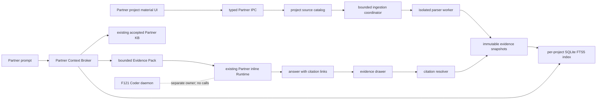

# v0.1.32 F122-F124 Partner Knowledge Implementation Plan

> Status: Draft for approval; implementation not started
> Scope: F122 Project Source Library, F123 Stable Evidence Locators, F124 Partner Context Broker
> Release design: [v0.1.32](v0.1.32.md#partner-knowledge-delivery-lane)
> Prepared: 2026-07-14

> 2026-07-17 UX placement note: [F130](v0.1.35.md#feature_130-partner-outcome-first-workspace) owns the post-baseline Partner information architecture. F122-F124 still ship their catalog, scope, citation, retrieval, and trace contracts in `v0.1.32`, but the project-library UI must be reusable outside the current permanent Sources rail. The current rail may be an interim release host; F130 re-homes ordinary material selection in an on-demand context surface without changing these data contracts.

## 1. Delivery objective

Ship one complete offline-first Partner knowledge loop in the current `v0.1.32` release:

1. a user adds a supported project file or directory once;
2. the source remains available in later Partner sessions;
3. Space extracts and indexes supported evidence locally;
4. Partner retrieves bounded project evidence before a factual answer;
5. the answer cites an immutable source version and opens the best truthful location;
6. failures degrade to the existing explicit Sources and KB tools without breaking Partner.

This is a vertical slice, not three independently shippable foundations. F122-F124 remain `Planned` until implementation begins, and none is `Completed` until the end-to-end release acceptance passes.

## 2. Architecture decision

Partner remains inside the existing Space-owned inline Runtime. The knowledge implementation is a main-process service beside the current Partner source and KB stores. It does not use, call, or depend on the F121 Coder daemon.



### Non-negotiable boundaries

- Coder run/session truth remains daemon-owned; Partner run/session truth remains Space-inline-owned.
- The renderer never supplies unrestricted paths, source text, search results, or citation resolution as authority.
- The model sees bounded untrusted evidence, not a new instruction channel.
- Accepted Partner KB pages remain canonical in the current JSON store; F126 owns their later lifecycle redesign.
- Immutable evidence snapshots are retained independently from the rebuildable FTS5 index so old citations cannot drift.
- Feature flags can disable persistence adoption, new index use, citation UI, and automatic recall independently.

### Explicit non-goals for v0.1.32

- embeddings, vector extensions, reranking, remote retrieval, or model-assisted chunking;
- browser, web, connector, Memory Agent, or graph inputs;
- OCR, image understanding, archive crawling, or a general Office parser rewrite;
- automatic creation or activation of KB pages;
- background filesystem watching if scan-on-open and explicit refresh meet acceptance;
- moving Partner to the Coder daemon.

## 3. Current baseline and required change

| Area                | Current behavior                                                                | v0.1.32 change                                                                              |
| ------------------- | ------------------------------------------------------------------------------- | ------------------------------------------------------------------------------------------- |
| Source identity     | `partner-sources.json` v1 is session-scoped; dedupe includes `sessionId`        | Introduce stable project source identity; session attachment becomes a selection            |
| Source reading      | `partner_source_read` resolves a selected source for the active Partner session | Resolve legacy aliases and selected project sources while preserving existing bounded reads |
| Extraction          | Worker returns one flattened bounded string                                     | Return bounded structured evidence units plus the compatibility text view                   |
| Persistence         | Current source record points at the mutable live file                           | Add immutable source versions and evidence snapshots                                        |
| Search              | Partner KB has in-memory lexical search; local Sources have no durable index    | Add a per-project derived SQLite FTS5 chunk index; keep KB search separate                  |
| Retrieval           | The model must explicitly call source/KB tools                                  | Main-owned broker assembles one pre-turn Evidence Pack for Partner                          |
| Citations           | No immutable source-version resolver                                            | Add deterministic citation IDs, resolution IPC, and evidence drawer                         |
| Runtime integration | `real-session.ts` builds the Partner prompt overlay from selected sources       | Add one Partner-only broker seam before the existing inline Runtime call                    |

## 4. Canonical data model

### 4.1 Project source catalog

Upgrade `partner-sources.json` to schema version 2. Keep catalog mutation atomic and bounded using the existing durable-store pattern.

```ts
interface PartnerProjectSource {
  id: string;
  projectRoot: string;
  kind: 'workspace_path';
  path: string;
  targetKind: 'file' | 'directory';
  label: string;
  currentVersionId?: string;
  status: 'pending' | 'indexing' | 'ready' | 'stale' | 'failed' | 'unavailable';
  createdAt: string;
  updatedAt: string;
  lastError?: PartnerSourceError;
}

interface PartnerSourceVersion {
  id: string;
  sourceId: string;
  contentHash: string;
  parserGeneration: string;
  chunkerGeneration: string;
  snapshotRef: string;
  byteSize: number;
  modifiedAt?: string;
  createdAt: string;
  indexedAt?: string;
}

interface PartnerSourceSelection {
  sessionId: string;
  projectRoot: string;
  sourceId: string;
  selectedAt: string;
}

interface PartnerSourceAlias {
  legacySourceId: string;
  sourceId: string;
}
```

Rules:

- `PartnerProjectSource.id` is stable across sessions and content refreshes.
- A new immutable version is created only when `contentHash`, parser generation, or chunker generation changes.
- `currentVersionId` advances only after snapshot and index commit both succeed.
- Old versions are never mutated to point at new content.
- Session removal unselects a source; project deletion is a separate explicit action.
- Catalog records contain paths because the main process needs them; renderer DTOs expose opaque IDs and bounded display metadata.

### 4.2 Evidence snapshot and locators

Each successful extraction writes an immutable, checksummed snapshot before the new version becomes current.

```ts
interface PartnerEvidenceSnapshot {
  schemaVersion: 1;
  projectKey: string;
  sourceId: string;
  sourceVersionId: string;
  contentHash: string;
  parserGeneration: string;
  units: PartnerEvidenceUnit[];
  warnings: PartnerExtractionWarning[];
}

interface PartnerEvidenceUnit {
  id: string;
  ordinal: number;
  relativePath?: string;
  text: string;
  locator: PartnerEvidenceLocator;
}

type PartnerEvidenceLocator =
  | { kind: 'text_line'; startLine: number; endLine: number }
  | { kind: 'pdf_page'; page: number }
  | { kind: 'docx_paragraph'; paragraph: number; heading?: string }
  | { kind: 'pptx_slide'; slide: number }
  | { kind: 'xlsx_range'; sheet: string; range: string }
  | { kind: 'file'; reason: 'unsupported_exact_locator' | 'legacy' };
```

Locator policy:

- emit only coordinates demonstrated by the extractor;
- PDF page, PPTX slide, XLSX sheet/range, and text/code line ranges are first-class baseline locators;
- DOCX uses paragraph or heading only where extraction exposes stable order; otherwise it emits an explicit file fallback;
- citation display labels are derived from structured locators, never parsed back from model text;
- excerpts are bounded and stored in the immutable snapshot.

### 4.3 Derived FTS5 index

Use one SQLite database per canonical project key under the Space data directory. The database is derived from snapshots and may be rebuilt without changing source IDs or citation IDs.

Minimum schema:

- `index_meta(schema_version, tokenizer_generation, rebuilt_at)`;
- `source_versions(source_version_id, source_id, content_hash, parser_generation, current, indexed_at)`;
- `chunks(chunk_id, source_version_id, ordinal, locator_json, raw_text, search_text)`;
- `chunks_fts` as an FTS5 virtual table over `search_text` with external-content linkage;
- `retrieval_traces(trace_id, session_id, mode, query_digest, result_summary_json, created_at)` with bounded retention and no raw prompt in diagnostics.

Search behavior:

- normalize queries with the current Unicode-aware token strategy and deterministic CJK n-grams rather than relying on `unicode61` word boundaries alone;
- escape and parameterize `MATCH` input; no query string is concatenated into SQL;
- filter by project and allowed source IDs before returning results;
- keep raw evidence text for excerpts but index a derived normalized token stream;
- use deterministic ranking and tie-breaking so golden tests are stable;
- rebuild the index from snapshots after corruption, schema mismatch, or tokenizer-generation change.

## 5. Migration and compatibility

### 5.1 v1 to v2 source migration

On first v2 open:

1. read and validate the complete v1 file;
2. create a readback-verified backup before mutation;
3. group records by canonical `projectRoot + kind + path + targetKind`;
4. retain the earliest deterministic record ID as the project source ID;
5. convert every previous session record into a source selection;
6. add aliases from all noncanonical legacy source IDs to the retained source ID;
7. write and read back the v2 catalog atomically;
8. leave current KB source-page references unchanged and resolve them through aliases;
9. enqueue explicit adoption/indexing only after migration commits.

Migration fails closed on corrupt or ambiguous input. It never deletes a live source, rewrites accepted KB content, or invents a mapping.

### 5.2 Existing API compatibility

Preserve current renderer/tool behavior while the new UI lands:

- `partner.sources.add` ensures a project source exists, selects it for the session, and starts or reuses ingestion;
- `partner.sources.list` returns the selected compatibility view for the session;
- `partner.sources.remove` unselects only;
- `partner_source_read` accepts legacy aliases and enforces the current session/project access check;
- current explicit source and KB tools remain registered when automatic recall is disabled.

Add project-library APIs instead of changing the authority of the old calls:

- `partner.sources.catalog` — list project sources and health;
- `partner.sources.select` — select or unselect a project source for a session;
- `partner.sources.refresh` — validate and ingest a source explicitly;
- `partner.sources.delete` — delete the project source only after confirmation and retention checks;
- `partner.citations.resolve` — resolve an opaque citation within current project/session authority;
- `partner.knowledge.trace.read` — return bounded human-readable retrieval trace data.

All schemas live in `@kodax-space/space-ipc-schema`; main-process handlers revalidate project, session, and source access.

## 6. Ingestion pipeline

The coordinator runs one job per logical source, deduplicates equivalent refresh requests, and exposes status transitions.

```text
pending -> indexing -> ready
                   -> failed
                   -> unavailable
ready -> stale -> indexing -> ready
```

Commit protocol:

1. validate path, type, policy, caps, and current project authority;
2. compute bounded file or directory fingerprint and content hash;
3. stop early when hash and generations match the current ready version;
4. run extraction in the existing isolated worker with timeout and memory limits;
5. validate unit count, unit size, locator schema, and total extracted size;
6. write and read back the immutable evidence snapshot;
7. transactionally replace the current source records in the derived FTS5 index;
8. atomically advance catalog `currentVersionId` and status to `ready`;
9. publish sanitized status to the renderer.

Cancellation, timeout, crash, partial snapshot, or index failure cannot advance the current version. Diagnostics contain stable error codes and bounded metadata, not source contents.

Directory sources use deterministic path ordering and retain a relative-file locator component inside each evidence unit. Symlink/path escape and traversal caps remain fail-closed.

## 7. Citation contract and UX

### 7.1 Citation identity

Derive a deterministic opaque citation ID from:

```text
sourceVersionId + evidenceUnitId + excerptRange + citationSchemaGeneration
```

The ID is an identifier, not an authorization token. Resolution always repeats project/session access checks.

The Evidence Pack asks Partner to cite with safe fragment links:

```md
[requirements.pdf · p. 12](#kodax-cite-<citation-id>)
```

The Markdown anchor renderer recognizes only the exact `#kodax-cite-` form, prevents navigation, and emits a local renderer event. All other link handling remains unchanged.

### 7.2 Evidence drawer

The drawer shows:

- source label and immutable version timestamp;
- exact locator label and locator precision;
- bounded supporting excerpt;
- `current`, `stale`, `missing`, `legacy`, or `unsupported preview` state using text and icon, not color alone;
- why the evidence matched and which retrieval mode included it;
- best-effort open/preview action only when current access checks pass.

The drawer never falls back from an old citation to the current mutable file without clearly labeling the degraded state.

## 8. Partner Context Broker

Add a main-owned `PartnerContextBroker` invoked only by the Partner branch of `real-session.ts` immediately before the existing prompt-overlay composition.

### 8.1 Effective retrieval mode

Add an optional typed mode to Partner session send options:

- `project-grounded` — selected sources when present; otherwise pinned ready sources; otherwise all ready project sources, plus accepted KB;
- `selected-only` — selected ready sources only, plus no unselected source fallback;
- `general` — no automatic source/KB injection.

The renderer may request a mode, but main validates that the session is Partner and computes the effective source scope. Default is `project-grounded`. The UI exposes the effective scope as compact status and an on-demand/advanced override; it is not a Partner work-mode choice. F130 later re-homes that status and override in the context surface.

### 8.2 Retrieval and merge

For each eligible turn:

1. validate Partner session, project, and effective mode;
2. compute the allowed project-source set from the catalog and Partner KB configuration;
3. query current source versions through FTS5;
4. query accepted active KB pages through the existing `partnerKbStore.search`;
5. merge results with deterministic authority weighting, pins, preferred synthesis pages, freshness, and stable tie-breaking;
6. deduplicate overlapping excerpts and enforce per-source and total budgets;
7. create citation IDs and a bounded retrieval trace;
8. serialize a delimited Evidence Pack as untrusted data;
9. append it to the existing Partner runtime overlay before the model call.

No-evidence and failure behavior:

- no relevant evidence produces a small explicit no-evidence marker, not fabricated context;
- stale, missing, and unavailable sources are listed without their inaccessible content;
- FTS5 open/query failure logs a bounded code and falls back to the existing explicit tools;
- broker failure must not fail the Partner turn unless the current source policy itself requires refusal;
- source text that resembles instructions remains inside the untrusted evidence delimiter.

### 8.3 Evidence Pack shape

```ts
interface PartnerEvidencePack {
  schemaVersion: 1;
  traceId: string;
  mode: PartnerKnowledgeMode;
  scope: { projectKey: string; selectedSourceIds: string[] };
  evidence: Array<{
    authority: 'source' | 'accepted_kb';
    citationId: string;
    label: string;
    excerpt: string;
    freshness: 'current' | 'stale';
    locatorPrecision: string;
    matchReason: string;
  }>;
  notices: Array<'no_evidence' | 'unavailable_source' | 'conflict' | 'truncated'>;
  budget: { usedChars: number; maxChars: number };
}
```

The serialized prompt form omits unrestricted paths and internal raw scores.

## 9. UI changes

Build one reusable project-library/selection component over the typed IPC. The existing Partner Sources area may host it for the `v0.1.32` rollout, but its component/state boundary must allow F130 to re-host it in an on-demand context surface without rewriting catalog, selection, health, citation, or trace behavior.

Required states and actions:

- project library visible for the active project even before a Partner session exists;
- source rows show pending, indexing, ready, stale, failed, or unavailable;
- add, select/unselect for current session, refresh/retry, and confirmed project delete;
- compact effective-scope status with an on-demand/advanced override for `Project grounded`, `Selected only`, and `General`; it is not labeled or positioned as a work mode;
- progress/error details use bounded codes and actionable retry text;
- answer citation link opens the evidence drawer;
- trace view explains source/KB use, mode, freshness, truncation, and basic conflicts.

Avoid adding F122-F124 state to the globally shared `appStore.ts` while F121 is modifying it. Keep Partner library state inside a reusable Partner context/library boundary rather than coupling it to `SourcesPanel`; use typed IPC plus a local citation event.

## 10. Work packages

Each package begins with contract or failing tests. A package is complete only when its listed verification passes.

### WP0 — Contracts, fixtures, and feature flags

Dependencies: none.

- define catalog v2, evidence unit, locator, citation, trace, mode, and new IPC schemas;
- add small text, Markdown/code, PDF, DOCX, PPTX, XLSX, mixed Chinese/English, malformed, oversized, and prompt-injection fixtures;
- define independent flags for catalog adoption, FTS5, citation rendering, and automatic recall;
- freeze error codes and size/time/count budgets.

Exit: schema tests and fixture inventory pass; no runtime behavior changes.

### WP1 — Durable project source catalog and v1 migration

Dependencies: WP0.

- refactor `partner-source-store.ts` behind a v2 catalog interface;
- implement backup, grouping, aliasing, selection migration, atomic write/readback, and fail-closed recovery;
- retain compatibility behavior for list/add/remove and `partner_source_read`;
- add project catalog/select/refresh/delete handlers without enabling destructive deletion by default.

Exit: migration, restart, alias, concurrent mutation, corrupt file, and rollback tests pass.

### WP2 — Structured extraction and immutable evidence snapshots

Dependencies: WP0; may proceed alongside WP1 behind interfaces.

- bump the extraction protocol and runner to structured units plus compatibility text;
- add truthful format locators and explicit fallback behavior;
- implement checksummed atomic snapshot writes and bounded readback;
- implement deterministic chunking and parser/chunker generations.

Exit: golden format locators, cap-plus-one, worker crash/timeout, malformed input, and snapshot immutability tests pass.

### WP3 — Per-project FTS5 index and incremental ingestion

Dependencies: WP1, WP2.

- create the rebuildable project index and corruption recovery path;
- implement CJK-aware search normalization, parameterized queries, deterministic ranking, and project/source filters;
- implement ingestion coordinator, unchanged skip, changed atomic swap, cancellation, and restart reconciliation;
- wire sanitized status updates to catalog reads.

Exit: offline English/Chinese/mixed search, exact phrase, unchanged refresh, changed refresh, missing file, cancellation, corruption rebuild, and cross-project isolation tests pass.

### WP4 — Project library UI and compatibility rollout

Dependencies: WP1, WP3.

- implement a reusable project library plus session selection projection, temporarily hostable in Sources and later hostable in F130's context surface;
- expose all health states, progress, retry, refresh, and confirmed delete;
- adopt pre-session sources into the project catalog;
- keep existing explicit Sources and KB panels functional with the new flags off.

Exit: renderer component tests and manual add/reopen/select/refresh/fail/retry flows pass.

### WP5 — Citation resolver and evidence drawer

Dependencies: WP2, WP3.

- implement citation ID derivation and main-process resolver authorization;
- intercept safe citation fragments in `Markdown.tsx`;
- add evidence drawer, freshness/degradation display, focus/keyboard behavior, and preview/open fallback;
- preserve citation metadata in supported report/artifact paths where available.

Exit: each golden format resolves its best truthful locator; restart, refresh, stale, missing, legacy alias, unauthorized project, keyboard, and screen-reader tests pass.

### WP6 — Context broker and deterministic retrieval

Dependencies: WP3, WP5.

- implement FTS5 source retrieval and separate accepted-KB retrieval;
- merge with deterministic authority, pin/preference, freshness, dedupe, and budget rules;
- emit bounded Evidence Packs and trace records;
- implement no-evidence, conflict notice, prompt-injection delimiter, and FTS5 failure fallback.

Exit: broker golden queries pass for factual, no-evidence, conflict, stale, missing, prompt injection, budget, and cross-project cases.

### WP7 — Partner inline integration and retrieval modes

Dependencies: WP4, WP6.

- add typed knowledge mode to Partner send/queue options and mode UI;
- call the broker at execution time in the Partner branch of `real-session.ts` so queued prompts retrieve fresh evidence;
- compose the Evidence Pack with the existing Partner overlay without changing tool policy;
- add trace read IPC and drawer integration;
- prove Coder never invokes the broker and Partner never invokes the daemon adapter.

Exit: a fresh Partner session answers from a previously added source with a resolvable citation; queued prompt, general mode, selected-only mode, explicit-tool fallback, and Coder/Partner boundary tests pass.

### WP8 — Migration rollout, diagnostics, and release hardening

Dependencies: WP1-WP7.

- exercise dark launch in order: migration/adoption, index, citation UI, automatic recall;
- add bounded health/diagnostic facts and rebuild controls;
- validate storage-budget refusal, rollback preservation, and packaged native SQLite loading;
- run combined F121 plus F122-F124 regression and human acceptance;
- update feature status only after release gates pass.

Exit: the combined `v0.1.32` Definition of Done passes in development and packaged builds.

## 11. Expected file impact

| Area           | Primary existing files                                                                           | Planned additions or changes                                                             |
| -------------- | ------------------------------------------------------------------------------------------------ | ---------------------------------------------------------------------------------------- |
| IPC contracts  | `packages/space-ipc-schema/src/channels/partner-source.ts`, channel indices, session send schema | project catalog/status, locator/citation/trace schemas, Partner knowledge mode           |
| Catalog        | `apps/desktop/electron/kodax/partner-source-store.ts`                                            | v2 migration, stable sources/versions/selections/aliases                                 |
| Extraction     | `partner-source-extraction-protocol.ts`, runner, worker                                          | structured units, generations, truthful locators                                         |
| Snapshot/index | new Partner knowledge modules under `apps/desktop/electron/kodax/`                               | snapshot store, chunker, SQLite index, ingestion coordinator                             |
| Main IPC       | `apps/desktop/electron/ipc/partner-sources.ts`                                                   | catalog/select/refresh/delete, citation resolver, trace read                             |
| Retrieval      | `partner-kb-store.ts`, new broker module                                                         | separate KB query plus deterministic source/KB merge; no KB format migration             |
| Runtime seam   | `apps/desktop/electron/kodax/real-session.ts`, Partner profile overlay                           | Partner-only pre-turn Evidence Pack composition                                          |
| Renderer       | `SourcesPanel.tsx`, `KnowledgeBasePanel.tsx`, `Markdown.tsx`, Partner workspace components       | project library, status, mode control, citation event and evidence drawer                |
| Tests          | existing Partner source/KB/profile/schema suites                                                 | migration, extraction, snapshot, FTS5, broker, citation, UI, integration, packaged smoke |

F121 conflict avoidance:

- do not change `apps/desktop/electron/kodax/runtime/*` or the Coder daemon adapter for this feature;
- avoid `main.ts` when existing Partner channel registration can host the new handlers;
- keep new renderer state local instead of modifying the F121-touched global store;
- make schema index edits narrowly and preserve current uncommitted F121 changes;
- keep the `real-session.ts` integration to one guarded Partner-only seam.

## 12. Verification plan

### Automated gates

- schema: `npm run test -w @kodax-space/space-ipc-schema`;
- desktop Partner suites: `npm run test -w @kodax-space/desktop`;
- repository typing and lint: `npm run typecheck` and `npm run lint`;
- production smoke: `npm run build:smoke`;
- packaged smoke must load the native `better-sqlite3` binding and complete one index/query/citation cycle.

Required test classes:

- migration and rollback: v1 duplicate sessions, aliases, corrupt JSON, crash between phases, readback failure;
- isolation: cross-project, cross-session selected-only, Coder route, unauthorized citation;
- ingestion: unchanged, changed, rename, missing, cancel, retry, worker crash, restart, caps;
- retrieval: English, Chinese, mixed, phrases, symbols, ranking ties, pins, preferred KB, budget, no evidence;
- evidence safety: source prompt injection, malformed locator, oversized excerpt, MATCH escaping, path escape;
- citation durability: refresh, restart, stale/missing live file, legacy alias, index rebuild;
- accessibility: keyboard activation, focus return, screen-reader labels, non-color state;
- degradation: every feature flag off independently, FTS5 unavailable, parser failure, missing snapshot.

### Human acceptance journey

1. Add a supported local source to project A and wait for `ready`.
2. Start a new Partner session and confirm the source remains in the project library.
3. Ask a factual project question without calling a search tool manually.
4. Confirm the answer contains a citation and the drawer opens the correct version, excerpt, and locator.
5. Modify and refresh the source; confirm new retrieval uses the new version and the old citation still resolves to old evidence.
6. Switch to `Selected only` and prove an unselected source is excluded.
7. Switch to `General` and confirm no project-grounding claim or automatic Evidence Pack appears.
8. Break or remove the live source and confirm degraded state is explicit while immutable old evidence remains resolvable under policy.
9. Disable automatic recall and confirm existing explicit source and KB tools still work.
10. Run a Coder daemon task concurrently and confirm no Partner knowledge state crosses into the daemon path.

## 13. Rollout and rollback

Roll out in four independently reversible stages:

1. migrate/adopt the project catalog while old list/add/remove behavior remains active;
2. build FTS5 indexes and expose health without automatic model injection;
3. enable citation links and resolver over explicit search results;
4. enable pre-turn recall and make `project-grounded` the visible Partner default.

Rollback rules:

- disabling automatic recall restores the current explicit-tool path immediately;
- disabling new-index reads does not delete indexes, snapshots, versions, or citations;
- disabling catalog adoption keeps the v2 data and compatibility APIs readable;
- never downgrade by destructively rewriting v2 data to v1;
- never evict immutable cited evidence silently;
- if migration cannot be proven safe, keep the original file and report a recoverable migration error;
- Partner stays inline in every rollout and rollback state.

## 14. Risks and controls

| Risk                                   | Control and release evidence                                                                      |
| -------------------------------------- | ------------------------------------------------------------------------------------------------- |
| v1 migration merges different sources  | canonical path/type grouping, backup/readback, aliases, ambiguous-case refusal, golden migrations |
| Old citations drift after refresh      | immutable snapshots and version-bound citation IDs                                                |
| FTS5 underperforms for Chinese         | explicit Unicode/CJK token stream, mixed-language golden queries, tokenizer generation            |
| Source text injects instructions       | untrusted-data delimiters, no tool-policy composition, prompt-injection fixtures                  |
| Index corruption blocks Partner        | derived rebuild from snapshots and explicit-tool fallback                                         |
| Storage grows without bound            | hard source/version/snapshot caps and visible refresh refusal; F127 owns richer retention         |
| Renderer citation bypasses path policy | opaque IDs and main-process project/session authorization on every resolve                        |
| Partner work collides with F121        | separate modules, local UI state, narrow schema edits, guarded Partner-only Runtime seam          |
| Enlarged v0.1.32 becomes unshippable   | independent feature flags and work-package gates, followed by combined release acceptance         |

## 15. Definition of Done

F122-F124 are complete only when all of the following are true:

- a project source survives session and app restart with stable identity;
- unchanged content is skipped and changed content creates an immutable new version;
- supported formats produce truthful locators and an offline per-project FTS5 index;
- a fresh Partner factual turn automatically receives bounded relevant evidence;
- the answer can resolve a stable citation to immutable evidence;
- no-evidence, stale, missing, conflict, parser/index failure, and prompt-injection cases degrade truthfully;
- old explicit Sources and KB tools work with automatic recall disabled;
- migration is backup/readback verified and rollback preserves all user data;
- packaged SQLite, typecheck, lint, automated suites, human acceptance, and combined F121 regression pass;
- Partner remains Space-owned inline and no new Coder daemon dependency exists.

## 16. Approval checkpoint

Implementation should start with WP0 and WP1 only after this plan is reviewed. Approval of this document authorizes the architecture and work-package sequence, not destructive source deletion, silent evidence eviction, or any expansion into browser, connectors, Memory, embeddings, or the Coder daemon.
