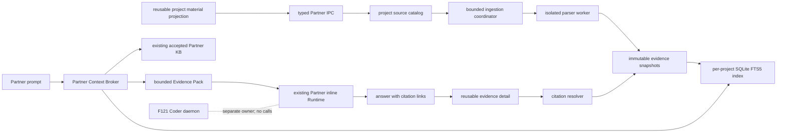

# v0.1.32 F122-F124 Partner Knowledge Implementation Plan

> Status: Implemented and verified for `v0.1.32`
> Scope: F122 Project Source Library, F123 Stable Evidence Locators, F124 Partner Context Broker
> Release design: [v0.1.32](v0.1.32.md#partner-knowledge-delivery-lane)
> Prepared: 2026-07-14
> Completed: 2026-07-19

> 2026-07-17 forward-projection note: F122-F124 still ship their catalog, scope, citation, retrieval, and trace contracts in `v0.1.32`. The current project-material area may be an interim release host, but no schema, command, reducer, or acceptance gate may encode a permanent Sources/KB rail. The reusable task projection is designed to move behind a future `+ Add material` context surface, while project-wide maintenance opens through `Manage project materials and knowledge`. This is a forward-compatible host seam, not a dependency on [F130](v0.1.64.md#feature_130-partner-composer-first-skill-workspace) or any later release.

## 1. Delivery objective

Ship one complete local-first indexing/retrieval/citation loop in the current `v0.1.32` release. Extraction, snapshots, FTS5 retrieval, and citation resolution work without a network; final answer generation still follows the user's configured model/provider disclosure and policy:

1. a user adds a supported project file or directory once;
2. the source remains available in later Partner sessions;
3. Space extracts and indexes supported evidence locally;
4. the user can distinguish project-available material from task-selected material;
5. Partner retrieves bounded project evidence before a factual answer and records the subset actually used;
6. the answer cites an immutable source version and opens the best truthful location;
7. failures degrade to existing bounded source and knowledge actions without breaking Partner or requiring permanent Sources/KB panels.

This is a vertical slice, not three independently shippable foundations. F122-F124 are now `Completed`: the end-to-end source, index, citation, automatic-recall, trace, rollback, and combined Coder/Partner automated acceptance passes. The overall `v0.1.32` release remains gated by F121's separate released-action and human multi-client acceptance.

## 2. Architecture decision

Partner remains inside the existing Space-owned inline Runtime. The knowledge implementation is a main-process service beside the current Partner source and KB stores. It does not use, call, or depend on the F121 Coder daemon.



### Non-negotiable boundaries

- Coder run/session truth remains daemon-owned; Partner run/session truth remains Space-inline-owned.
- The renderer never supplies unrestricted paths, source text, search results, or citation resolution as authority.
- The model sees bounded untrusted evidence, not a new instruction channel.
- No source text is sent to a separate indexing, embedding, or rerank service in this baseline. Bounded evidence excerpts sent for final answer generation follow the active model/provider disclosure and authorization; this feature does not claim that a remote-provider answer keeps those excerpts on-device.
- Accepted Partner KB pages remain canonical in the current JSON store; F126 owns their later lifecycle redesign.
- Immutable evidence snapshots are retained independently from the rebuildable FTS5 index so old citations cannot drift.
- Feature flags can disable persistence adoption, new index use, citation UI, and automatic recall independently.
- Project availability, task selection, and turn use are separate facts owned by the catalog, session-selection store, and retrieval trace respectively.
- Task detach/unselect never deletes a project source or the underlying user file. Project-source deletion is a separate confirmed management action with retention checks.

### Explicit non-goals for v0.1.32

- embeddings, vector extensions, reranking, remote retrieval, or model-assisted chunking;
- browser, web, connector, graph, or F117/KX-F260 Memory Agent inputs; F117 is Coder-only and has no Partner Context Broker adapter;
- OCR, image understanding, archive crawling, or a general Office parser rewrite;
- automatic creation or activation of KB pages;
- background filesystem watching if scan-on-open and explicit refresh meet acceptance;
- moving Partner to the Coder daemon.

## 3. Current baseline and required change

| Area                | Current behavior                                                                | v0.1.32 change                                                                                          |
| ------------------- | ------------------------------------------------------------------------------- | ------------------------------------------------------------------------------------------------------- |
| Source identity     | `partner-sources.json` v1 is session-scoped; dedupe includes `sessionId`        | Introduce stable project source identity; legacy Sources attachment becomes a relation-backed selection |
| Source reading      | `partner_source_read` resolves a selected source for the active Partner session | Resolve legacy aliases and selected project sources while preserving existing bounded reads             |
| Extraction          | Worker returns one flattened bounded string                                     | Return bounded structured evidence units plus the compatibility text view                               |
| Persistence         | Current source record points at the mutable live file                           | Add immutable source versions and evidence snapshots                                                    |
| Search              | Partner KB has in-memory lexical search; local Sources have no durable index    | Add a per-project derived SQLite FTS5 chunk index; keep KB search separate                              |
| Retrieval           | The model must explicitly call source/KB tools                                  | Main-owned broker assembles one pre-turn Evidence Pack for Partner                                      |
| Citations           | No immutable source-version resolver                                            | Add deterministic citation IDs, resolution IPC, and one reusable evidence-detail surface                |
| Runtime integration | `real-session.ts` builds the Partner prompt overlay from selected sources       | Add one Partner-only broker seam before the existing inline Runtime call                                |

## 4. Canonical data model

### 4.1 Project source catalog

Upgrade `partner-sources.json` to schema version 2. Keep catalog mutation atomic and bounded using the existing durable-store pattern.

```ts
interface PartnerProjectSource {
  id: string;
  projectRoot: string;
  kind: 'workspace_path';
  path: string;
  targetKind: 'file' | 'directory';
  label: string;
  currentVersionId?: string;
  ingestionStatus: 'pending' | 'indexing' | 'ready' | 'failed';
  createdAt: string;
  updatedAt: string;
  lastError?: PartnerSourceError;
}

interface PartnerSourceVersion {
  id: string;
  sourceId: string;
  contentHash: string;
  parserGeneration: string;
  chunkerGeneration: string;
  snapshotRef: string;
  byteSize: number;
  modifiedAt?: string;
  createdAt: string;
  indexedAt?: string;
}

interface PartnerSourceSelection {
  sessionId: string;
  projectRoot: string;
  sourceId: string;
  selectedAt: string;
}

interface PartnerSourceAlias {
  legacySourceId: string;
  sourceId: string;
}

type PartnerEvidenceOwnerIdentity =
  | {
      kind: 'project-source' | 'task-attachment-snapshot';
      ownerId: string;
      adapterId?: never;
    }
  | {
      kind: 'web-fetch-snapshot' | 'browser-capture' | 'connector-snapshot' | 'result-snapshot';
      ownerId: string;
      adapterId: string;
    };

type PartnerEvidenceVersionSelector =
  | { policy: 'pinned'; versionId: string }
  | { policy: 'current-at-run' };

type PartnerEvidenceSelectionRef = PartnerEvidenceOwnerIdentity & {
  version: PartnerEvidenceVersionSelector;
};

type PartnerEvidenceOwnerVersionRef = PartnerEvidenceOwnerIdentity & {
  versionId: string;
  unitId?: string;
};

type PartnerImmutableMaterialEvidenceVersionRef =
  | {
      kind: 'task-attachment-snapshot';
      ownerId: string;
      adapterId?: never;
      versionId: string;
      unitId?: never;
    }
  | {
      kind: 'web-fetch-snapshot' | 'browser-capture' | 'connector-snapshot';
      ownerId: string;
      adapterId: string;
      versionId: string;
      unitId?: never;
    };

type PartnerResultSnapshotVersionRef = {
  kind: 'result-snapshot';
  ownerId: string;
  adapterId: string;
  versionId: string;
  unitId?: never;
  linkedResultOwner: 'artifact' | 'delivery' | 'presentation-project';
  linkedResultOwnerId: string;
  linkedResultOwnerVersionId: string;
  linkedOwnerSubresourceId?: string;
};

type PartnerProjectMaterialTarget =
  | { kind: 'project-source'; sourceId: string }
  | { kind: 'evidence'; evidenceRef: PartnerImmutableMaterialEvidenceVersionRef }
  | ({
      kind: 'result';
      resultOwner: 'artifact' | 'delivery' | 'presentation-project';
      resultOwnerId: string;
      resultOwnerVersionId: string;
      ownerSubresourceId?: string;
    } & (
      | { searchable: false; resultSnapshotRef?: never }
      | { searchable: true; resultSnapshotRef: PartnerResultSnapshotVersionRef }
    ));

type ProjectMaterialRelation = {
  id: string;
  projectKey: string;
  target: PartnerProjectMaterialTarget;
  createdAt: string;
  createdBy: 'user' | 'migration';
  supersedesRelationId?: string;
} & (
  | { lifecycle: 'active'; removedAt?: never }
  | { lifecycle: 'removed'; removedAt: string; removalReasonCode?: string }
);

type PartnerSelectedProjectMaterialTarget =
  | { kind: 'project-source'; sourceId: string; version: PartnerEvidenceVersionSelector }
  | { kind: 'evidence'; evidenceRef: PartnerImmutableMaterialEvidenceVersionRef }
  | ({
      kind: 'result';
      resultOwner: 'artifact' | 'delivery' | 'presentation-project';
      resultOwnerId: string;
      resultOwnerVersionId: string;
      ownerSubresourceId?: string;
    } & (
      | { searchable: false; resultSnapshotRef?: never }
      | { searchable: true; resultSnapshotRef: PartnerResultSnapshotVersionRef }
    ));

type PartnerMaterialSelection = {
  sessionId: string;
  projectKey: string;
  selectedAt: string;
} & (
  | {
      origin: 'project-relation';
      materialRelationId: string;
      selectedTarget: PartnerSelectedProjectMaterialTarget;
    }
  | {
      origin: 'task-only';
      materialRelationId?: never;
      evidenceRef: PartnerImmutableMaterialEvidenceVersionRef | PartnerResultSnapshotVersionRef;
    }
);
```

Rules:

- `PartnerProjectSource.id` is stable across sessions and content refreshes.
- A new immutable version is created only when `contentHash`, parser generation, or chunker generation changes, or when an explicit reacquisition follows a `forgotten`/`corrupt` retained-content state. Reacquisition never reactivates the old version even when bytes match.
- `currentVersionId` advances only after snapshot and index commit both succeed.
- Old versions are never mutated to point at new content.
- An active `ProjectMaterialRelation` means `available` to the project. `PartnerMaterialSelection` means explicitly `selected` for a task/session: a relation-backed selection freezes the authoritative owner plus version policy, while a task-only selection carries an exact immutable evidence snapshot/version and no relation ID. A pinned project-source selection freezes its exact version; `current-at-run` resolves the then-current committed version at each execution and records that exact used version in the trace. A turn is `used` only when its trace contains the exact evidence owner/version or knowledge-page version. These states are never inferred from one another. `PartnerSourceSelection` remains only the local-source compatibility projection.
- A local workspace-path add creates/reuses both `PartnerProjectSource` and its project-material relation. Task attachment, web/browser/connector evidence, and Results keep their authoritative owners and gain only an explicit relation; none is relabeled as a project source.
- At most one active relation exists for `(projectKey, canonicalTargetIdentity)`. Repeated adoption is idempotent and returns that relation. Re-adoption after removal creates a new relation with `supersedesRelationId`; it never reactivates or rewrites the removed tombstone.
- A Result relation pins the exact Artifact/Delivery/Presentation Project version or export. Its discriminant is `searchable:false` with no snapshot, or `searchable:true` with a required exact immutable `result-snapshot` evidence version whose back-link must equal the surrounding Result owner, version, and subresource target.
- Session removal is a task detach/unselect and deletes only the selection. User-facing `Remove from project materials` transitions only the `ProjectMaterialRelation` to `removed`, ending future project-grounded eligibility while retaining its immutable target tombstone; it never deletes or mutates the underlying evidence/source/result owner or user file. Existing task selections keep their frozen target and continue or become typed unavailable according to the current access/content policy; the command never detaches them implicitly.
- Removing a material relation changes project-grounded eligibility only and does not alter any access-state axis. Origin deletion/revocation/access change does not silently remove the relation.
- Catalog records contain paths because the main process needs them; renderer DTOs expose opaque IDs and bounded display metadata.
- Every owner, snapshot, version, relation, and trace ID is opaque and non-semantic; it must not encode a URL, path, account, external resource identity, title, or prompt fragment.
- `project-source` may select a current pointer or pinned version. Immutable task-attachment/result snapshots require `pinned`. External adapters may use `current-at-run` only when they advertise and validate a current pointer; any retained-local selection after origin loss must pin an exact version. The used trace always records an exact `PartnerEvidenceOwnerVersionRef`.

Changing evidence access/content state is represented on four orthogonal axes:

```ts
interface PartnerEvidenceAccessObservation {
  ownerRef: PartnerEvidenceOwnerIdentity;
  versionId: string;
  liveAvailability: 'current' | 'stale' | 'missing' | 'deleted';
  originAccess: 'authorized' | 'revoked' | 'unknown';
  retainedSnapshotUse: 'permitted' | 'audit-only' | 'restricted';
  retainedContentAvailability: 'present' | 'missing' | 'forgotten' | 'corrupt';
  reasonCode?: string;
  observedAt: string;
}

interface PartnerEvidenceAccessDecision {
  observation: PartnerEvidenceAccessObservation;
  decision: 'include' | 'metadata-only' | 'exclude';
  boundedReasonCode: string;
}
```

`missing`/`deleted` blocks live-origin read, refresh, and current-pointer advancement but does not by itself revoke an exact retained version. `revoked` and `unknown` both fail closed for origin reads/refresh; retained-local use still follows its independent policy. Retrieval/citation content requires both `retainedSnapshotUse=permitted` and `retainedContentAvailability=present`. `audit-only` permits only opaque citation/tombstone/reason/remediation metadata, never title, URL, path, account/resource identity, excerpt, retrieval, preview, export, or diagnostics content. `restricted` blocks snapshot content everywhere. `Forget retained evidence` writes `forgotten` plus a tombstone without falsifying origin state; the same exact version never silently rehydrates, and a later explicit authorized refresh creates a new version with audit. Reauthorization never assumes that a different account or origin is the previous owner.

### 4.2 Evidence snapshot and locators

Each successful extraction writes an immutable, checksummed snapshot before the new version becomes current.

```ts
interface PartnerEvidenceSnapshot {
  schemaVersion: 1;
  projectKey: string;
  sourceId: string;
  sourceVersionId: string;
  contentHash: string;
  parserGeneration: string;
  units: PartnerEvidenceUnit[];
  warnings: PartnerExtractionWarning[];
}

interface PartnerEvidenceUnit {
  id: string;
  ordinal: number;
  relativePath?: string;
  text: string;
  locator: PartnerEvidenceLocator;
}

interface PartnerTaskAttachmentSnapshot {
  schemaVersion: 1;
  taskAttachmentId: string;
  sessionId: string;
  snapshotVersionId: string;
  contentHash: string;
  capturedAt: string;
  capturedEntries: readonly {
    entryId: string;
    boundedRelativePath?: string;
    contentHash: string;
  }[];
  units: PartnerEvidenceUnit[];
  warnings: PartnerExtractionWarning[];
}

type PartnerEvidenceLocator =
  | { kind: 'text_line'; startLine: number; endLine: number }
  | { kind: 'pdf_page'; page: number }
  | { kind: 'docx_paragraph'; paragraph: number; heading?: string }
  | { kind: 'pptx_slide'; slide: number }
  | { kind: 'xlsx_range'; sheet: string; range: string }
  | { kind: 'file'; reason: 'unsupported_exact_locator' | 'legacy' };
```

Locator policy:

- emit only coordinates demonstrated by the extractor;
- PDF page, PPTX slide, XLSX sheet/range, and text/code line ranges are first-class baseline locators;
- DOCX uses paragraph or heading only where extraction exposes stable order; otherwise it emits an explicit file fallback;
- citation display labels are derived from structured locators, never parsed back from model text;
- excerpts are bounded and stored in the immutable snapshot.

This task-attachment schema is a forward adapter contract, not a `v0.1.32` runtime registration. When F130 ships the adapter, its draft store may observe local paths while the user composes, but an accepted send freezes every supported local file/image/folder input into an immutable `task-attachment-snapshot` before evidence use. The snapshot uses the already-established immutable session identity plus a main-owned attachment identity; any later Runtime task/run correlation belongs in the F124 trace because a Runtime `taskId` may not exist at freeze time. A folder snapshot records the bounded exact file set and hashes actually read; later directory changes never rewrite that version. Unsupported image understanding emits only truthful metadata/file-level evidence until an advertised extractor exists. Detach removes task selection only; project adoption creates a separate `ProjectMaterialRelation`; F127 `Forget retained evidence` governs eligible snapshot content; Files alone governs the underlying local file.

### 4.3 Forward external-evidence adapter seam

This seam is not a `v0.1.32` release dependency.

```ts
interface PartnerExternalEvidenceSnapshot {
  schemaVersion: 1;
  owner: 'web-fetch-snapshot' | 'browser-capture' | 'connector-snapshot';
  adapterId: string;
  snapshotId: string;
  snapshotVersionId: string;
  projectKey: string;
  contentHash: string;
  capturedAt: string;
  sourceUpdatedAt?: string;
  units: PartnerExternalEvidenceUnit[];
}

interface PartnerExternalEvidenceUnit {
  id: string;
  ordinal: number;
  text: string;
  locator: PartnerExternalEvidenceLocatorEnvelope;
}

interface PartnerExternalEvidenceLocatorEnvelope {
  locatorSchemaId: string;
  locatorSchemaGeneration: string;
  kind: string;
  fields: Readonly<Record<string, string | number | boolean>>;
  fallbackLabel: string;
}
```

A task-only external snapshot is not a `PartnerProjectSource` and is not project-available. Its adapter must provide immutable evidence units, bounded digest, a namespaced and versioned truthful locator schema, authorization-aware resolution, and stable citation identity. The envelope is deliberately extensible enough for F050 URL/DOM/screenshot coordinates and F096 resource/comment/cursor coordinates; every adapter caps keys, values, and payload size, validates its registered schema, and emits a labeled snapshot-level fallback when it cannot prove a finer locator. Current access never lives in this immutable envelope: the resolver returns the latest effective `PartnerEvidenceAccessObservation`, and each F124 trace freezes the observation/decision used for that turn. Explicit F122 adoption creates only a `ProjectMaterialRelation`; it never rewrites or merges either owner.

Every registered evidence adapter implements one bounded execution contract: advertise whether a current pointer exists; resolve a `pinned` or permitted `current-at-run` selector to an exact owner/version; enumerate or search authorized units under explicit count/byte/time budgets; resolve the version-addressed four-axis access/content observation; and resolve a citation unit/locator without falling through to another owner or current version. The registry owns stable adapter keys and rejects duplicate owner-kind claims. `v0.1.32` implements the local project-source adapter and contract fixtures for task attachments, Result snapshots, and one external adapter; F130/F050/F052/F096 own the later runtime registrations.

The public citation resolver accepts the provider-neutral immutable identity types defined in section 4.1. The local baseline maps a `project-source` used ref to `sourceVersionId`; task attachments and later adapters retain their own immutable snapshot version. External refs require their registered `adapterId`, while built-in project-source/task-attachment refs prohibit it, so two adapters cannot collide on the same opaque owner ID.

These provider-neutral refs are canonical in citations and traces. `selectedSourceIds`, `usedSourceIds`, and `usedSourceVersionIds` remain read-only v0.1.32 local-source compatibility projections derived exactly from generic `project-source` refs; they are never independently writable and a mismatch fails validation.

### 4.4 Derived FTS5 index

Use one SQLite database per canonical project key under the Space data directory. The database is derived from snapshots and may be rebuilt without changing source IDs or citation IDs.

Minimum schema:

- `index_meta(schema_version, tokenizer_generation, rebuilt_at)`;
- `source_versions(source_version_id, source_id, content_hash, parser_generation, current, indexed_at)`;
- `chunks(chunk_id, source_version_id, ordinal, locator_json, raw_text, search_text)`;
- `chunks_fts` as an FTS5 virtual table over `search_text` with external-content linkage;
- `retrieval_traces(trace_id, session_id, retrieval_scope, query_digest, selected_evidence_owner_refs_json, used_evidence_owner_versions_json, used_knowledge_page_versions_json, access_decisions_json, selected_source_ids_json, used_source_ids_json, used_source_versions_json, result_summary_json, created_at)` with bounded retention and no raw prompt in diagnostics.

Search behavior:

- normalize queries with the current Unicode-aware token strategy and deterministic CJK n-grams rather than relying on `unicode61` word boundaries alone;
- escape and parameterize `MATCH` input; no query string is concatenated into SQL;
- filter by the effective project-material relations, task selection, evidence-owner access observations, and knowledge state before returning results;
- keep raw evidence text for excerpts but index a derived normalized token stream;
- use deterministic ranking and tie-breaking so golden tests are stable;
- rebuild the index from snapshots after corruption, schema mismatch, or tokenizer-generation change.

## 5. Migration and compatibility

### 5.1 v1 to v2 source migration

On first v2 open:

1. read and validate the complete v1 file;
2. create a readback-verified backup before mutation;
3. group records by canonical `projectRoot + kind + path + targetKind`;
4. retain the earliest deterministic record ID as the project source ID;
5. create one local project-material relation for each canonical source and convert every previous session record into a relation-backed material selection plus the read-only source-selection compatibility projection;
6. add aliases from all noncanonical legacy source IDs to the retained source ID;
7. write and read back the v2 catalog atomically;
8. leave current KB source-page references unchanged and resolve them through aliases;
9. enqueue explicit adoption/indexing only after migration commits.

Migration fails closed on corrupt or ambiguous input. It never deletes a live source, rewrites accepted KB content, or invents a mapping.

### 5.2 Existing API compatibility

Preserve current renderer/tool behavior while the new UI lands:

- `partner.sources.add` ensures a local project source plus `ProjectMaterialRelation` exist, selects the relation for the session, and starts or reuses ingestion;
- `partner.sources.list` returns the selected compatibility view for the session;
- `partner.sources.remove` remains a compatibility alias for task detach/unselect only and never deletes a project source or user file;
- `partner_source_read` accepts legacy aliases and enforces the current session/project access check;
- current explicit source and KB tools remain registered when automatic recall is disabled.

When the forward F130 projection ships, it must not reuse `partner.sources.add` for every local picker/drop. Its separate task-attachment command and store create task-only file/image/folder inputs by default and freeze supported inputs as `task-attachment-snapshot` versions at accepted send. Only the explicit `Add to project materials` action creates a durable `ProjectMaterialRelation` to that owner/version; it does not fabricate a project-source ID. Picker and drag/drop share that same task-attachment command. `v0.1.32` validates this as a schema/adapter fixture only.

Add project-library APIs instead of changing the authority of the old calls:

- `partner.sources.catalog` — list project sources and health;
- `partner.sources.select` — select or detach/unselect a project source for a session;
- `partner.sources.refresh` — validate and ingest a source explicitly;
- `partner.materials.catalog` — list project-material relations with their typed target owner, version policy, lifecycle, and safe current health;
- `partner.materials.select` — select/detach a discriminated active relation or task-only evidence ref for a session, freezing the owner plus explicit version policy (or an exact task-only version) without adopting it;
- `partner.materials.adopt` — after explicit confirmation, create one validated `ProjectMaterialRelation` to a source, immutable evidence version, or exact Result version/export;
- `partner.materials.remove` — after impact checks, transition only a confirmed `ProjectMaterialRelation` to its retained `removed` tombstone state;
- legacy `partner.sources.delete` — compatibility alias that resolves the local source's relation and invokes the same lifecycle transition; it never deletes the relation tombstone, source/evidence owner, current task selection, or underlying user file;
- `partner.citations.resolve` — resolve an opaque citation within current project/session authority;
- `partner.knowledge.trace.read` — return bounded human-readable retrieval trace data.

All schemas live in `@kodax-space/space-ipc-schema`. Catalog/select/adopt/remove handlers revalidate project/session authority, relation lifecycle/membership, canonical target identity, and current access/content policy. Citation, trace, and previously frozen task-selection reads revalidate the immutable owner/version, historical project/session authority, and current four-axis decision but do not require the relation to remain active. Renderer labels, paths, or legacy source projections are never authorization inputs.

The product commands remain distinct even when several records refer to the same path or capture:

| User command                    | Owner                         | Effect                                                                                                                            |
| ------------------------------- | ----------------------------- | --------------------------------------------------------------------------------------------------------------------------------- |
| `Detach from task`              | session selection store       | Remove only the task selection                                                                                                    |
| `Remove from project materials` | F122 material relation        | End project eligibility and retain the relation target tombstone; preserve current task selections, every target owner, and files |
| `Forget retained evidence`      | F127/evidence retention owner | Remove eligible snapshots/indexes/caches and leave typed tombstones for surviving references                                      |
| `Delete underlying file`        | Files/F113/F114               | Governed workspace mutation; never invoked by Context                                                                             |

## 6. Ingestion pipeline

The coordinator runs one job per logical source, deduplicates equivalent refresh requests, and exposes status transitions.

```text
pending -> indexing -> ready
                   -> failed
ready -> indexing -> ready
                  -> failed
```

This is ingestion state only. Stale/missing/deleted origin, authorization, retained-use permission, and retained-content availability come from the separate version-addressed access observation; the UI may derive one combined health label but storage never collapses the axes.

Commit protocol:

1. validate path, type, policy, caps, and current project authority;
2. compute bounded file or directory fingerprint and content hash;
3. stop early only when hash and generations match the current ready version, its retained content is `present`, and integrity readback passes; `forgotten` or `corrupt` content always requires an explicit reacquisition into a new version;
4. run extraction in the existing isolated worker with timeout and memory limits;
5. validate unit count, unit size, locator schema, and total extracted size;
6. write and read back the immutable evidence snapshot;
7. transactionally upsert records for the new exact version and advance current flags without deleting chunks for older retained pinned versions; only the governed retention/forget path may remove those old-version records;
8. atomically advance catalog `currentVersionId` and `ingestionStatus` to `ready`;
9. publish sanitized status to the renderer.

Cancellation, timeout, crash, partial snapshot, or index failure cannot advance the current version. A failed refresh preserves the previously committed current pointer and its permitted index records for retrieval while exposing the failed update attempt separately. Diagnostics contain stable error codes and bounded metadata, not source contents.

Directory sources use deterministic path ordering and retain a relative-file locator component inside each evidence unit. Symlink/path escape and traversal caps remain fail-closed.

## 7. Citation contract and UX

### 7.1 Citation identity

Derive a deterministic opaque citation ID from:

```text
kind + registeredAdapterKey + ownerId + versionId + unitId + excerptRange + citationSchemaGeneration
```

The fields are the canonical `PartnerEvidenceOwnerVersionRef` identity plus the bounded excerpt range and citation-schema generation. `registeredAdapterKey` is the required external `adapterId` or a fixed built-in key for project-source/task-attachment; it is never omitted ambiguously. The local-source compatibility projection maps `ownerId`/`versionId` to `sourceId`/`sourceVersionId`; external adapters never pretend their snapshot version is a local source version. The citation record contains only opaque immutable owner/version/unit refs, bounded excerpt range/digest, schema generation, and safe timestamp/tombstone facts; it does not retain a second excerpt body or sensitive provenance/locator fields. Truthful locator coordinates, labels, provenance, and excerpt text remain in the governed immutable snapshot and are projected only by the authorized resolver. Current project relation, access/freshness, retained-content state, and resolution capability are resolver-time projections and the trace freezes the decision used for that turn. The ID is an identifier, not an authorization token. Resolution always repeats project/session access checks.

The Evidence Pack asks Partner to cite with safe fragment links:

```md
[requirements.pdf · p. 12](#kodax-cite-<citation-id>)
```

The Markdown anchor renderer recognizes only the exact `#kodax-cite-` form, prevents navigation, and emits a local renderer event. All other link handling remains unchanged.

### 7.2 Reusable evidence-detail surface

The detail surface shows:

- a resolver-produced policy-safe label and immutable version timestamp; legacy Markdown labels are untrusted text and never become a path/URL/open target;
- exact locator label/precision only when the current four-axis decision permits snapshot content; otherwise an opaque tombstone/reason label;
- bounded supporting excerpt only when retained use is `permitted`, retained content is `present`, and integrity passes;
- resolver-time live/access/retained-content state, relation eligibility, `legacy`, or `unsupported preview` using text and icon, not color alone;
- why the evidence matched and which retrieval scope included it;
- retained-snapshot preview only under the permitted/present/integrity decision; live-origin open additionally requires permitted live availability plus authorized origin access.

The surface never falls back from an old citation to the current mutable file without clearly labeling the degraded state. A conversation citation opens it in `v0.1.32`. Its typed open event also accepts a result-evidence reference, Process trace row, or future F130 task-receipt-projection trace reference so later host projections reuse the same resolver and content without creating another receipt owner. It is contextual detail, not an `Evidence` top-level tab or a fourth Partner rail destination.

## 8. Partner Context Broker

Add a main-owned `PartnerContextBroker` invoked only by the Partner branch of `real-session.ts` immediately before the existing prompt-overlay composition.

### 8.1 Effective retrieval scope

Add an optional typed scope to Partner session send options:

```ts
type PartnerRetrievalScope = 'project-grounded' | 'selected-only' | 'general';
```

- `project-grounded` — usable explicitly selected task evidence/material relations when present; otherwise active permitted usable project-material relations, plus eligible active project knowledge;
- `selected-only` — usable explicitly selected task evidence/material relations only, with no unselected project-material, project-knowledge, or Core Project Context fallback;
- `general` — no automatic project-material/project-knowledge/Core Project Context injection; direct task inputs remain ordinary explicit input rather than a hidden scope expansion.

Any later Core Project Context adapter obeys the same scope matrix: automatic inclusion is allowed only under `project-grounded`; `selected-only` and `general` exclude Core Project Context. A future explicit block-selection contract may pass a selected block as ordinary task input, but it cannot silently widen either scope.

Main validates that the session is Partner and computes the effective scope. Default is `project-grounded`. The renderer may change it only through an explicit advanced retrieval-scope command in the task material/context projection. `Selected only` and `General` are not Partner work modes, and selecting an outcome/result entry, prompt playbook, Skill route, model route, or automatic task classification cannot change them.

### 8.2 Retrieval and merge

For each eligible turn:

1. validate Partner session, project, and effective retrieval scope;
2. resolve eligible relation-backed and task-only selections to exact owner/versions, then freeze their four-axis access/content decisions;
3. query each exact eligible project-source version through FTS5, including retained pinned old versions; future registered adapters enumerate/search their own exact versions through the same bounded registry contract;
4. query accepted active KB pages through the existing `partnerKbStore.search` and retain each exact page-version ref;
5. merge results with deterministic authority weighting, pins, preferred synthesis pages, freshness, and stable tie-breaking;
6. deduplicate overlapping excerpts and enforce per-owner and total budgets;
7. create citation IDs and a bounded retrieval trace containing selected relation IDs, exact used owner/page versions, and access decisions;
8. serialize a delimited Evidence Pack as untrusted data;
9. append it to the existing Partner runtime overlay before the model call.

No-evidence and failure behavior:

- no relevant evidence produces a small explicit no-evidence marker, not fabricated context;
- stale evidence may be included only under the declared freshness policy with disclosure; missing/deleted origins never trigger a live read, while an exact retained version may be included only when its independent decision is `permitted + present + integrity-valid`; every other unavailable item is represented only by its allowed opaque reason/tombstone metadata;
- FTS5 open/query failure logs a bounded code and falls back to existing bounded source/knowledge search and read actions, not a permanent panel;
- broker failure must not fail the Partner turn unless the current source policy itself requires refusal;
- source text that resembles instructions remains inside the untrusted evidence delimiter.

### 8.3 Evidence Pack shape

```ts
type PartnerKnowledgePageVersionRef =
  | {
      model: 'legacy-kb';
      pageId: string;
      contentHash: string;
      storeGeneration: string;
    }
  | {
      model: 'versioned-project-knowledge';
      pageId: string;
      versionId: string;
    };

interface PartnerEvidencePackItemBase {
  label: string;
  excerpt: string;
  freshness: 'current' | 'stale';
  matchReason: string;
}

type PartnerEvidencePackItem =
  | (PartnerEvidencePackItemBase & {
      kind: 'evidence';
      authority: 'task-input' | 'project-material';
      ownerVersionRef: PartnerEvidenceOwnerVersionRef;
      citationId: string;
      locatorPrecision: string;
    })
  | (PartnerEvidencePackItemBase & {
      kind: 'project-knowledge';
      authority: 'accepted_kb';
      knowledgePageVersionRef: PartnerKnowledgePageVersionRef;
      evidenceCitationIds: readonly string[];
      evidenceCoverage: 'cited' | 'partial' | 'uncited-assumption';
    });

interface PartnerEvidencePack {
  schemaVersion: 1;
  traceId: string;
  retrievalScope: PartnerRetrievalScope;
  materialScope: { projectKey: string; selectedMaterialRelationIds: string[] };
  selectedSourceIds: string[];
  usedSourceIds: string[];
  usedSourceVersionIds: string[];
  selectedEvidenceOwnerRefs: PartnerEvidenceSelectionRef[];
  usedEvidenceOwnerVersionRefs: PartnerEvidenceOwnerVersionRef[];
  usedKnowledgePageVersionRefs: PartnerKnowledgePageVersionRef[];
  accessDecisions: PartnerEvidenceAccessDecision[];
  evidence: PartnerEvidencePackItem[];
  notices: Array<'no_evidence' | 'unavailable_evidence' | 'conflict' | 'truncated'>;
  budget: { usedChars: number; maxChars: number };
}
```

`Selected` and `used` are never inferred from one another. An evidence or knowledge version is `used` only when that exact item enters the bounded turn pack or an explicit bounded read is appended to that turn's trace. Legacy accepted KB projects page ID plus content hash/store generation; F126 maps the same field to immutable page versions. Local `selectedSourceIds`/`usedSourceIds`/`usedSourceVersionIds` are exact derived compatibility views of generic project-source refs. The serialized prompt form omits unrestricted paths and internal raw scores.

## 9. UI changes

Build one reusable project-library/selection projection over the typed IPC. The current project-material area may host it during the `v0.1.32` rollout, but the contract must remain independent of that rail, tab, or component tree. It has two destinations from the start:

1. a task material projection designed to be re-hosted behind `+ Add material`, for attaching direct task inputs and selecting project sources;
2. `Manage project materials and knowledge`, a project-level management destination for material relations, owner health, refresh, retention, confirmed `Remove from project materials`, and knowledge maintenance.

This forward-compatible placement does not require F130 to ship in `v0.1.32`.

Required states and actions:

- project library available from the project management destination even before a Partner session exists;
- material rows derive combined UI health from relation membership, owner ingestion state, access observation, and retained-content availability without collapsing those stored facts;
- task context distinguishes project-available, task-selected, and turn-used material; used status comes only from the bounded retrieval trace;
- task actions add/select/detach for the current session; refresh/retry and confirmed `Remove from project materials` live in project management, and no Context action deletes the underlying user file;
- compact effective-scope status with an on-demand advanced override for `Project grounded`, `Selected only`, and `General`; it is not labeled or positioned as a work mode and no outcome entry can mutate it;
- progress/error details use bounded codes and actionable retry text;
- conversation citation, result evidence, Process trace, and the future F130 task-receipt projection open the same evidence-detail surface when their host projection exists;
- trace view explains source/knowledge use, retrieval scope, freshness, truncation, and basic conflicts.

Avoid adding F122-F124 state to the globally shared `appStore.ts` while F121 is modifying it. Keep Partner material state inside a reusable context/library boundary rather than coupling it to an interim panel; use typed IPC plus a local evidence-detail event.

## 10. Work packages

Each package begins with contract or failing tests. A package is complete only when its listed verification passes.

### WP0 — Contracts, fixtures, and feature flags

Dependencies: none.

- define catalog v2, `ProjectMaterialRelation`, material/evidence selection refs, version selectors, version-addressed access observations, knowledge-page version refs, locator, citation, trace, retrieval scope, and new IPC schemas;
- add small text, Markdown/code, PDF, DOCX, PPTX, XLSX, task-attachment, result-snapshot, mixed Chinese/English, malformed, oversized, and prompt-injection fixtures;
- define independent flags for catalog adoption, FTS5, citation rendering, and automatic recall;
- freeze error codes and size/time/count budgets.

Exit: schema tests and fixture inventory pass; no runtime behavior changes.

### WP1 — Durable project source catalog and v1 migration

Dependencies: WP0.

- refactor `partner-source-store.ts` behind a v2 catalog interface;
- implement backup, grouping, aliasing, selection migration, atomic write/readback, and fail-closed recovery;
- retain compatibility behavior for list/add/remove and `partner_source_read`;
- add project-source catalog/select/refresh compatibility handlers plus typed material catalog/select/adopt/remove commands; none deletes an owner or underlying file.

Exit: migration, restart, alias, concurrent mutation, corrupt file, and rollback tests pass.

### WP2 — Structured extraction and immutable evidence snapshots

Dependencies: WP0; may proceed alongside WP1 behind interfaces.

- bump the extraction protocol and runner to structured units plus compatibility text;
- add truthful format locators and explicit fallback behavior;
- implement checksummed atomic snapshot writes and bounded readback;
- implement deterministic chunking and parser/chunker generations.

Exit: golden format locators, cap-plus-one, worker crash/timeout, malformed input, and snapshot immutability tests pass.

### WP3 — Per-project FTS5 index and incremental ingestion

Dependencies: WP1, WP2.

- create the rebuildable project index and corruption recovery path;
- implement CJK-aware search normalization, parameterized queries, deterministic ranking, and project/source filters;
- implement ingestion coordinator, unchanged skip, changed atomic swap, cancellation, and restart reconciliation;
- wire sanitized status updates to catalog reads.

Exit: offline English/Chinese/mixed search, exact phrase, unchanged refresh, changed refresh, missing file, cancellation, corruption rebuild, and cross-project isolation tests pass.

### WP4 — Context-ready project material projection and compatibility rollout

Dependencies: WP1, WP3.

- implement a reusable typed project-material relation catalog plus session selection projection across project sources, evidence snapshots, and exact Result targets, temporarily hostable in the current project-material area and forward-compatible with the single `+ Add material` context control;
- expose available, selected, and used states without conflating them;
- keep detach/unselect in task context and expose health, progress, retry, refresh, and confirmed `Remove from project materials` through `Manage project materials and knowledge`;
- adopt pre-session sources into the project catalog;
- keep existing bounded source and knowledge actions functional with the new flags off; no fallback depends on permanent Sources/KB panels.

Exit: renderer component tests and manual add/reopen/select/detach/refresh/fail/retry/remove flows pass, including proof that task detach and `Remove from project materials` are different actions and neither deletes the underlying file.

### WP5 — Citation resolver and reusable evidence detail

Dependencies: WP2, WP3.

- implement citation ID derivation and main-process resolver authorization;
- intercept safe citation fragments in `Markdown.tsx`;
- add the reusable evidence-detail surface, freshness/degradation display, focus/keyboard behavior, and preview/open fallback;
- accept typed open events from conversation citations and forward-compatible result, Process, and future F130 task-receipt-projection evidence references without adding another receipt owner or a top-level Evidence destination;
- preserve citation metadata in supported report/artifact paths where available.

Exit: each golden format resolves its best truthful locator; restart, refresh, stale, missing, legacy alias, unauthorized project, keyboard, and screen-reader tests pass.

### WP6 — Context broker and deterministic retrieval

Dependencies: WP3, WP5.

- implement FTS5 source retrieval and separate accepted-KB retrieval;
- merge with deterministic authority, pin/preference, freshness, dedupe, and budget rules;
- emit bounded Evidence Packs and trace records containing exact used evidence-owner versions, used knowledge-page versions, resolver-time access decisions, and the read-only local-source compatibility projection;
- implement no-evidence, conflict notice, prompt-injection delimiter, and FTS5 failure fallback.

Exit: broker golden queries pass for factual, no-evidence, conflict, stale, missing, prompt injection, budget, and cross-project cases.

### WP7 — Partner inline integration and retrieval scopes

Dependencies: WP4, WP6.

- add the typed retrieval scope to Partner send/queue options and an advanced task-context override;
- keep all non-scope commands and automatic routing unable to mutate retrieval scope; the contract leaves no write path for a later outcome/result adapter;
- call the broker at execution time in the Partner branch of `real-session.ts` so queued prompts retrieve fresh evidence;
- compose the Evidence Pack with the existing Partner overlay without changing tool policy;
- add trace-read IPC and evidence-detail integration;
- prove Coder never invokes the broker and Partner never invokes the daemon adapter.

Exit: a fresh Partner session answers from a previously added source with a resolvable citation; queued prompt, general scope, selected-only scope, explicit-action fallback, non-scope-command invariance, and Coder/Partner boundary tests pass.

### WP8 — Migration rollout, diagnostics, and release hardening

Dependencies: WP1-WP7.

- exercise dark launch in order: migration/adoption, index, citation UI, automatic recall;
- add bounded health/diagnostic facts and rebuild controls;
- validate storage-budget refusal, rollback preservation, and packaged native SQLite loading;
- run combined F121 plus F122-F124 regression and human acceptance;
- update feature status only after release gates pass.

Exit: the combined `v0.1.32` Definition of Done passes in development and packaged builds.

## 11. Expected file impact

| Area           | Primary existing files                                                                           | Implemented additions or changes                                                              |
| -------------- | ------------------------------------------------------------------------------------------------ | --------------------------------------------------------------------------------------------- |
| IPC contracts  | `packages/space-ipc-schema/src/channels/partner-source.ts`, channel indices, session send schema | project catalog/status, locator/citation/trace schemas, Partner retrieval scope               |
| Catalog        | `apps/desktop/electron/kodax/partner-source-store.ts`                                            | v2 migration, stable sources/versions/selections/aliases                                      |
| Extraction     | `partner-source-extraction-protocol.ts`, runner, worker                                          | structured units, generations, truthful locators                                              |
| Snapshot/index | new Partner knowledge modules under `apps/desktop/electron/kodax/`                               | snapshot store, chunker, SQLite index, ingestion coordinator                                  |
| Main IPC       | `apps/desktop/electron/ipc/partner-sources.ts`                                                   | source compatibility plus material catalog/select/adopt/remove, citation resolver, trace read |
| Retrieval      | `partner-kb-store.ts`, new broker module                                                         | separate KB query plus deterministic source/KB merge; no KB format migration                  |
| Runtime seam   | `apps/desktop/electron/kodax/real-session.ts`, Partner profile overlay                           | Partner-only pre-turn Evidence Pack composition                                               |
| Renderer       | `Markdown.tsx`, reusable Partner material/context projection, evidence-detail components         | project library, state projection, advanced scope control, evidence-detail event and renderer |
| Tests          | existing Partner source/KB/profile/schema suites                                                 | migration, extraction, snapshot, FTS5, broker, citation, UI, integration, packaged smoke      |

F121 conflict avoidance:

- do not change `apps/desktop/electron/kodax/runtime/*` or the Coder daemon adapter for this feature;
- avoid `main.ts` when existing Partner channel registration can host the new handlers;
- keep new renderer state local instead of modifying the F121-touched global store;
- make schema index edits narrowly and preserve current uncommitted F121 changes;
- keep the `real-session.ts` integration to one guarded Partner-only seam.

## 12. Verification plan

### Automated gates

- schema: `npm run test -w @kodax-space/space-ipc-schema`;
- desktop Partner suites: `npm run test -w @kodax-space/desktop`;
- repository typing and lint: `npm run typecheck` and `npm run lint`;
- production smoke: `npm run build:smoke`;
- packaged smoke must load the native `better-sqlite3` binding and complete one index/query/citation cycle.

Required test classes:

- migration and rollback: v1 duplicate sessions, aliases, corrupt JSON, crash between phases, readback failure;
- isolation: cross-project, cross-session selected-only, Coder route, unauthorized citation;
- ingestion: unchanged, changed, rename, missing, cancel, retry, worker crash, restart, and caps; forward schema/adapter fixtures validate task-attachment freeze timing and Result-snapshot linkage without registering those runtimes in `v0.1.32`;
- material-state projection: available versus selected versus used, task detach versus confirmed remove-from-project, and underlying-file preservation;
- retrieval: English, Chinese, mixed, phrases, symbols, ranking ties, pins, preferred KB, budget, no evidence, and non-scope-command invariance (including a forward outcome-adapter fixture);
- evidence safety: source prompt injection, malformed locator, oversized excerpt, MATCH escaping, path escape;
- citation durability: refresh, restart, stale/missing live file, legacy alias, index rebuild, and typed open references from conversation/result/Process/future F130 task-receipt projection;
- accessibility: keyboard activation, focus return, screen-reader labels, non-color state;
- degradation: every feature flag off independently, FTS5 unavailable, parser failure, missing snapshot.
- scope matrix: project-grounded, selected-only, and general with active project knowledge and a forward Core Project Context fixture;
- access-aware selection fallback: a selected live origin that cannot be read does not enter retrieval, while an explicitly selected exact retained version may enter only when retained use is `permitted`, retained content is `present`, and integrity passes; fallback follows only the effective scope contract;
- access matrix: origin-missing-but-retained-present, retained-content-missing, unknown origin authority, revoked-and-restricted, revoked-but-retention-permitted, audit-only, forgotten, corrupt, and explicit-reacquisition citation cases;
- evidence-owner adapter fixtures: task-attachment and result-snapshot plus one external adapter cover task-only selection, F123 locator resolution, exact F124 evidence/knowledge/access trace facts, explicit project adoption, and no implicit knowledge promotion.

### Human acceptance journey

1. Add a supported local source to project A and wait for `ready`.
2. Start a new Partner session and confirm the source is project-available but not reported as selected or used until those facts occur.
3. Ask a factual project question without calling a search tool manually.
4. Confirm the answer contains a citation and the evidence detail opens the correct version, excerpt, and locator; verify the same typed reference can be launched from result, Process, and future F130 task-receipt-projection hosts when present without adding another receipt owner or an Evidence tab.
5. Modify and refresh the source; confirm new retrieval uses the new version and the old citation still resolves to old evidence.
6. Open the task material/context advanced controls, switch to `Selected only`, and prove an unselected source is excluded without presenting it as a work mode.
7. Switch the advanced retrieval scope to `General` and confirm no project-grounding claim or automatic Evidence Pack appears; ordinary route/playbook changes do not change the scope.
8. Detach a source from the task and confirm its material relation remains in project management and the file remains on disk; separately remove the relation and verify the source/evidence owner, retained citation versions, and underlying user file are preserved.
9. Break or remove the live file and confirm degraded state is explicit while immutable old evidence remains resolvable under policy.
10. Disable automatic recall and confirm existing bounded source and knowledge actions still work without a permanent Sources/KB panel.
11. Run a Coder daemon task concurrently and confirm no Partner knowledge state crosses into the daemon path.

## 13. Rollout and rollback

Roll out in four independently reversible stages:

1. migrate/adopt the project catalog while old list/add/remove behavior remains active;
2. build FTS5 indexes and expose health without automatic model injection;
3. enable citation links and resolver over explicit search results;
4. enable pre-turn recall with `project-grounded` as the validated default scope and keep `selected-only`/`general` behind the explicit advanced context override.

Rollback rules:

- disabling automatic recall restores the current bounded explicit source/knowledge actions immediately;
- disabling new-index reads does not delete indexes, snapshots, versions, selections, traces, or citations;
- disabling catalog adoption keeps the v2 data and compatibility APIs readable;
- never downgrade by destructively rewriting v2 data to v1;
- never evict immutable cited evidence silently;
- if migration cannot be proven safe, keep the original file and report a recoverable migration error;
- Partner stays inline in every rollout and rollback state.

## 14. Risks and controls

| Risk                                   | Control and release evidence                                                                      |
| -------------------------------------- | ------------------------------------------------------------------------------------------------- |
| v1 migration merges different sources  | canonical path/type grouping, backup/readback, aliases, ambiguous-case refusal, golden migrations |
| Old citations drift after refresh      | immutable snapshots and version-bound citation IDs                                                |
| FTS5 underperforms for Chinese         | explicit Unicode/CJK token stream, mixed-language golden queries, tokenizer generation            |
| Source text injects instructions       | untrusted-data delimiters, no tool-policy composition, prompt-injection fixtures                  |
| Index corruption blocks Partner        | derived rebuild from snapshots and explicit-tool fallback                                         |
| Storage grows without bound            | hard source/version/snapshot caps and visible refresh refusal; F127 owns richer retention         |
| Renderer citation bypasses path policy | opaque IDs and main-process project/session authorization on every resolve                        |
| Partner work collides with F121        | separate modules, local UI state, narrow schema edits, guarded Partner-only Runtime seam          |
| Enlarged v0.1.32 becomes unshippable   | independent feature flags and work-package gates, followed by combined release acceptance         |

## 15. Definition of Done

F122-F124 are complete only when all of the following are true:

- a project source survives session and app restart with stable identity;
- unchanged content is skipped and changed content creates an immutable new version;
- supported formats produce truthful locators and an offline per-project FTS5 index;
- a fresh Partner factual turn automatically receives bounded relevant evidence;
- project-available, task-selected, and turn-used source sets remain distinct, and used facts come from the retrieval trace;
- task detach/unselect and confirmed `Remove from project materials` remain separate, and neither deletes the underlying user file;
- the answer can resolve a stable citation to immutable evidence;
- one reusable evidence-detail surface accepts conversation, result, Process, and future F130 task-receipt-projection references without creating another receipt owner or a top-level Evidence destination;
- `selected-only` and `general` are explicit advanced retrieval scopes, and outcome/result entry selection cannot change them;
- no-evidence, stale, missing, conflict, parser/index failure, and prompt-injection cases degrade truthfully;
- bounded explicit source and knowledge actions work with automatic recall disabled and do not depend on permanent Sources/KB panels;
- migration is backup/readback verified and rollback preserves all user data;
- packaged SQLite, typecheck, lint, automated suites, human acceptance, and combined F121 regression pass;
- Partner remains Space-owned inline and no new Coder daemon dependency exists.

## 16. Approval checkpoint

Implementation should start with WP0 and WP1 only after this plan is reviewed. Approval of this document authorizes the architecture and work-package sequence, not destructive source deletion, silent evidence eviction, or any expansion into browser, connectors, Memory, embeddings, or the Coder daemon.
