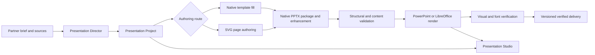

# v0.1.38 - Partner Presentation Project and Verified Native PPTX Delivery

> Status: Planned
> Feature: F129
> Roadmap rebase: this release replaces the former `v0.1.38` stabilization reserve with a dedicated Partner presentation release. The preceding `v0.1.33-v0.1.34` reserve remains the near-term stabilization lane, and `v0.1.44` remains the final 0.1.x patch/RC reserve.
> Depends on: F095 Partner route/playbook foundation, F109 Office/PDF baseline writers for migration compatibility, F114 workspace-first delivery, F122-F124 grounded local sources, F130 Partner Outcome-First Workspace, and the shared Artifact renderer/action primitives.
> SDK gate: none. The Presentation Project, worker protocol, template catalog, preview, and verification pipeline are Space-owned. KodaX supplies the existing Partner managed run and tool host but does not own presentation semantics.

## Batch decision

Space will replace the current bullet-list PPTX fast path with one coherent **Partner Presentation Project** subsystem. A presentation is a durable workspace project with sources, a story plan, an explicit design contract, slide-level source-of-truth files, previews, verification evidence, and versioned exports.

The first production engine pins and ships an audited MIT-licensed PPT Master revision: a strict presentation workflow, native PowerPoint template filling for layout-controlled work, SVG page design for free-form work, and conversion to editable DrawingML. Packaging may vendor those modules as source or install them as a locked Space worker dependency, but replacing them with an unrelated "compatible subset" is not an F129 implementation choice. KodaX Space owns the project protocol, policy boundary, UI, delivery identity, and verification contract; it does not expose PPT Master, Huashu, PptxGenJS, or any other implementation as separate peer products.

F129 defines at most three creation choices. A packaged build exposes only the choices whose acceptance gates have passed:

1. **Stable template** - the default for reports, training, analysis, and text-heavy decks;
2. **Use my template** - preserve a supplied corporate or school PPTX design;
3. **Creative design** - allow a freer SVG-authored visual system.

All enabled choices produce the same Presentation Project experience and pass the same publication policy. `Stable template` is the release-critical v0.1.38 route. `Use my template` and `Creative design` remain independently gated expansions inside the same subsystem and are hidden, not shown as unavailable promises, until their own acceptance sets pass. Advanced export mechanics are not shown during initial setup.

---

## FEATURE_129: Partner Presentation Project and Verified Native PPTX Delivery

### Decision and user outcome

Partner users can turn a prompt, document set, research result, or existing PPTX into a coherent, visually controlled presentation; inspect real slide previews while it is being made; revise individual slides without restarting the whole task; and download a PPTX that has been structurally validated and opened/rendered by a real office engine.

The primary deliverable is a natively editable PPTX. Text, images, ordinary shapes, tables, and charts remain editable when the selected route can represent them safely. Complex decorative layers may remain grouped vectors or rasterized layers when that is required for fidelity, but the UI must disclose the trade-off instead of claiming universal editability.

### Current evidence and gap

| Current surface     | Evidence                                                                                                                             | Gap                                                                                                                                                                                         |
| ------------------- | ------------------------------------------------------------------------------------------------------------------------------------ | ------------------------------------------------------------------------------------------------------------------------------------------------------------------------------------------- |
| PPTX input contract | `apps/desktop/electron/artifact/office-artifact-tool.ts` accepts only `title`, optional `subtitle`, `bullets`, and `notes` per slide | The model cannot express layout, images, charts, tables, hierarchy, brand, citations, or page roles. Text-card output is structurally predetermined.                                        |
| PPTX writer         | `apps/desktop/electron/artifact/office-writers.ts` hand-builds the OOXML package                                                     | ZIP/part checks do not establish that current PowerPoint versions can open and render the result. The writer has no template, master/layout, chart, table, font, or visual-fidelity system. |
| PPTX preview        | `PptxViewer.tsx` and `pptxPreviewParser.ts` extract bounded `<a:t>` text and render textual slide cards                              | The preview is not the presentation and cannot reveal clipping, font substitution, misplaced shapes, image crops, or export drift.                                                          |
| Partner sidebar     | `PartnerRightSidebar.tsx` uses the shared sidebar frame and `ArtifactPanel`                                                          | The shared shell is correct, but pre-artifact presentation planning and generation have no useful task-specific projection.                                                                 |
| Partner delivery    | F114 records arbitrary workspace deliverables and rich previews                                                                      | The delivery foundation is suitable, but there is no durable presentation project, page-level lineage, render evidence, or presentation-specific revision model.                            |
| F109 contract       | F109 explicitly describes its Office writers as a bounded convenience path rather than a template-rich publishing engine             | Extending the baseline writer would contradict its accepted boundary and continue accumulating one-off OOXML behavior.                                                                      |

The existing PPTX text extractor remains useful for source ingestion and degraded preview. It is not the rendering path for a presentation created by F129.

### Product principles

1. **One product, one project protocol.** Presentation engines are implementation details behind a Space-owned contract.
2. **Template-first, not template-only.** Stable visual delivery is the default; creative design remains available without weakening the reliable path.
3. **Explicit visual authority.** The system records which file determines what a slide looks like. Exporters do not silently invent missing design content.
4. **Preview the authored slide, then verify the exported slide.** The user sees source previews during generation and office-rendered previews after export.
5. **Editable where meaningful, faithful where necessary.** The product reports the actual editability of each export instead of marketing every layer as native.
6. **Atomic delivery.** A deck with missing, failed, or unverified required slides is not published as a successful PPTX.
7. **No capability-catalog UI.** Users choose a presentation authoring approach by outcome; libraries, converters, and validators stay behind the product boundary.

### Scope

F129 includes:

- a durable Presentation Project manifest and folder lifecycle;
- a Presentation Director workflow for source analysis, narrative planning, slide roles, citations, and design specification;
- a curated stable-template catalog and its metadata/capacity contract;
- existing-PPTX analysis and native template filling;
- a creative SVG-authoring route with native PPTX conversion;
- real visual thumbnails and page previews;
- slide-level regeneration and revision lineage;
- a Presentation Studio projection inside the shared right-sidebar/artifact shell;
- structural, content, font, visual, and office-engine verification;
- versioned PPTX, PDF/PNG preview, notes, source, and verification outputs;
- routing compatibility and rollback from the F109 PPTX convenience writer.

### Explicit non-goals

- No new Partner runtime, agent kernel, or independent presentation application.
- No fourth user-facing "hybrid" creation mode and no mixed-authority deck in the v0.1.38 release. An exporter may choose a different native/grouped/raster output representation for fidelity, but it may not change a slide's authoring authority.
- No promise that arbitrary CSS, HTML, SVG filters, 3D, video, or animation will remain editable as native PowerPoint objects.
- No silent use of cloud image generation, web search, or remote fonts. Those require separately allowed capabilities and visible provenance.
- No macros, executable embedded objects, `.pptm` output, external workbook links, or remote template relationships.
- No automatic installation or update of an unpinned upstream repository at runtime.
- No copying of proprietary Anthropic document-skill code. Every vendored component requires license and provenance review.
- No replacement of the generic Outputs browser or Coder Artifact shell.

### Release-critical boundary

F129 defines the durable subsystem and its expansion routes, but v0.1.38 does not claim every route before it is proven:

- **Required for v0.1.38 GA**: stable-template project creation, Director planning/checkpoint, at least two redistributable starter packs, real previews, targeted revision, verified native PPTX publication, Studio states, migration routing, sandboxing, and rollback.
- **Conditional in v0.1.38**: supplied-template direct fill and creative SVG authoring. Each is enabled only when its dedicated corpus, security, editability, and office-matrix gates pass; otherwise its flag stays off and the roadmap receives a named follow-up target rather than silently shrinking acceptance.
- **Not a GA shortcut**: the legacy bullet writer, an unrendered PPTX, raster-only slides presented as editable, or a worker without the OS isolation contract cannot satisfy the stable-template gate.

## User experience

### Entry and creation choices

Selecting F130's `PPT 演示` entry only prepares the composer; it never creates a project, sends a turn, or changes Auto LLM/permission state. A Presentation Project is created only after the first accepted user send is routed to F129, whether the user selected the entry or Partner inferred a presentation request from free-form text. Partner recommends from the creation choices enabled in the current packaged build; the recommendation is visible but does not block a user override. These are presentation authoring choices inside one result, not Partner work modes. Gated choices are omitted from normal setup rather than displayed as broken tools.

Project creation immediately registers or updates a `PartnerResultRef` with owner `presentation-project` and emits the normal monotonic Result event. Results does not wait for the first published Delivery before making the project and Studio reachable.

| Choice          | Default route                                                                | Use when                                                       | Visible promise                                                                           |
| --------------- | ---------------------------------------------------------------------------- | -------------------------------------------------------------- | ----------------------------------------------------------------------------------------- |
| Stable template | native template fill from the curated catalog                                | reports, training, reviews, analysis, text-heavy decks         | Fastest and most predictable; editable within the selected layout system                  |
| Use my template | native template fill; optional extracted style package after explicit choice | company, school, conference, or client templates               | Preserve the supplied brand, master, layouts, fonts, and reusable slide shells where safe |
| Creative design | SVG page design and DrawingML conversion                                     | launches, marketing, editorial storytelling, visual explainers | More visual freedom; complex layers may have reduced editability                          |

Source and template selection use F130's single composer `+ Add material` control and shared Context surface. F129 adds no project-local source picker or setup attachment control. When the request does not specify an authoring choice, Partner automatically uses the qualified Stable-template recommendation, shows it in Story, and lets the user override it before design approval. Setup asks only when the user explicitly requires a template that is missing, no enabled route can truthfully satisfy the request, or a source/template, aspect ratio, audience, or purpose cannot be safely inferred. It appears as a bounded clarification or result-context action, never as a creation-mode chooser or permanent setup mode. Page count, visual tone, citation style, and delivery purpose are inferred and shown in Story rather than presented as a long form.

### Story and design checkpoint

Before full generation, the Presentation Director produces:

- audience, purpose, delivery setting, and expected reading distance;
- story mode and section outline;
- slide roles and evidence/source coverage;
- recommended creation route and template/style;
- body-text baseline and density policy;
- a two-slide visual checkpoint for decks of five or more slides.

The user can approve, revise in natural language, or switch the creation choice. Approval locks a versioned design specification; it does not freeze later slide-level edits.

### F130 right-rail integration

The right sidebar remains built on the shared `RightSidebarFrame`, but F129 does not replace F130's three stable top-level tabs:

1. **Results** owns the stable Presentation Project row, adapter host, selected-result navigation, latest published preview/verification summary, export/open actions, and entry into the result-scoped Presentation Studio;
2. **Process** projects `Setup`, `Story`, `Build`, and `Verify` from the typed F129 lifecycle, including live checkpoints, current slide, waits, warnings, retry/cancel/recovery, and completion state;
3. **Files** retains F114 workspace paths, proposals, checkpoints, reveal, and rollback without becoming a second presentation browser.

Sources and templates remain in F130's context drawer. `Setup`, `Story`, `Build`, and `Verify` are compact user-facing stage labels inside Process or Studio, not additional right-rail tabs and not a second persisted lifecycle. `Story` is F129's presentation-specific planning stage: it is result-scoped project state, not the F089 Task plan and not a Partner `Plan` mode. Internal storage may retain the `planning` state name. The sidebar does not repeat the conversation, advertise internal Skills, list generic capabilities, or show raw tool logs. A row is present only when it helps the user decide, inspect, revise, or recover.

Process is run-scoped: it shows the active F129 stage, warnings, waits, retry/cancel/recovery, and completion. Presentation Studio is selected-result-scoped: it owns the story, draft and published slide previews, slide state, revisions, project versions, design approval, degraded-publication acknowledgement, and publication decisions. Results hosts the stable row and adapter summary but does not own a second copy of Studio state. A Process row may deep-link into the single Studio action, but neither surface duplicates the other's authoritative state or exposes two independently actionable copies.

The result-scoped Studio anatomy is fixed enough to prevent another generic information rail:

```text
┌─ shared RightSidebarFrame ─────────────────────┐
│ Results | Process | Files                      │  F130 top-level tabs
├────────────────────────────────────────────────┤
│ Presentation · project title          status  │  selected result header
│ Setup → Story → Build → Verify                 │  compact lifecycle; not tabs
├────────────────────────────────────────────────┤
│ stage decision or current-slide focus          │
│ real template/slide previews                   │  scrollable Studio work area
│ evidence, warnings, and revision targets       │
│ version/verification detail on demand          │
├────────────────────────────────────────────────┤
│ primary action · secondary recovery action     │  sticky decision footer
└────────────────────────────────────────────────┘
```

The shared frame owns close, resize, focus, tab follow, and window behavior under F130's per-run manual-hold state machine. Presentation Studio owns only the selected-result header, compact lifecycle, work area, and decision footer. At narrow widths it shows one preview column; at wider user-resized widths it may show a thumbnail strip plus focused slide. Shared Artifact renderer/action primitives may wrap the presentation preview inside Results, but F129 does not restore Coder's Artifact shell as Partner's top-level navigation. Empty sections collapse completely; internal logs and advanced receipts open from a specific warning/version rather than occupying permanent space.

An immutable export is concurrently available in Results even while a newer draft is failing or being revised. F130's manual hold always wins over the default tab below, and a closed rail remains closed.

| Persisted condition                               | F130 default tab | In-tab projection and required recovery/action                                                              |
| ------------------------------------------------- | ---------------- | ----------------------------------------------------------------------------------------------------------- |
| `setup`                                           | Process          | Show the missing decision and cancel action; deep-link to the single Studio/Context decision owner          |
| `planning` / `awaiting-design-checkpoint`         | Process          | Show Story wait; open Studio to approve, revise, or switch an enabled creation choice                       |
| `generating` / `reviewing`                        | Process          | Show Build and safe cancel/retry; deep-link to Studio for slide inspection or revision targeting            |
| `verifying`                                       | Process          | Show Verify/retry state and preserve the last immutable export summary in Results                           |
| Current export passes its target policy           | Results          | Update the stable row and published summary; Studio owns versions, compare, restore, and publication detail |
| Worker crash, timeout, or cancelled draft         | Process          | Resume from the last valid checkpoint or retry/cancel; Studio owns any explicit draft-discard decision      |
| Verification failure with a prior verified export | Process          | Explain/retry the failed gate; keep the prior verified version available in Results/Studio                  |
| Publishable degraded export                       | Process          | Show a decision wait and deep-link to Studio for the one explicit acknowledgement/publication action        |
| Rolled-back feature or unsupported future schema  | Results          | Preserve read-only summary/export/receipt access; Studio opens read-only when its adapter remains available |

Cancellation never means publication. A retry creates a new attempt under the same draft revision; restoring or exporting a prior version never mutates that version.

### Revision semantics

- A copy, data, image, or layout revision targets stable slide/element IDs.
- Slide-only changes regenerate the smallest safe dependency set.
- Theme or template changes create a new design-spec version and may invalidate all slide renders, but retain the story and citations.
- F129 stores a presentation-local dependency map from every slide/claim to F123 source-version locators. On project open and before export, it compares recorded source hashes and marks only directly referenced slides stale; this narrow check does not claim F127's later cross-project watcher, conflict, retention, or automatic impact-propagation scope.
- Users can compare project/export versions and restore a prior version without overwriting its evidence.
- A failed revision leaves the last verified export available and clearly labels the current draft as unverified.

## Architecture



### Component ownership

| Component                                              | Owner                                         | Responsibility                                                                                                                                           |
| ------------------------------------------------------ | --------------------------------------------- | -------------------------------------------------------------------------------------------------------------------------------------------------------- |
| Presentation Project protocol/store                    | Space                                         | IDs, paths, status, versions, source refs, permissions, lineage, export records                                                                          |
| Presentation Director                                  | Space state machine + Partner prompt playbook | Deterministic gates/state transitions; existing managed Partner turns provide source analysis, story, slide roles, design decisions, and revision intent |
| Presentation Worker protocol                           | Space                                         | Bounded request/response contract, process lifecycle, resource limits, cancellation, progress, audit                                                     |
| First engine implementation                            | Pinned and audited PPT Master integration     | Template analysis/fill, SVG authoring support scripts, DrawingML conversion, notes and package enhancement                                               |
| Template catalog/importer                              | Space                                         | Approved packs, metadata, previews, capacity rules, version/provenance, user-template isolation                                                          |
| Verification service                                   | Space                                         | Package validation, office-engine open/render, screenshot comparison, font/overflow/content checks                                                       |
| Presentation Studio                                    | Space renderer                                | Story/design approval, slide preview/revision, project-version selection, publication                                                                    |
| Delivery registry and shared Artifact renderer/actions | Existing Space infrastructure                 | Delivery is the authoritative published-file identity; shared rendering/actions present it without implicitly creating a second Artifact record          |

The Director is not an executable SDK Skill and does not use Partner's blocked SDK `skill`, workflow, subagent, or MCP-mutation surfaces. Space advances a typed host-owned state machine, invokes versioned prompt-playbook turns through the existing managed Partner run for bounded judgment, validates their DTO output, and calls Space-owned project/worker tools. Therefore the current `SDK gate: none` remains truthful.

PPT Master is the pinned first engine dependency, not the IPC or persisted project schema. `engine.id` is `ppt-master`, while `engine.version` records the audited commit/package revision and the export receipt records its attribution and SBOM reference. Engine load failure disables new presentation generation; it never falls back to the F109 writer under an F129 success label. Replacing or upgrading the engine requires an explicit feature/ADR decision, compatibility fixtures, and a project migration decision, not a prompt or packaging change.

## Presentation Project contract

### Workspace layout

```text
presentation-project/
├── manifest.json
├── sources/
├── analysis/
├── story/
│   ├── outline.md
│   └── slide-plan.json
├── design/
│   ├── design-spec.md
│   ├── spec-lock.json
│   └── template/
├── slides/
│   ├── svg-output/
│   ├── previews/
│   └── rendered/
├── notes/
├── validation/
├── backup/
└── exports/
```

Only directories relevant to the selected route need to exist. Empty folders and placeholder exports are not created.

### Manifest semantics

The persisted schema is versioned and validated. The following shape defines required product semantics, not final TypeScript syntax:

```ts
interface PresentationProjectManifestV1 {
  schema: 'kodax.presentation-project.v1';
  id: string;
  sessionId: string;
  projectRoot: string;
  title: string;
  status:
    | 'setup'
    | 'planning'
    | 'awaiting-design-checkpoint'
    | 'generating'
    | 'reviewing'
    | 'verifying'
    | 'ready'
    | 'failed'
    | 'cancelled';
  accessMode: 'editable' | 'read-only-rollback' | 'read-only-future-schema';
  draftState: 'clean' | 'dirty' | 'stale' | 'failed';
  creationMode: 'stable-template' | 'user-template' | 'creative-design';
  compatibilityTarget: 'powerpoint' | 'libreoffice' | 'portable';
  sourceRefs: readonly PresentationSourceRef[];
  storyVersion: number;
  designVersion: number;
  engine: {
    id: 'ppt-master';
    version: string;
    licenseRef: string;
    attributionRef: string;
    sbomRef: string;
  };
  slides: readonly PresentationSlideRecord[];
  exports: readonly PresentationExportRecord[];
  lastPublishedExportId?: string;
  createdAt: string;
  updatedAt: string;
}

interface PresentationExportRecord {
  id: string;
  projectId: string;
  version: number;
  deliveryId?: string;
  verificationReceiptId: string;
  status: 'draft' | 'verified' | 'degraded' | 'failed';
  createdAt: string;
}
```

Every slide record has a stable ID, order, narrative role, section, status, source/citation refs, notes path, visual authority, preview ref, rendered-export ref, verification state, and revision lineage. Project lifecycle, current-draft health, access mode, and immutable export verification are independent axes: a failed or stale draft cannot erase `lastPublishedExportId`, and a `ready` project does not upgrade any export's verification label. `deliveryId` is absent until publication succeeds; once set it is immutable and resolves the authoritative F114 delivery. F130 projects that delivery with a `derived-from` relation to `(presentation-project, projectId, exportId)` via `ownerSubresourceId`. Shared Artifact rendering does not create an Artifact-store identity unless another owning subsystem explicitly registers one and persists its relation.

Absolute paths are main-process/worker facts. Renderer DTOs use project-owned opaque references or policy-checked display paths.

### Visual source-of-truth rules

The two authoring routes deliberately do not pretend to share one universal visual scene graph. Every slide has exactly one discriminated visual authority:

```ts
type SlideVisualAuthority =
  | {
      kind: 'native-pptx';
      sourcePptxRef: string;
      fillPlanRef: string;
      workingDeckRef: string;
    }
  | {
      kind: 'svg-page';
      svgRef: string;
      designVersion: number;
    };
```

- **Native template fill**: visual authority is the pinned source PPTX plus a confirmed `fill-plan.json`. Selected slides are cloned and patched directly. The route must not pass through SVG when the user expects the original master, layout, animation, or native shell to be preserved. Pre-export thumbnails come from an office render of a project-local working deck containing the filled checkpoint/current slides; text-card extraction is never presented as a visual preview.
- **Creative design**: visual authority is the completed page SVG in `slides/svg-output/`, guided by the locked design specification. The PPTX compiler may reorganize represented content into DrawingML, master/layout, and native objects but may not invent visible content that is absent from the SVG.
- **Extracted user-template style**: if the user requests a new structure rather than filling original slides, template import creates a versioned design package and SVG/layout prototypes. This is an explicit conversion from native-fill expectations to the creative/adaptive route.

`manifest.json` unifies identity, status, story, lineage, and exports; it is not a lossy replacement for either route's visual authority.

For v0.1.38, `stable-template` and `user-template` projects contain only `native-pptx` slide authorities, while `creative-design` projects contain only `svg-page` authorities. A project cannot switch authority after design approval in place: choosing a different authoring authority creates a new design version and regenerates all slide authorities. The exporter may translate either authority into native shapes, grouped vectors, or disclosed raster layers, but that output representation never becomes a second authoring authority. Per-slide route mixing is deferred until a later design proves lineage, preview, revision, and verification semantics without ambiguity.

## Presentation Director

The Presentation Director is a scoped Partner workflow, not a new autonomous agent type. It operates serially through explicit gates:

1. normalize sources and capture citations;
2. identify audience, purpose, delivery setting, and story mode;
3. create the section outline and slide-role plan;
4. recommend a creation choice and template/style;
5. lock design tokens, typography, density, image strategy, layout assignments, and chart/table choices;
6. generate the two-slide checkpoint;
7. generate slides sequentially with the locked specification re-read for every page;
8. run page checks and revisions;
9. export atomically;
10. render and verify the exported file;
11. publish only the verified delivery or an explicitly labeled degraded result.

The workflow may use F122-F124 evidence and F123 locators. Missing browser/connectors or optional image generation cannot block a local-source presentation; they change the available evidence/assets and are disclosed.

## Template system

### Template pack

A curated or imported template is a versioned, provenance-bearing pack rather than an unstructured PPTX filename:

```text
template-pack/
├── template.json
├── source-template.pptx
├── preview/
├── design-spec.md
├── layouts/
├── images/
└── fonts.json
```

Required metadata includes:

- template ID, version, origin, license, author, checksum, aspect ratio, locale support, and engine compatibility;
- theme colors, fonts, grid, spacing, logo/safe areas, background policy, and visual motif;
- slide role, density, required/optional slots, accepted element types, slot capacity, image aspect/crop behavior, supported chart/table types, and repeatability for every reusable layout;
- strict/adaptive policy and known export limitations;
- tested PowerPoint, LibreOffice, WPS, and Keynote compatibility facts where available.

### Layout matching

The Director selects a layout from semantic role, content density, item count, asset types, chart/table requirements, and slot capacity. If content does not fit, it must shorten/split the content or choose another layout. Reducing body text below the locked delivery-purpose baseline requires a visible warning and cannot be the automatic first response.

### User template handling

- Treat every uploaded PPTX as untrusted Office ZIP input and run existing expansion/ratio/entry guards before analysis.
- Analyze masters, layouts, slide geometry, placeholders, fonts, colors, images, tables, charts, notes, transitions, and external relationships.
- Generate a slide-library overview and classify candidate layouts before content mapping.
- Direct fill preserves the original native slide shell; repeated source layouts are allowed.
- Unsupported, corrupt, encrypted, macro-enabled, externally linked, or rights-unclear inputs fail with a specific explanation and do not partially import.
- A user template remains project-scoped unless the user explicitly promotes it to a reusable local catalog item.

## Native PPTX and editability policy

- Ordinary text becomes merged paragraph-aware text frames where possible; layout-sensitive lines may remain separate frames when fidelity requires it.
- Images remain native media with explicit crop rectangles and accessible source/provenance metadata where supported.
- Charts and tables prefer native data-backed objects when the selected compatibility target renders them acceptably; otherwise they use editable shape groups or a disclosed visual fallback.
- Complex gradients, masks, filters, textures, and generated illustrations may be grouped vectors or raster layers.
- Speaker notes and slide-level citations are retained in the PPTX and project.
- The exporter records an editability summary for the deck and per-slide exceptions.
- F129 does not author new animation or transitions. The conditional user-template route preserves only fixture-proven existing native transitions/animations and records anything removed; creative animation is deferred.

## Verification and publication gate

### Verification stages

1. **Project completeness** - all required slide IDs, source refs, notes, assets, and visual-authority files exist and match their recorded hashes.
2. **Content checks** - slide order/count, missing text, stale citations, placeholder text, unsupported characters, and notes completeness.
3. **Package checks** - ZIP integrity, required OOXML parts, relationships, content types, media references, and Open XML validation where supported.
4. **Office open/render** - render through the office engine required by the export's declared compatibility target; Microsoft PowerPoint COM is the gold PowerPoint lane and LibreOffice headless is the portable secondary implementation.
5. **Visual checks** - compare authored previews with office-rendered pages for crop, position, missing object, font substitution, overflow, and material visual drift.
6. **Compatibility/readback** - reparse the final file, confirm the expected slide count and semantic content, and record the office engine/version used.

### Verification policy layers

Verification has three explicit layers and does not use the word "mandatory" without naming the layer:

1. **Release qualification** - the versioned release corpus must pass the exact Windows + PowerPoint build recorded in `presentation-compatibility-matrix.json` and the pinned LibreOffice build on every supported packaged OS. A supported platform must have a product-managed renderer installation/discovery path; otherwise verified PPTX publication is disabled on that platform and the platform cannot satisfy the F129 GA claim.
2. **Per-export target policy** - `powerpoint` requires PowerPoint to open/render every slide; `libreoffice` requires the pinned LibreOffice lane; `portable` requires both when both are provisioned and at least the pinned portable lane otherwise. Structural validation alone never publishes a PPTX.
3. **Optional compatibility checks** - additional PowerPoint/LibreOffice/WPS/Keynote versions may add evidence or a degraded warning but cannot upgrade the declared target label.

A degraded export is publishable only when its declared target engine opened and rendered every slide and all hard content/safety checks passed, while a non-critical compatibility, fidelity, or editability expectation failed. If the target engine fails, a different engine's success may be offered only as a new target-specific export attempt; it is not a downloadable degraded result under the original target.

The release policy file locks the engine revisions, OS/build matrix, required font packs, page raster size, resource budgets, and fixture-specific tolerances before Slice 1 begins. The baseline hard thresholds are zero missing slides/objects/required text, zero clipped or overflowed required text, zero unreplaced placeholders, zero required-font substitutions, exact slide/order/notes/citation readback, and no unsafe relationship. Antialiasing/pixel tolerances are calibrated in Slice 0 per fixture and any later relaxation requires a reviewed fixture diff rather than a global percentage change.

### Atomic semantics

- Export writes to a project-local temporary target.
- Any required slide/export failure aborts publication of that version.
- The previous verified export remains available.
- A final filename is moved into `exports/` and registered as a delivery only after all mandatory gates pass.
- Optional compatibility/fidelity/editability failures may produce an explicitly labeled `degraded` result only under the target-policy rule above.
- Zero-byte, partial-slide, structurally invalid, or not-opened files are never downloadable as successful PPTX artifacts.

### Verification labels

| Label               | Meaning                                                                                                                    |
| ------------------- | -------------------------------------------------------------------------------------------------------------------------- |
| Draft preview       | Authored slide source exists; no final PPTX claim                                                                          |
| Structurally valid  | Package/relationships/content readback passed; office rendering not yet proven                                             |
| Render verified     | A declared office engine opened and rendered all slides                                                                    |
| PowerPoint verified | Microsoft PowerPoint opened and rendered all slides in the tested environment                                              |
| Degraded            | The declared target passed every hard gate, but a disclosed optional compatibility/fidelity/editability limitation remains |

The UI never collapses these states into a generic success checkmark.

## Security and permission boundary

- A JavaScript Worker is fault isolation, not the security boundary. Template analysis, the pinned presentation engine, LibreOffice, and PowerPoint automation run behind a Space-owned `PresentationSandboxBackend` in separate OS processes; absence of that backend disables new F129 generation/import rather than downgrading to main-process or shared-Worker execution.
- The sandbox exposes read-only staged inputs and one fresh output root, resolves every path after creation, rejects symlinks/junctions/reparse-point escape and archive traversal, starts with a scrubbed environment and isolated temporary/user profile, denies network by default, and exposes no host credential/token stores.
- Process-tree policy allowlists only the selected engine and office-render binaries, assigns every descendant to the same kill/resource boundary, blocks arbitrary child-process launch, and enforces versioned CPU, RSS/native-memory, wall-clock, file-count, expanded-size, and output-size budgets from the release policy. Timeout/cancellation kills the whole tree before staged output is inspected.
- PowerPoint automation runs only on the supported Windows verification host/profile with macros and automation security forced off, links/DDE/update-on-open disabled, read-only/no-repair input policy, an isolated desktop/profile, modal/first-run detection, deadline, and process-tree cleanup. LibreOffice uses a fresh isolated user profile with macros, links, extensions, and network disabled.
- Do not expose unrestricted shell, package managers, arbitrary host filesystem access, environment enumeration, credentials, or runtime self-update to the engine.
- Network and external image/font acquisition are off by default and require a separately permitted capability with recorded provider, query/prompt, URL, license, and attribution.
- Sanitize Office ZIP paths, external relationships, embedded packages, OLE objects, macros, formulas/links, and media MIME types before analysis or reuse.
- Store API keys only in approved host credential facilities; never copy them into Presentation Projects, templates, manifests, logs, or exports.
- Preserve session, project, source, delivery, checkpoint, and audit ownership through F114 rather than inventing a presentation-specific permission system.
- Template promotion, engine update, and reusable asset installation are explicit local mutations with checksum, provenance, collision, and rollback checks.

Slice 0 must prove the sandbox with adversarial fixtures for archive bombs, hostile relationships, reparse-point escape, child-process escape, network attempts, modal office hangs, native-memory exhaustion, and process-tree cleanup. A clean subprocess or Electron utility process without those controls does not pass this gate.

## Compatibility and migration

### F109 routing and compatibility migration

- Existing F109-generated PPTX artifacts remain readable/exportable and retain their versions.
- `create_office_artifact(kind: 'pptx')` stays available behind a legacy/simple-deck route during rollout; it is no longer the default Partner presentation instruction.
- A new `create_presentation_project` path owns high-quality presentation work and returns project/delivery references rather than base64 or arbitrary paths.
- Once F129 passes release gates, F130 routes its `PPT 演示` entry and inferred presentation requests to the qualified F129 adapter. The F109 PPTX route is labeled `Legacy simple deck` or hidden unless compatibility requires it.
- DOCX, PDF, and XLSX behavior in F109 is unaffected.
- F129 does not silently upgrade a legacy Artifact or Delivery into a project. Explicit import creates a new project with a stored source/template relation and preserves the original object under its authoritative owner and ID.
- The legacy creation entry is hidden when v0.1.38 becomes default and may be removed no earlier than v0.1.39, after one full released rollback window and packaged tests prove legacy read/preview/export plus F129 creation. The legacy reader/export path remains through 0.1.x even after creation is removed.
- Removal means deleting the legacy prompt/tool creation route, not deleting files or rewriting history. During the one-release window, a failed retirement gate may restore the labeled legacy creation entry without presenting its output as F129 verified. After the window expires, later rollback uses the legacy read-only adapter and never re-registers that creation route.

### Preview migration

- Existing text-only PPTX preview remains a bounded fallback for arbitrary external/legacy files.
- F129 projects use authored slide previews during generation and office-rendered images for final artifact review.
- A future general PPTX renderer may reuse the verification service, but F129 does not block on replacing every legacy preview path.

### Project compatibility

- Manifests, template packs, engine versions, and verification receipts are schema-versioned.
- Engine upgrades run fixture comparison before becoming the default and never rewrite existing verified exports.
- Unsupported future schemas open read-only with an upgrade explanation rather than being silently downgraded.
- F051's later Partner Document Work Pack may consume F129 for presentation requests, but it cannot reopen a second slide writer, project schema, Studio, or verification path.
- Presentation Project and immutable export keep `projectId`/`exportId`; every published file keeps its authoritative `deliveryId`. F129 writes the explicit delivery-to-project/export relation consumed by F130's `PartnerResultRef`; Results never groups identities by filename or path equality, and the shared Artifact renderer does not imply an Artifact-store record.
- Until F119 explicitly supports `presentation-project`, object-attached reviews target the exact immutable export's supported Artifact or Delivery ID. Project-level authoring/verification receipts remain F129-owned and cannot be relabeled as an F119 review packet.

## Implementation slices

### Slice 0 - engine and packaging spike

- Pin one PPT Master revision and audit its license, provenance, dependencies, scripts, network behavior, and Windows packaging needs.
- Generate a stable-template deck, a supplied-template deck, and a creative SVG deck from the same grounded brief.
- Open and render every deck in Microsoft PowerPoint and LibreOffice; inspect native editability and file/package structure.
- Decide only whether the audited pinned modules are vendored as source or installed as a locked packaged worker dependency; either choice keeps `engine.id = 'ppt-master'`, ships attribution/SBOM, and passes identical fixtures.
- Lock `presentation-compatibility-matrix.json`, numeric resource budgets, the sandbox backend, render provisioning, and visual fixture tolerances. Slice 1 cannot start until these release-critical gates are reviewed.

### Slice 1 - project protocol and persistence

- Add versioned manifest/DTO schemas, project store, atomic updates, recovery, cancellation, lineage, and delivery references.
- Add the bounded worker protocol and feature/capability status.
- Add fixtures for corrupt, missing, stale, interrupted, and future-schema projects.

### Slice 2 - stable-template vertical slice

- Ship a small reviewed starter catalog with role/capacity metadata and real previews.
- Implement story/slide planning, native slide selection/reuse, fill plans, notes, citations, export, and verification.
- Route F130's presentation entry and inferred presentation requests to this path behind a feature flag; card selection alone remains side-effect free.

### Slice 3 - Presentation Studio

- Register Presentation Project/Studio as a Results adapter, map Setup/Story/Build/Verify into Process, and reuse F130's context drawer for sources/templates.
- Add thumbnail navigation, slide status, page comparison, revision targeting, export history, and precise degraded states.
- Reuse shared Artifact renderer/actions inside Results without changing F130's top-level rail or Coder behavior.

### Slice 4 - user-template path

- Add guarded template intake, slide-library analysis, direct native fill, project-scoped template packs, and explicit style-extraction conversion.
- Cover master/layout/placeholder/font/image/table/chart/transition preservation and unsupported-input errors.
- Keep the choice hidden unless its conditional release corpus and hostile-input sandbox suite pass.

### Slice 5 - creative design path

- Add locked design specifications, two-slide checkpoints, sequential SVG page generation, quality checks, DrawingML conversion, and editability receipts.
- Reuse the same story, project, Studio, verification, delivery, and revision contracts.
- Keep the choice hidden unless its conditional fidelity/editability corpus passes; its failure does not weaken the stable-template GA gate.

### Slice 6 - hardening and legacy retirement

- Add release corpus, packaged worker smoke, fault injection, office-version matrix, visual regression, performance/resource limits, diagnostics, and rollback.
- Remove high-quality presentation claims from F109 instructions and documentation.
- Disable the legacy Partner PPTX route by default only after migration/readback tests pass.

## Automated acceptance

- Manifest, slide, template, fill-plan, worker, verification, and renderer DTO schemas reject malformed or cross-project references.
- Interrupted writes, worker crashes, cancellations, timeouts, and disk-full simulations preserve the last verified export and recover the project deterministically.
- Template intake rejects traversal, ZIP bombs, external relationships, macros, OLE packages, encrypted/corrupt files, unsupported MIME, and unsafe links.
- Stable-template fixtures preserve expected masters/layouts, slide shells, notes, transitions, fonts, images, tables, and chart data within the declared compatibility contract.
- Creative fixtures preserve slide count, text, image crop, element order, notes, citations, and declared editability through SVG-to-PPTX conversion.
- Every generated release-corpus deck passes ZIP/readback checks and opens/renders all slides in LibreOffice.
- The Windows release lane opens and renders every release-corpus deck in a supported Microsoft PowerPoint version; any failure blocks release.
- Authored and office-rendered visual comparisons detect missing slides/objects, material crop/position drift, overflow, and font substitution.
- Release-policy tests prove the locked maximum input/expanded/project/output sizes, per-slide/full-deck deadlines, RSS/native-memory ceiling, descendant-process count, and kill-tree deadline at the boundary and one unit beyond it.
- The exact OS, PowerPoint, LibreOffice, presentation-engine, and font-pack revisions in `presentation-compatibility-matrix.json` run in packaged CI/release hosts; an unrecorded engine cannot emit a verified label.
- Placeholder scans find no `lorem`, `xxxx`, template instruction copy, or unreplaced sample values.
- Revision tests prove that slide-only edits preserve unrelated verified slide hashes while design/theme changes invalidate the required set.
- E2E covers stable-template and every enabled conditional creation choice, the design checkpoint, progress states, one targeted slide revision, a verification failure, recovery, version comparison, and verified export. Disabled choices are covered by feature-flag and hidden-UI assertions instead of becoming implicit GA gates.
- A plain request such as `做一份汇报 PPT` reaches Story on the qualified Stable-template route without a creation-choice prompt; any later override remains a Studio decision before design approval.
- Presentation Studio visual/E2E coverage runs at 1280 px, 820 px, and the current minimum supported desktop width in both light and dark themes.
- At minimum width, Studio remains inside the full-height Results sheet with one preview column and no nested horizontal squeeze.
- Studio chrome uses F130 semantic theme tokens; slide previews preserve the authored presentation colors and are never recolored to match application dark mode.
- Legacy F109 DOCX/PDF/XLSX tests remain unchanged; legacy PPTX artifacts still open in the fallback viewer and export.
- Typecheck, lint, unit, Electron integration, packaged smoke, and existing Partner/Coder Artifact regressions pass.

## Human acceptance

The review corpus contains a release-critical stable-template set and conditional route sets:

1. **Core**: a Chinese/English quarterly business report with native charts and citations;
2. **Core**: a text-heavy training deck using a curated stable template;
3. **Core**: a research deck with equations, tables, long citations, and dense source material;
4. **Core**: stress cases for long titles, missing fonts, unusual image ratios, empty sections, and conflicting content density;
5. **User-template gate**: a supplied corporate template with masters, repeated layouts, notes, and existing transitions;
6. **Creative gate**: an image-heavy editorial/marketing deck using creative design.

For every core deck and every enabled conditional-route deck, reviewers confirm:

- the story and page roles are coherent rather than a sequence of bullet summaries;
- the selected template/style remains consistent across the whole deck;
- no required content, citation, image, chart, table, note, or slide is missing;
- no critical overlap, clipping, unreadable contrast, unintended tiny text, or placeholder remains;
- the file opens in the declared Microsoft PowerPoint and LibreOffice versions;
- important text, image, shape, table, and chart elements are editable as promised;
- disclosed grouped/rasterized layers are acceptable for the selected authoring choice;
- the final artifact preview matches the actual exported PPTX render;
- changing one slide and exporting a new version is understandable and does not destroy the prior verified version.

## Release acceptance

- An accepted F130 presentation request creates a durable project instead of invoking the bullet-list writer; selecting, switching, or clearing the entry before send creates nothing and preserves the draft/material.
- Results/Process/Files remain the only Partner right-rail tabs; Studio lifecycle stages do not become Setup/Story/Build/Verify tabs, and material selection does not restore a permanent Sources rail.
- A newly created Presentation Project appears as one Results row and opens Studio before any Delivery exists; publishing later relates the Delivery without replacing or duplicating the project identity.
- Stable template is the reliable default and passes the full core corpus. If user-template or creative design is enabled, it passes its own corpus and uses the same project/delivery experience; a disabled route is not counted as delivered.
- At least one production starter template pack exists for business/report work and one for education/training; both have provenance, capacity metadata, and real PowerPoint verification.
- All core release-corpus decks, plus every corpus whose route is enabled, achieve `PowerPoint verified` on the Windows release lane and `Render verified` on the LibreOffice lane.
- No incomplete or not-opened PPTX can receive a successful delivery state.
- F129 ships its own redacted Presentation Project/Studio diagnostics and export receipts in v0.1.38. F094 consumes them in the broader beta diagnostics bundle at v0.1.43; that later integration is not a retroactive v0.1.38 release blocker.
- Documentation describes PPT Master as the first pinned engine implementation, not a KodaX runtime capability or an interchangeable user-facing mode.

## Rollout and rollback

- Gate project creation, stable templates, user templates, creative design, office verification, and legacy-route retirement independently.
- Gate precedence is fixed: authoritative owner capability/policy -> F129 master project creation/authoring -> required stable-template route -> optional user-template/creative routes -> the time-bounded legacy-creation retirement gate. A child route never re-enables a disabled parent.
- With F129 creation/authoring off, existing projects, manifests, previews, receipts, verified exports, and legacy files remain reachable through owner-backed read-only adapters. With the master on but stable-template unavailable, Partner exposes no qualified F129 creation path and does not silently fall back under the same result promise.
- Start with internal fixture generation, then opt-in F130 presentation-adapter routing, then default stable-template routing.
- Keep the F109 PPTX path available for rollback until at least one full release after F129 is verified in packaged builds.
- Rolling back hides new project creation but preserves manifests, source files, previews, receipts, and exports as read-only deliverables.
- Engine updates use a pinned allowlist and shadow-generate the release corpus before promotion.
- A failed engine/verification health check automatically stops new verified exports; it does not fall back to the legacy writer under the same success label.
- Packaged E2E exercises every feature-flag dependency order, cancellation/kill-tree cleanup, rollback with existing projects, read-only artifact access after rollback, restoration of the labeled legacy route only during its one-release window, post-window absence of that creation route, engine downgrade refusal, and re-enable without manifest rewriting.

## Open engineering choices with fixed decision gates

These choices do not reopen the product architecture:

1. **PPT Master packaging** - vendor the audited pinned modules as source or ship them as a locked worker dependency. Decide in Slice 0 using packaged size, startup, security, Windows reliability, SBOM, and maintenance evidence; both remain the same declared PPT Master engine.
2. **Structural validator** - use Microsoft Open XML SDK in a bounded helper or an equivalent validated implementation. The chosen path must produce part/relationship diagnostics and run in packaged builds.
3. **Renderer provisioning** - PowerPoint COM remains the Windows gold lane. Slice 0 must choose a licensed product-managed pinned LibreOffice install/discovery strategy for each supported platform; structural-only exports are never promoted when neither target renderer is available.
4. **Starter-template licenses** - only templates with documented commercial redistribution rights enter the built-in catalog; otherwise ship metadata/import tooling without the asset.
5. **Native chart/table threshold** - choose native objects per compatibility fixtures; do not make a global promise before the target office matrix proves it.
6. **OS sandbox implementation** - choose the platform backends that satisfy the documented file/network/process/profile/resource contract. A Worker, ordinary child process, or Electron utility process without OS enforcement is not an acceptable implementation.

## Research basis

- [PPT Master](https://github.com/hugohe3/ppt-master) - MIT-licensed skill/workflow and native editable PPTX reference architecture;
- [PPT Master technical design](https://github.com/hugohe3/ppt-master/blob/main/docs/technical-design.md) - SVG visual authority, project lifecycle, native/template routes, and conversion boundaries;
- [PPT Master template-fill workflow](https://github.com/hugohe3/ppt-master/blob/main/skills/ppt-master/workflows/template-fill-pptx.md) - native slide selection, reuse, and OOXML patching;
- [Kimi creation modes](https://www.kimi.com/zh-cn/help/ppt/ppt-creation-mode) - explicit separation between stable template generation and freer intelligent layout;
- [Kimi Slides](https://www.kimi.com/zh-cn/features/slides) - user template, master/font/grid, editable component, online review, and export product expectations;
- [Huashu Design](https://github.com/alchaincyf/huashu-design) - HTML/SVG-first visual design workflow, thumbnail overview, and design-quality constraints;
- F109 and F114 in [v0.1.30](v0.1.30.md) - current baseline writer and workspace-first delivery boundaries.
